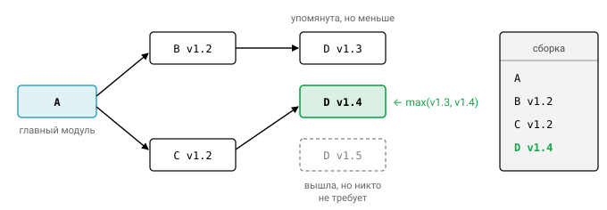

# Урок 3. Управление пакетами и модулями

## Пакет, модуль, репозиторий

Прежде чем говорить о версиях и зависимостях, разберёмся с тремя словами, которые в Go легко перепутать.

**Пакет** — это директория с `.go`-файлами, у которых одинаковое объявление `package name`. Пакет служит единицей компиляции и единицей видимости: именно на его границе решается, что видно снаружи.

**Модуль** — дерево пакетов с файлом `go.mod` в корне. Это единица версионирования и распространения: версию получает модуль целиком, а не отдельный пакет.

**Репозиторий** может содержать один модуль или несколько. Вложенный `go.mod` отрезает своё поддерево в отдельный модуль.

Путь импорта пакета складывается из пути модуля и пути директории внутри него. Например, `github.com/acme/app/internal/store` — это пакет `internal/store` модуля `github.com/acme/app`.


## Видимость

Правило экспорта в Go помещается в одну строку: наружу видно всё, что начинается с **заглавной** буквы. Заглавной в смысле Unicode, поэтому `Имя` тоже экспортируется, а `_x` и `имя` — нет. Правило действует на уровне пакета: внутри пакета видно всё, в том числе между разными файлами одного пакета.

### internal/

Двух уровней видимости не всегда хватает. Бывает код, который нужен нескольким пакетам вашего модуля, но который вы не хотите отдавать внешнему миру. Для этого есть директория `internal`.

Импортировать пакет `a/b/internal/c` может только код с корнем в `a/b/...`, то есть пакеты внутри `a/b` и глубже. Проверяет это не сам компилятор, а **команда `go`** при сборке: `go build`, `go vet` и `go test` откажутся работать с сообщением `use of internal package ... not allowed`. Это хорошее место для деталей реализации. Всё, что лежит вне `internal`, после релиза v1 становится публичным API, и менять его без новой major-версии уже нельзя.


Типовая раскладка сервиса выглядит так:

```
cmd/server/main.go      // точки входа
internal/...            // бизнес-логика, адаптеры
pkg/...                 // (опционально) то, что осознанно отдаём наружу
```

## init() и порядок инициализации

Когда программа стартует, Go инициализирует пакеты в строго определённом порядке. Сначала инициализируются **импортируемые** пакеты, по графу зависимостей, причём каждый ровно один раз. Затем внутри пакета инициализируются **переменные уровня пакета**. Их порядок определяется зависимостями между ними, а среди переменных, уже готовых к инициализации, — порядком объявления (файлы подаются компилятору в порядке имён). После переменных выполняются все функции `init()` пакета в порядке их появления в файлах. Файлов может быть несколько, и в каждом может быть несколько `init`. В самом конце вызывается `main.main`.

Зависимости между переменными важнее порядка объявления, и это иногда удивляет:

```go
var a = b + 1 // инициализируется после b, хотя объявлена раньше
var b = f()
func init() { fmt.Println("init", a, b) }
```

`init` нельзя вызвать явно и нельзя взять на неё ссылку. Соблазн сложить в неё что-нибудь полезное велик, но злоупотребление (походы в сеть, чтение переменных окружения, глобальная регистрация) делает код трудно тестируемым: всё это выполняется при любом импорте пакета, в том числе в тестах. Легитимный сценарий — импорт ради побочного эффекта, когда пакет регистрирует себя в другом: `import _ "net/http/pprof"` или `_ "image/png"`.

## go.mod

Файл `go.mod` описывает модуль: его путь, версию языка и зависимости.

```
module github.com/acme/app

go 1.23              // минимальная версия языка/семантики
toolchain go1.23.4   // желаемый тулчейн (GOTOOLCHAIN)

require (
    github.com/google/uuid v1.6.0
    golang.org/x/text v0.14.0 // indirect
)

replace github.com/acme/lib => ../lib
exclude github.com/bad/mod v1.2.3
retract v1.0.1 // опубликовали с багом
```

Комментарий `// indirect` означает, что ваш модуль не импортирует эту зависимость напрямую. Она нужна транзитивно или не указана в `go.mod` той зависимости, которая её использует.

Директива `replace` подменяет модуль другим. Её правая часть — либо `модуль@версия`, либо локальный путь, и тогда по этому пути должен лежать `go.mod`. Важная деталь: `replace` действует **только в главном модуле**, а в зависимостях игнорируется.

Начиная с Go 1.17, `go.mod` перечисляет **все** транзитивные зависимости, нужные для сборки пакетов модуля. Это называется module graph pruning, и из-за него блоков `require` обычно два: в одном прямые зависимости, в другом indirect.

## go.sum

Если `go.mod` говорит, какие версии нужны, то `go.sum` отвечает на вопрос, как убедиться, что скачано именно то, что нужно. В нём лежат криптографические хэши содержимого модулей и их `go.mod`. Префикс `h1:` означает SHA-256 от дерева файлов.

Поэтому `go.sum` — не lock-файл версий (версии фиксирует `go.mod`), а **проверка целостности**. Хэши к тому же сверяются с публичной базой **sumdb** (`sum.golang.org`). Это прозрачный лог, который гарантирует, что все пользователи получают одно и то же содержимое каждой версии и никто не может незаметно подменить уже опубликованный релиз. Коммитьте `go.sum` всегда.

## Семантическое версионирование

Версии модулей в Go следуют SemVer и выглядят как `vMAJOR.MINOR.PATCH[-pre][+build]`. MAJOR растёт при несовместимых изменениях API, MINOR — при добавлении функциональности с сохранением совместимости, PATCH — при исправлениях. Версии вида `v0.x.y` означают нестабильный API, для которого совместимость не обещается.

Сравнение pre-release версий стоит разобрать подробнее, потому что на нём часто ошибаются. Pre-release младше соответствующего релиза: `v1.0.0-rc.1 < v1.0.0`. Сами pre-release сравниваются по идентификаторам (частям, разделённым точками) слева направо. Числовые идентификаторы сравниваются как числа, строковые — лексикографически по ASCII, а числовой всегда меньше строкового. Если все общие идентификаторы совпали, больше та версия, у которой их больше: `v1.0.0-alpha < v1.0.0-alpha.1`.

Для коммитов без тега Go использует **псевдоверсии** вида `v0.0.0-20240102150405-abcdef123456`: в них зашиты время коммита и его хэш. Суффикс `+incompatible` достался в наследство от эпохи до модулей: так помечается модуль версии v2 и выше, у которого нет `go.mod` или суффикса в пути.

### Major version suffix

В основе модульной системы лежит **правило импортной совместимости**: если у нового пакета тот же путь импорта, что у старого, он обязан быть обратно совместим со старым. Отсюда следует, что несовместимая версия v2 и выше должна менять путь:

```
module github.com/acme/lib/v2
import "github.com/acme/lib/v2/client"
```

Неожиданный плюс такого решения в том, что можно одновременно зависеть от `lib` и `lib/v2`: для Go это просто разные модули. Суффиксы `/v0` и `/v1` не используются.


## Minimal Version Selection (MVS)

Как Go выбирает конкретные версии зависимостей? Менеджеры пакетов вроде npm или cargo ищут самые свежие совместимые версии и для этого решают довольно сложную задачу. Go поступает проще. Алгоритм **Minimal Version Selection** начинает с главного модуля и обходит граф требований, то есть директив `require` каждой встреченной версии модуля. Затем для каждого пути модуля он выбирает **максимальную из упомянутых** версий:

$$
v(M) = \max\{\, v \mid \text{какой-то модуль в графе требует } M\ v \,\}
$$

В итоге получаются минимальные версии, которые удовлетворяют всем требованиям одновременно. У такого подхода три приятных свойства. Он детерминирован без всякого lock-файла. Он воспроизводим: новые релизы зависимостей ничего не меняют, пока вы явно не обновитесь. И он прост, потому что не требует SAT-решателя.

```
A -> B v1.2, C v1.2
B v1.2 -> D v1.3
C v1.2 -> D v1.4
=> D v1.4 (а не v1.5, даже если она вышла)
```



Управлять требованиями помогает `go get`. Команда `go get example.com/m@v1.5.0` поднимает требование к модулю (и при необходимости к другим модулям), а `go get m@none` удаляет его. Итоговый список версий, попадающих в сборку, показывает `go list -m all`.

## Команды

Основные команды для работы с модулями собраны в таблице:

| Команда | Что делает |
|---|---|
| `go mod init <path>` | создать go.mod |
| `go mod tidy` | добавить недостающие и удалить неиспользуемые require, обновить go.sum |
| `go get m@v` | изменить требование (`@latest`, `@upgrade`, `@patch`, `@none`) |
| `go mod why -m m` | кратчайшая цепочка импортов до модуля |
| `go mod graph` | граф требований (ребро на строку) |
| `go mod download` | скачать в кэш (`$GOMODCACHE`) |
| `go mod vendor` | скопировать зависимости в `vendor/` |
| `go mod verify` | проверить, что модули в кэше не изменены с момента скачивания |
| `go list -m -u all` | список модулей и доступные обновления |
| `go mod edit -replace=...` | редактировать go.mod скриптами |

## Workspaces (go.work)

Представьте, что вы одновременно правите приложение и библиотеку, от которой оно зависит. Раньше для этого в `go.mod` приложения временно дописывали `replace`, а потом забывали его убрать. Workspaces решают ту же задачу, не трогая `go.mod`:

```
go work init ./app ./lib
```

Команда создаёт файл `go.work`:

```
go 1.23
use (
    ./app
    ./lib
)
```

`go.work` описывает ваше локальное окружение, поэтому его обычно **не коммитят**. Отключить workspace можно переменной `GOWORK=off`.

## Vendoring

Команда `go mod vendor` кладёт исходники всех зависимостей в директорию `vendor/` вместе с файлом `vendor/modules.txt`. Если директория `vendor` существует, а версия в директиве `go` файла `go.mod` не ниже 1.14, сборка использует её автоматически, как с флагом `-mod=vendor`. Так можно собирать проект без сети и проводить аудит кода зависимостей, но за это приходится платить раздутым репозиторием.

## GOPROXY, GOPRIVATE, GONOSUMDB

Откуда команда `go` вообще берёт модули? Это определяет переменная `GOPROXY`, по умолчанию `GOPROXY=https://proxy.golang.org,direct`. Прокси отвечает по простому протоколу (`/@v/list`, `/@v/v1.2.3.info|.mod|.zip`). Значение `direct` означает «идти напрямую в систему контроля версий», а `off` запрещает сеть вовсе.

С приватными модулями нужно поступать иначе: публичный прокси их не увидит, и сверять их с публичной sumdb бессмысленно, да и отправлять туда пути внутренних репозиториев не хочется. Для этого есть `GOPRIVATE`, например `GOPRIVATE=*.corp.example.com,github.com/acme/*`. Модули с такими путями не скачиваются через публичный прокси и не сверяются с sumdb. Технически `GOPRIVATE` задаёт значения по умолчанию для `GONOPROXY` и `GONOSUMDB`.

Реже нужны другие ручки: `GOFLAGS=-mod=mod`, `GOINSECURE`, `GOSUMDB=off`. В компаниях обычно поднимают собственный прокси (Athens, Artifactory) и настраивают `GOPRIVATE`.


## Типичные ошибки

1. Выпуск v2 без смены пути модуля.
2. `replace` в библиотеке в расчёте на то, что он подействует у потребителей.
3. Закоммиченный `go.work` со ссылками на локальные пути.
4. Забытый `go mod tidy`, из-за которого CI падает с «missing go.sum entry».
5. Циклические импорты пакетов. Они запрещены, и лечатся выделением общего пакета или интерфейсом на стороне потребителя.
6. Тяжёлые побочные эффекты в `init()`.

## Вопросы с собеседований

- Чем `go.sum` отличается от lock-файла и зачем нужна sumdb?
- Как работает MVS и почему Go не берёт самые свежие версии?
- Как выпустить v2 модуля? Можно ли зависеть одновременно от v1 и v2?
- Как устроен `internal/` и кто проверяет это ограничение?
- В каком порядке инициализируются пакетные переменные и выполняются `init()`?
- Как настроить работу с приватным репозиторием?

## Ссылки

- [Go Modules Reference](https://go.dev/ref/mod)
- [Russ Cox: Minimal Version Selection](https://research.swtch.com/vgo-mvs)
- [Go blog: Go Modules: v2 and Beyond](https://go.dev/blog/v2-go-modules)
- [Tutorial: Getting started with multi-module workspaces](https://go.dev/doc/tutorial/workspaces)
- Спецификация: [Package initialization](https://go.dev/ref/spec#Package_initialization), [Exported identifiers](https://go.dev/ref/spec#Exported_identifiers)
- [semver.org](https://semver.org/lang/ru/)

## Практика

- [04_semver](../tasks/04_semver) — разбор и сравнение SemVer, правило /vN.
- [05_modgraph](../tasks/05_modgraph) — парсер go.mod, MVS и `go mod why`.
