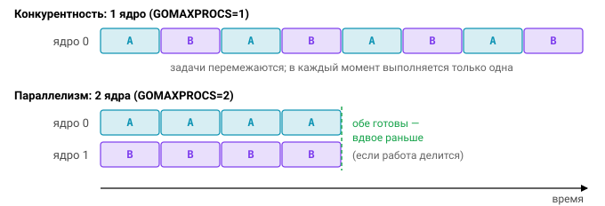
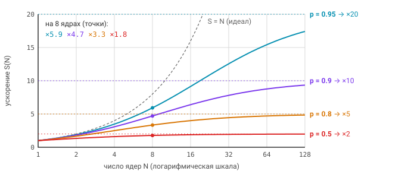

# Урок 1. Введение в параллельное программирование. Модель PMG

## Concurrency ≠ parallelism

Два слова, которые в русском языке легко слипаются в одно «параллельность», в Go означают разные вещи, и путать их — верный способ неверно оценить, что даст вашей программе ещё одно ядро.

**Конкурентность (concurrency)** — это способ *структурировать* программу как набор независимо выполняющихся задач, которые могут перемежаться во времени. Это свойство дизайна: вы решаете, из каких самостоятельных частей состоит работа. **Параллелизм (parallelism)** — это *одновременное* выполнение вычислений на нескольких ядрах, то есть свойство исполнения. Роб Пайк сформулировал разницу так:

> «Concurrency is about dealing with lots of things at once. Parallelism is about doing lots of
> things at once.» — Rob Pike, [Concurrency is not Parallelism](https://go.dev/blog/waza-talk)

Конкурентная программа, запущенная на одном ядре (`GOMAXPROCS=1`), остаётся конкурентной, но параллельной уже не является: задачи по-прежнему независимы, просто выполняются по очереди. Обратное почти всегда верно — параллельная программа конкурентна, иначе ей было бы нечего раскладывать по ядрам. Go даёт конкурентность дёшево, через горутины и каналы, а параллелизм достаётся бесплатно, если ядра есть и работа хорошо делится.



### Типы нагрузки

Сколько горутин имеет смысл запускать, зависит от того, во что упирается работа. Если она считает (хэши, сжатие, парсинг), потолок задают ядра. Если она ждёт (HTTP, БД, диск), потолок задаёт внешняя система, и горутин может быть на порядки больше.

| Нагрузка | Что ограничивает | Сколько горутин имеет смысл |
|---|---|---|
| CPU-bound (хэши, сжатие, парсинг) | число ядер | ≈ `GOMAXPROCS` |
| I/O-bound (HTTP, БД, диск) | латентность внешних систем | сотни–тысячи, ограничение — внешний ресурс |

## Закон Амдала

Прежде чем распараллеливать, полезно прикинуть, сколько вообще можно выиграть. Пусть доля $p$ программы параллелится идеально, а оставшаяся доля $1-p$ строго последовательна. Тогда ускорение на $N$ ядрах равно

$$
S(N) = \dfrac{1}{(1 - p) + \dfrac{p}{N}}
$$

а при бесконечном числе ядер параллельное слагаемое исчезает, и остаётся предел

$$
\lim_{N \to \infty} S(N) = \dfrac{1}{1 - p}.
$$

Цифры отрезвляют. При $p = 0.9$ даже бесконечность ядер даёт максимум $\times 10$, а при $p = 0.5$ — всего $\times 2$. Последовательная часть быстро становится узким местом, поэтому первое, что стоит делать, — искать её: глобальный мьютекс, запись всех результатов в один канал, аллокации.

Вторая поправка к идеальной картине в том, что у параллелизма есть собственные накладные расходы: запуск горутин, синхронизация, false sharing. На малых данных они перевешивают, и параллельная версия оказывается медленнее последовательной.

Наконец, у Амдала есть более оптимистичный оппонент — закон Густафсона. Он исходит из того, что с ростом числа ядер растёт и объём решаемой задачи, а последовательная часть остаётся примерно той же. Тогда ускорение масштабированной задачи растёт почти линейно: $S(N) = (1 - p) + p \cdot N$.



## Планировщик Go: модель G-M-P

Горутин в программе могут быть сотни тысяч, а потоков ОС столько не заведёшь. Поэтому Go использует **M:N-планирование**: множество горутин (G) выполняется на небольшом числе потоков ОС (M) через логические процессоры (P). Разберём участников по очереди.

**G (goroutine)** — это структура `runtime.g`: стек, указатель инструкции и статус (`_Grunnable`, `_Grunning`, `_Gwaiting`, `_Gsyscall`…). Создание горутины стоит порядка 1 мкс, стартовый стек — 2 КБ, а с Go 1.19 его начальный размер адаптивный и подбирается по среднему использованию.

**M (machine)** — это поток ОС. Чтобы выполнять Go-код, M обязан держать P. Потоков может оказаться больше, чем P, потому что часть из них бывает заблокирована в системных вызовах; их общее число ограничивает `debug.SetMaxThreads`, по умолчанию 10 000.

**P (processor)** — это «право исполнять Go-код» вместе с локальными ресурсами: локальной очередью runnable-горутин (кольцевой буфер на 256 элементов), кэшем аллокатора `mcache` и слотом `runnext`. Число P равно `GOMAXPROCS`.

Зачем нужен P, если можно было бы просто сопоставлять горутины потокам? Именно P позволяет большинству операций планировщика обходиться без глобальной блокировки: у каждого своя очередь и свой кэш аллокатора, а при блокирующем вызове P можно целиком передать другому потоку.

```
      global run queue (под мьютексом)
               │
   ┌───────────┼───────────┐
   P0 [G G G]  P1 [G]      P2 [ ]      ← local run queues
   │           │           │
   M0          M1          M2 ─→ (idle → steal)
   │           │           │
  ядро        ядро        ядро
```


### Как выбирается следующая G (`runtime.schedule` и `findRunnable`)

Когда потоку нужна следующая горутина, он проходит по источникам в фиксированном порядке:

1. Раз в 61 тик планировщик сначала заглядывает в **глобальную очередь**, чтобы она не голодала.
2. Затем берёт горутину из `runnext`, а если там пусто — из локальной очереди своего P.
3. Потом снова проверяет глобальную очередь и забирает оттуда сразу пачку.
4. Опрашивает **netpoller** — нет ли горутин, чьи сокеты стали готовы.
5. Прибегает к **work stealing**: крадёт половину локальной очереди у случайного другого P.
6. Если ничего не нашлось, M «паркуется». Число вращающихся (spinning) потоков, которые активно ищут работу, ограничено, чтобы они не жгли CPU впустую.

Инструкция `go f()` кладёт новую G в `runnext` текущего P, поэтому только что созданная горутина часто запускается следующей. Если же локальная очередь переполнена, половина её содержимого переезжает в глобальную.

Почему крадут именно половину? Это компромисс: вор получает достаточно работы, чтобы не возвращаться за ней сразу, а жертва не остаётся пустой.


### Системные вызовы и handoff

Блокирующий системный вызов, например `read` файла, блокирует поток M целиком. Если бы вместе с ним простаивал и P, вся его очередь горутин встала бы. Рантайм решает это так.

При входе в syscall горутина переходит в состояние `_Gsyscall`, а P — в `_Psyscall`; M при этом остаётся к нему привязан. Фоновый поток **sysmon** периодически проверяет такие P и, если P находится в syscall дольше одного тика sysmon (не меньше ~20 мкс, а если у P пустая очередь и есть простаивающие P — до 10 мс), отбирает его. Это и называется handoff: P отдаётся другому или новому M, который продолжает исполнять очередь. Когда syscall завершается, M пытается вернуть свой P, а если не выходит — взять любой свободный. Если свободных нет, горутина кладётся в глобальную очередь, а M засыпает.

Отсюда практическое следствие: программа, делающая много блокирующих syscalls, может держать гораздо больше потоков, чем `GOMAXPROCS`.


### Netpoller

С сетью история другая: сетевой I/O в Go вообще **не блокирует потоки**. Сокеты открываются в неблокирующем режиме, а ожидание готовности идёт через epoll в Linux, kqueue в macOS и IOCP в Windows. Горутина, которая читает из сокета без данных, паркуется в состоянии `_Gwaiting`, и M тут же берёт другую G. Когда netpoller сообщает, что данные пришли, горутина снова становится runnable.

Благодаря этому вы пишете обычный «синхронный» код с `conn.Read`, а получаете эффективность асинхронного сервера и можете держать 100 000 соединений — по горутине на каждое.


### Вытеснение (preemption)

До Go 1.14 вытеснение было **кооперативным**: горутину можно было переключить только в точке вызова функции, где пролог проверяет, не пора ли уступить. Цикл `for {}` без вызовов мог навсегда занять P и заодно заблокировать сборщик мусора, которому для stop-the-world нужно остановить все горутины.

В Go 1.14 появилось **асинхронное вытеснение**. Sysmon замечает горутину, которая работает дольше 10 мс, и посылает её потоку сигнал `SIGURG`; обработчик сигнала останавливает горутину в безопасной точке и возвращает её в очередь. Пример ниже раньше зависал навсегда, а сейчас спокойно печатает `done`:

```go
// До 1.14 с GOMAXPROCS=1 зависало навсегда; сейчас печатает "done".
runtime.GOMAXPROCS(1)
go func() { for {} }()
time.Sleep(10 * time.Millisecond)
fmt.Println("done")
```

У механизма есть побочный эффект: из-за сигналов системные вызовы могут возвращать `EINTR`. Стандартная библиотека это обрабатывает, но если вы работаете с syscalls напрямую, держите это в голове.


### GOMAXPROCS

По умолчанию `GOMAXPROCS` равен `runtime.NumCPU()`, то есть числу доступных ядер с учётом CPU affinity. Вызов `runtime.GOMAXPROCS(0)` только читает текущее значение, а `runtime.GOMAXPROCS(n)` устанавливает новое, и это приводит к остановке мира (STW). Задать значение снаружи можно переменной окружения: `GOMAXPROCS=4 ./app`.

Главная ловушка — контейнеры. В Go 1.23 рантайм *не* учитывает CPU-квоту cgroup (`cpu.max`), поэтому в поде с `limits.cpu: 2` на 64-ядерной ноде вы получите `GOMAXPROCS=64`. Шестьдесят четыре потока будут бороться за квоту в два ядра, и ядро ОС начнёт троттлить процесс. Лечится это ручной установкой `GOMAXPROCS` или библиотекой `go.uber.org/automaxprocs`. В Go 1.25 учёт cgroup-лимитов наконец появился в самом рантайме.

Для CPU-bound задач число воркеров стоит брать примерно равным `GOMAXPROCS(0)`: больше воркеров не ускорят работу, а только добавят лишних переключений.

## Стек горутины

Миллион горутин — это реальность, а миллион потоков — нет. Разница в стеке: у потока ОС он занимает 1–8 МБ, а горутина стартует с 2 КБ, так что миллион горутин укладывается примерно в 2–4 ГБ.

Маленький стек должен уметь расти, и в Go он **растёт копированием** (contiguous stacks, с Go 1.3; в Go 1.4 стартовый размер уменьшили с 8 до 2 КБ). Пролог каждой функции проверяет условие `sp < stackguard`. Если места мало, вызывается `runtime.morestack`: он выделяет стек вдвое больше, копирует туда содержимое и исправляет указатели, которые смотрели внутрь старого стека. Раньше в Go были «сегментированные» стеки, но от них отказались из-за проблемы hot split: функция на границе сегмента в горячем цикле раз за разом выделяла и освобождала новый сегмент.

Работает и обратное направление: во время сборки мусора стек может **сжаться**, если используется меньше $\tfrac{1}{4}$ его объёма. Верхний предел — 1 ГБ на 64-битных системах. Его превышение (как правило, из-за бесконечной рекурсии) заканчивается `fatal error: stack overflow`. Это не `panic`, и перехватить его через `recover` нельзя.

У копирования есть неочевидное следствие: адреса переменных на стеке могут меняться. Именно поэтому указатели на стек нельзя сохранять в `uintptr` — после переезда стека такое число будет указывать в никуда.


## Инструменты наблюдения

Увидеть планировщик в работе проще всего через `GODEBUG` и трассировщик:

```bash
GODEBUG=schedtrace=1000 ./app           # раз в секунду: gomaxprocs, idleprocs, threads, runqueue
GODEBUG=schedtrace=1000,scheddetail=1 ./app
go test -trace trace.out && go tool trace trace.out   # визуализация G/P/M во времени
```

Для поиска утечек пригодятся `runtime.NumGoroutine()`, `runtime.NumCPU()` и профиль `goroutine` из `pprof`.

## Типичные ошибки

Самое частое заблуждение — считать, что больше горутин значит быстрее. Для CPU-bound работы выше `GOMAXPROCS` роста нет. Рядом с ним стоит использование `runtime.NumCPU()` в контейнере с квотой: число получится честным для ноды, но не для вашего пода. Третья ошибка — параллелить мелкую работу, где накладные расходы съедают весь выигрыш; здесь спасают только бенчмарки.

Отдельного упоминания заслуживает **false sharing**. Если горутины часто пишут в соседние элементы массива, которые попадают в одну кэш-линию (64 байта), ядра постоянно инвалидируют кэш друг друга, и параллельный код ползёт медленнее последовательного. Лекарство простое: копите результат в локальной переменной и записывайте его в общий массив один раз.

## Вопросы с собеседований

1. Чем конкурентность отличается от параллелизма? Приведите пример программы, которая конкурентна, но не параллельна.
2. Что такое G, M и P? Зачем вообще нужен P, почему нельзя обойтись схемой G:M? Подсказка: локальные очереди без глобальной блокировки, `mcache`, handoff при системных вызовах.
3. Что происходит, когда горутина делает блокирующий syscall? А когда читает из сетевого сокета?
4. Как работает work stealing и почему крадут именно половину очереди?
5. Что изменилось в Go 1.14 с появлением асинхронного вытеснения и как оно реализовано (sysmon, `SIGURG`)?
6. Какой начальный размер у стека горутины, как он растёт и есть ли у него предел?
7. Чему равен `GOMAXPROCS` по умолчанию и какая с ним проблема в Kubernetes?
8. По закону Амдала: если параллелится 80% кода, какое максимальное ускорение можно получить? (Ответ: $\tfrac{1}{1 - 0.8} = 5$, то есть $\times 5$.)

## Ссылки

- [Scalable Go Scheduler Design Doc](https://golang.org/s/go11sched) (Д. Вьюков)
- `src/runtime/proc.go` — комментарий в начале файла описывает модель
- [runtime package](https://pkg.go.dev/runtime), [GODEBUG](https://go.dev/doc/godebug)
- [Go 1.14 release notes: goroutine preemption](https://go.dev/doc/go1.14#runtime)
- [Contiguous stacks design](https://go.dev/s/contigstacks)

## Практика

- [01_parsum](../tasks/01_parsum/) — параллельная сумма и подсчёт по чанкам с числом воркеров по `GOMAXPROCS`.
