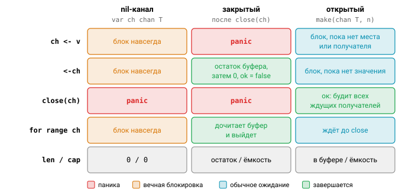

# Урок 4. Concurrency в Go: каналы и паттерны

> «Don't communicate by sharing memory; share memory by communicating.»

Эта пословица Go объясняет, почему каналы стоят в языке на таком видном месте. Вместо того чтобы защищать общие данные замками, горутины передают данные друг другу, и в каждый момент значением владеет кто-то один. В этом уроке разберём, как устроены каналы, какие операции над ними опасны и какие паттерны из них складываются.

## Каналы

Канал создаётся через `make`, может быть буферизованным или нет, а его тип можно сузить до направленного, чтобы компилятор не дал записать туда, откуда положено только читать:

```go
ch := make(chan int)      // небуферизованный: отправка ждёт получателя (рандеву)
bc := make(chan int, 10)  // буферизованный: отправка блокируется, только когда буфер полон
var nc chan int           // nil-канал
var recvOnly <-chan int = ch  // направленные типы: компилятор запрещает запись/close
var sendOnly chan<- int = ch
len(bc), cap(bc)          // элементов в буфере / ёмкость (для небуферизованного — 0)
```

Внутри канал — это структура `runtime.hchan`: кольцевой буфер, мьютекс и две очереди ждущих горутин, отправителей (`sendq`) и получателей (`recvq`). Когда отправитель и получатель встречаются (рандеву), значение копируется **напрямую** со стека отправителя на стек получателя, минуя буфер.


Отсюда разница в назначении. Небуферизованный канал — прежде всего инструмент **синхронизации**: обе стороны гарантированно встречаются в одной точке. Буфер же нужен для развязки по скорости между производителем и потребителем. Не используйте его как лекарство от дедлока: если программа зависала без буфера, с буфером она, скорее всего, просто зависнет чуть позже.


## Таблица операций

Поведение канала зависит от его состояния, и эту таблицу стоит знать наизусть: на собеседованиях её просят нарисовать очень часто.

| Операция | `nil`-канал | закрытый | открытый |
|---|---|---|---|
| `ch <- v` | блок навсегда | **panic** | блок / успех |
| `<-ch` | блок навсегда | нулевое значение сразу (`v, ok` → `ok == false`), сначала дочитывается буфер | блок / значение |
| `close(ch)` | **panic** | **panic** | ок |
| `len/cap` | 0 | остаток буфера / ёмкость | … |
| `for range ch` | блок навсегда | дочитывает буфер и выходит | ждёт до закрытия |



## Кто закрывает канал

Раз запись в закрытый канал вызывает панику, должно быть ясно, кто и когда его закрывает. Правило простое: закрывает **отправитель**, то есть владелец канала, и никогда — получатель. Полезно помнить, что закрытие — это сигнал «данных больше не будет», а не освобождение ресурса. Незакрытый канал, на который никто не ссылается, спокойно соберёт GC, поэтому закрывать стоит только тогда, когда получателю действительно нужно узнать о конце потока — через `range` или флаг `ok`.

Сложнее, когда отправителей несколько. Тогда закрывает отдельная координирующая горутина после `wg.Wait()` (как в fan-in ниже), либо сигнал останова передаётся иначе — через отдельный `done`-канал или контекст. А чтобы потребитель физически не мог закрыть канал, возвращайте из функций тип `<-chan T`.

## select

`select` ждёт сразу несколько канальных операций и выполняет ту, что готова первой. Вот почти все его возможности в одном фрагменте:

```go
select {
case v, ok := <-in:
	if !ok { in = nil; break } // закрытый канал отключаем, присвоив nil
	use(v)
case out <- x:
case <-ctx.Done():
	return ctx.Err()
case <-time.After(time.Second): // таймаут
default: // неблокирующая операция: выполнится, если ни одна ветка не готова
}
```

Если готово несколько веток, `select` выбирает **случайную**, равномерно. Приоритетов у веток нет; если он нужен, сделайте отдельную проверку перед `select`, например `if ctx.Err() != nil { return }`. Пустой `select {}` блокирует горутину навсегда.

Очень полезное свойство: **nil-канал в `select` никогда не выбирается**. Этим пользуются, чтобы динамически отключать ветки. Например, когда при слиянии двух каналов один из входов закрылся, его переменной присваивают `nil`, и дальше `select` работает только со вторым.

С `time.After` в цикле надо быть осторожнее. До Go 1.23 каждый вызов создавал таймер, который не собирался до срабатывания, и в горячем цикле это было утечкой. С 1.23 неиспользуемые таймеры собирает GC, но в горячем цикле всё равно лучше завести один `time.NewTimer` и вызывать `Reset`.

И последняя тонкость: выражения во всех ветках, например `out <- f()`, вычисляются **до** выбора. Значит, `f()` вызовется, даже если в итоге выбрана другая ветка.

## Паттерны

Из каналов и `select` складывается небольшой набор приёмов, которые встречаются в любом конкурентном коде на Go. Разберём их по порядку.

### Generator

Генератор — функция, которая запускает горутину, производящую значения, и возвращает канал для их чтения. Горутина закрывает канал, когда значения кончились, и выходит досрочно, если контекст отменён:

```go
func gen(ctx context.Context, nums ...int) <-chan int {
	out := make(chan int)
	go func() {
		defer close(out)
		for _, n := range nums {
			select {
			case out <- n:
			case <-ctx.Done():
				return
			}
		}
	}()
	return out
}
```

### Pipeline

Конвейер — это цепочка стадий вроде `gen`, `sq`, `print`, где каждая стадия работает в своей горутине, а соседние связаны каналами. В статье [go.dev/blog/pipelines](https://go.dev/blog/pipelines) сформулированы два правила, на которых держится корректность: стадия закрывает свой выход, когда все отправки сделаны, и читает вход до закрытия **или** до отмены.


### Fan-out / Fan-in

Когда одна стадия не успевает, её размножают: несколько воркеров читают один и тот же входной канал (fan-out). Результаты потом нужно собрать обратно в один канал (fan-in). Слияние делается по горутине на каждый вход, а выход закрывает отдельная горутина, когда все пересылающие закончили:

```go
// fan-out: несколько воркеров читают один канал
c1, c2 := sq(ctx, in), sq(ctx, in)
// fan-in: слияние
func merge(ctx context.Context, cs ...<-chan int) <-chan int {
	out := make(chan int)
	var wg sync.WaitGroup
	wg.Add(len(cs))
	for _, c := range cs {
		go func() {
			defer wg.Done()
			for v := range c {
				select {
				case out <- v:
				case <-ctx.Done():
					return
				}
			}
		}()
	}
	go func() { wg.Wait(); close(out) }()
	return out
}
```


### Worker pool

Пул воркеров — это фиксированное число горутин, которые разбирают задачи из общего канала и складывают результаты в общий канал; тот закрывается после `wg.Wait()`. Главная ценность пула в том, что он ограничивает и параллелизм, и общее число горутин. Реализовать его целиком предстоит в задаче 06.

### Semaphore

Если задачи удобнее запускать по горутине на каждую, но одновременно их должно работать не больше заданного числа, пригодится семафор на буферизованном канале:

```go
sem := make(chan struct{}, 10) // не более 10 одновременно
for _, t := range tasks {
	sem <- struct{}{}           // занять слот (блок, если занято 10)
	go func() {
		defer func() { <-sem }() // освободить
		do(t)
	}()
}
```

Почему это корректный семафор, а не просто удачное совпадение? Модель памяти гарантирует, что $k$-й приём из канала ёмкости $C$ происходит раньше (happens-before), чем завершается $(k+C)$-я отправка. Иначе говоря, новая горутина не займёт слот, пока одна из прежних его не освободила. Если нужен взвешенный семафор с поддержкой контекста, возьмите `golang.org/x/sync/semaphore`.


### Or-done

Бывает, что вы читаете из чужого канала через `range` и хотите иметь возможность прервать чтение по отмене. Паттерн or-done оборачивает такой канал в свой, который закрывается либо вместе с исходным, либо по `done`:

```go
func orDone[T any](ctx context.Context, c <-chan T) <-chan T {
	out := make(chan T)
	go func() {
		defer close(out)
		for {
			select {
			case <-ctx.Done():
				return
			case v, ok := <-c:
				if !ok { return }
				select {
				case out <- v:
				case <-ctx.Done():
					return
				}
			}
		}
	}()
	return out
}
```

### Tee

Tee раздваивает поток: каждое входное значение нужно отправить в **оба** выхода, причём в любом порядке, какой из получателей будет готов первым. Трюк в том, чтобы завести локальные копии каналов и обнулять их после отправки; благодаря правилу про nil-каналы отработавшая ветка больше не будет выбрана.

```go
for v := range orDone(ctx, in) {
	o1, o2 := out1, out2
	for range 2 {
		select {
		case o1 <- v: o1 = nil // nil — ветка больше не выбирается
		case o2 <- v: o2 = nil
		case <-ctx.Done(): return
		}
	}
}
```

### Rate limiting через time.Ticker

Простейший ограничитель частоты — тикер: перед каждым запросом ждём очередного тика. Если нужно разрешить короткие всплески, поверх тикера строят token bucket на буферизованном канале:

```go
tick := time.NewTicker(100 * time.Millisecond) // 10 запросов/с
defer tick.Stop()                              // до 1.23 обязательно, иначе утечка тикера
for _, req := range reqs {
	<-tick.C
	go handle(req)
}

// Bursty: token bucket на буферизованном канале
tokens := make(chan struct{}, 5) // допускаем всплеск до 5
for range 5 { tokens <- struct{}{} }
go func() {
	for range tick.C {
		select { case tokens <- struct{}{}: default: } // корзина полна — токен теряется
	}
}()
```

В продакшене вместо самодельных решений используют `golang.org/x/time/rate`: `rate.NewLimiter(r, burst)` с методами `Wait(ctx)` и `Allow()`.

### Паттерн «done»-канал и сигнал broadcast

Закрытие канала будит **всех**, кто читает из него `<-done`, поэтому `close(done)` — самый дешёвый способ разослать сигнал сразу многим горутинам. Ровно так устроен `ctx.Done()`, к которому мы придём в следующем уроке.

## Типичные ошибки

Большинство ошибок с каналами сводится к нарушению правил владения. «Опоздавший» воркер пишет в уже закрытый канал — значит, закрывать надо после `wg.Wait()`. Двойной `close` вызывает панику, поэтому, если закрытие может произойти из нескольких мест, оберните его в `sync.Once`. Цикл `for v := range ch` по каналу, который никто не закроет, блокируется навсегда и становится утечкой.

Отдельно стоит запомнить связку «небуферизованный канал результата плюс ранний возврат по таймауту»: получатель ушёл, а горутина-отправитель навсегда застряла на отправке. И совсем простой, но частый дедлок в одной горутине: `ch := make(chan int); ch <- 1; <-ch` — отправка ждёт получателя, который никогда не наступит.

## Вопросы с собеседований

1. Нарисуйте таблицу операций над nil-каналом, закрытым и открытым каналом.
2. Какую ветку выберет `select`, если готовы несколько? Как сделать приоритет?
3. Зачем может понадобиться nil-канал в `select`?
4. Кто должен закрывать канал? Как закрыть канал, в который пишут несколько отправителей?
5. Как канал устроен внутри (`hchan`) и где хранится его буфер?
6. Реализуйте на каналах семафор, пул воркеров или fan-in.
7. Что выбрать: буферизованный канал ёмкости 1 или мьютекс?

## Ссылки

- [Spec: Channel types](https://go.dev/ref/spec#Channel_types), [Select statements](https://go.dev/ref/spec#Select_statements)
- [Go Concurrency Patterns: Pipelines and cancellation](https://go.dev/blog/pipelines)
- [Advanced Go Concurrency Patterns](https://go.dev/talks/2013/advconc.slide)
- К. Кокс-Будэй, «Concurrency in Go» (O'Reilly) — or-done, tee, bridge

## Практика

- [05_pipeline](../tasks/05_pipeline/) — конвейер из стадий Generate, Square и Merge с fan-out/fan-in и отменой.
- [06_workerpool](../tasks/06_workerpool/) — пул воркеров с результатами и отменой.
