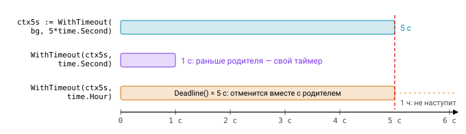

# Урок 5. Контекст (Context)

Представьте HTTP-запрос, который обращается к базе и к двум внешним сервисам. Клиент ушёл, не дождавшись ответа. Как сообщить всем горутинам, работающим над этим запросом, что можно остановиться? И как ограничить общее время запроса, чтобы каждый вложенный вызов знал, сколько у него осталось? Для этого в Go есть `context.Context`.

Контекст переносит через границы API три вещи: **сигнал отмены**, **дедлайн** и **значения уровня запроса** (request-scoped), такие как trace id или текущий пользователь. Сам интерфейс крошечный:

```go
type Context interface {
	Deadline() (deadline time.Time, ok bool)
	Done() <-chan struct{} // закрывается при отмене; nil, если контекст неотменяем
	Err() error            // nil, пока Done не закрыт; затем Canceled или DeadlineExceeded
	Value(key any) any
}
```

## Дерево контекстов

Контексты образуют дерево: каждый вызов `With*` создаёт **дочерний** узел от переданного родителя. Отмена распространяется только вниз. Отменили родителя — каскадно отменились все его потомки; отменили потомка — ни родитель, ни соседние ветки этого не заметят.

```
Background
 └─ WithTimeout(5s)           ← запрос HTTP
     ├─ WithValue(traceID)
     │   └─ WithCancel         ← запрос в БД
     └─ WithTimeout(1s)        ← вызов внешнего API (итоговый дедлайн = min(1s, остаток 5s))
```


В корне дерева всегда стоит один из двух пустых контекстов. `context.Background()` используют в `main`, `init` и тестах, а `context.TODO()` — как заглушку в местах, где вы ещё не решили, какой контекст передавать. Оба никогда не отменяются, и их `Done()` возвращает `nil`.

## Конструкторы

Отменяемые контексты создаются тремя конструкторами, и каждый из них, помимо самого контекста, возвращает функцию `cancel`. Вызывать её нужно всегда, даже если вы уверены, что контекст «сам истечёт»:

```go
ctx, cancel := context.WithCancel(parent)
ctx, cancel := context.WithTimeout(parent, 2*time.Second)
ctx, cancel := context.WithDeadline(parent, time.Now().Add(2*time.Second))
defer cancel() // всегда, даже если контекст «сам истечёт»

ctx := context.WithValue(parent, userKey{}, u)
```

Почему так строго? Если `cancel` не вызвать, дочерний контекст останется висеть в списке `children` родителя до тех пор, пока не отменят самого родителя, а у `WithTimeout` и `WithDeadline` вдобавок будет жить таймер, пока не истечёт срок. Это **утечка**, и `go vet` с анализатором lostcancel предупреждает о потерянном `cancel`. Сама функция `cancel()` идемпотентна и потокобезопасна, так что лишний вызов ничему не вредит.

Дедлайн потомка не может оказаться позже дедлайна родителя. Если у родителя осталось 5 секунд, то `WithTimeout(ctx5s, time.Hour)` всё равно истечёт через 5 с. После отмены `Err()` возвращает одно из двух значений: `context.Canceled`, если был вызван `cancel`, или `context.DeadlineExceeded`, если истёк срок. Второе реализует `net.Error` и отвечает `Timeout() == true`.



### Go 1.20–1.21: причины и отвязка

Долгое время по `ctx.Err()` можно было понять только сам факт отмены, но не её причину. В Go 1.20 и 1.21 пакет заметно подрос: появились контексты с причиной отмены, способ отвязаться от отмены родителя и колбэк на отмену.

```go
ctx, cancel := context.WithCancelCause(parent)
cancel(errBadInput)
ctx.Err()            // context.Canceled — как и раньше
context.Cause(ctx)   // errBadInput — причина

ctx, cancel := context.WithTimeoutCause(parent, d, errSlowUpstream) // (1.21)
ctx, cancel := context.WithDeadlineCause(parent, t, cause)          // (1.21)

// Отвязать от отмены родителя, сохранив значения (1.21):
bg := context.WithoutCancel(ctx) // для фоновой работы после ответа клиенту: аудит, запись в кэш

// Колбэк при отмене (1.21): запускается в своей горутине
stop := context.AfterFunc(ctx, func() { conn.SetDeadline(time.Now()) })
defer stop() // stop() == true — отменили регистрацию до срабатывания
```

Несколько деталей, которые легко упустить. Для контекста без причины `context.Cause(ctx)` возвращает то же, что `ctx.Err()`. Вызов `cancel(nil)` у `WithCancelCause` записывает в качестве причины `context.Canceled`. А `AfterFunc` оказывается удобным мостом к API, которые ничего не знают о контексте, — сокетам или `sync.Cond`: он позволяет сказать «при отмене разбуди вот это».

## Как это устроено

Реализация контекста короткая и хорошо читается. Отменяемый контекст `cancelCtx` хранит мьютекс `mu`, лениво создаваемый канал `done` (в `atomic.Value`), map `children`, а также `err` и `cause`.

Связь с родителем устанавливает функция `propagateCancel`. Если родитель — «свой» `cancelCtx` из стандартной библиотеки, потомок просто регистрируется в его `children`. Если родитель — чужая реализация `Context`, приходится запускать отдельную горутину, которая ждёт `parent.Done()`. Сама отмена выполняется в три шага: закрыть `done` (это и есть broadcast всем ждущим), рекурсивно отменить детей и удалить себя из родителя.

Остальные виды строятся поверх. `timerCtx` — это `cancelCtx` плюс `time.AfterFunc`. `valueCtx` — узел односвязного списка: `Value` идёт вверх по цепочке родителей, сравнивая ключи, поэтому поиск занимает $O(d)$, где $d$ — глубина цепочки. Это ещё одна причина не складывать в контекст много данных.


## Правила использования

У контекста сложились устойчивые соглашения, и код, который их нарушает, сразу бросается в глаза на ревью:

1. Контекст передаётся **первым аргументом** функции и называется `ctx`: `func Do(ctx context.Context, ...)`.
2. **Не храните контекст в структурах** — передавайте его явно в каждый вызов. Исключение составляют структуры-«запросы» вроде `http.Request` и обёртки, которые живут ровно одну операцию.
3. Никогда не передавайте `nil` вместо контекста; если подходящего нет, используйте `context.TODO()`.
4. Ключом для `WithValue` должен быть **неэкспортируемый собственный тип** — так ключи разных пакетов не столкнутся:
   ```go
   type ctxKey struct{}
   func WithUser(ctx context.Context, u *User) context.Context { return context.WithValue(ctx, ctxKey{}, u) }
   func UserFrom(ctx context.Context) (*User, bool) { u, ok := ctx.Value(ctxKey{}).(*User); return u, ok }
   ```
   Вызов `WithValue(ctx, "user", u)` со строковым ключом — анти-паттерн, его ловит staticcheck (SA1029).
5. `Value` предназначен только для request-scoped данных, которые пересекают границы API. Опциональные параметры функций, логгеры-зависимости и подключения к БД туда **не** кладут.
6. Кто создал отменяемый контекст, тот и вызывает `cancel`, обычно через `defer cancel()`.
7. Контекст неизменяем и безопасен для конкурентного использования.
8. Отмена кооперативна: функция должна сама проверять `ctx.Done()` или `ctx.Err()` в долгих циклах и передавать `ctx` во все вызовы ввода-вывода.

## Идиомы

Несколько приёмов встречаются настолько часто, что их стоит держать под рукой: прерываемый sleep, проверка отмены в CPU-цикле (не на каждой итерации, а раз в тысячу), таймаут поверх контекста HTTP-запроса и graceful shutdown по сигналу.

```go
// Прерываемый sleep
func sleep(ctx context.Context, d time.Duration) error {
	t := time.NewTimer(d)
	defer t.Stop()
	select {
	case <-t.C:
		return nil
	case <-ctx.Done():
		return ctx.Err()
	}
}

// Проверка в CPU-цикле
for i, item := range items {
	if i%1000 == 0 && ctx.Err() != nil {
		return ctx.Err()
	}
	process(item)
}

// HTTP: контекст запроса отменяется, когда клиент разорвал соединение
func handler(w http.ResponseWriter, r *http.Request) {
	ctx, cancel := context.WithTimeout(r.Context(), 2*time.Second)
	defer cancel()
	rows, err := db.QueryContext(ctx, q)
	...
}

// Graceful shutdown по сигналу
ctx, stop := signal.NotifyContext(context.Background(), os.Interrupt, syscall.SIGTERM)
defer stop()
```

## Типичные ошибки

Самая частая ошибка — выбросить `cancel`: `ctx, _ := context.WithTimeout(...)`. Таймер при этом живёт до истечения срока, а vet справедливо ругается. Коварнее выглядит `defer cancel()` внутри цикла: отложенные вызовы копятся до выхода из функции, и все контексты живут дольше, чем нужно. Лечится это выносом тела цикла в отдельную функцию.

Ошибки отмены почти всегда приходят обёрнутыми — `net/http`, например, возвращает `Get "...": context deadline exceeded`. Поэтому сравнение `err == context.Canceled` не сработает, и проверять нужно через `errors.Is(err, context.Canceled)`.

Ещё одна ловушка — фоновая работа на контексте HTTP-запроса. Как только ответ отправлен, контекст отменяется, а вместе с ним и ваша работа. Здесь нужен `context.WithoutCancel(r.Context())`. И наконец, ожидание `<-ctx.Done()` у `context.Background()` блокирует навсегда, потому что его канал равен `nil`.

## Вопросы с собеседований

1. Как отмена распространяется по дереву контекстов? Может ли потомок отменить родителя?
2. Зачем вызывать `cancel`, если таймаут и так истечёт сам?
3. Почему не стоит использовать `string` в качестве ключа `WithValue`? Какова сложность поиска в `Value`?
4. Чем `Err()` отличается от `Cause()` и что возвращает `Cause`, если причина не задана?
5. В каких ситуациях нужен `WithoutCancel`, а в каких — `AfterFunc`?
6. Почему контекст не принято хранить в структуре?
7. Как отменить операцию, которая не принимает контекст? (Горутина плюс `select`, либо `AfterFunc` плюс дедлайн на сокете.)

## Ссылки

- [context](https://pkg.go.dev/context)
- [Go Concurrency Patterns: Context](https://go.dev/blog/context)
- [Contexts and structs](https://go.dev/blog/context-and-structs)
- Исходник: `src/context/context.go` — ~800 строк, читается за вечер

## Практика

- [07_retry](../tasks/07_retry/) — `Retry` с экспоненциальным backoff, прерываемый контекстом, и `DoWithTimeout`.
