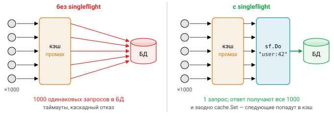

# Урок 6. Concurrency в Go: errgroup, singleflight

Некоторые конкурентные задачи повторяются так часто, что для них есть готовые решения. Модуль [`golang.org/x/sync`](https://pkg.go.dev/golang.org/x/sync) — «полустандартная» библиотека от команды Go, в которой лежат `errgroup`, `singleflight`, `semaphore` и `syncmap`. Подключается он как обычная зависимость:

```bash
go get golang.org/x/sync@latest
```

> В этом курсе внешние зависимости недоступны, поэтому ниже — реальный API x/sync, а в задачах
> 08 и 09 вы реализуете его аналоги сами.

## errgroup

Вспомните, чего не хватает `sync.WaitGroup` в реальном коде. Горутины возвращают ошибки, и хочется получить хотя бы первую из них. Когда одна горутина упала, остальные хорошо бы остановить. А ещё часто нужно, чтобы одновременно работало не больше $n$ горутин. `errgroup` — это ровно `WaitGroup` плюс сбор первой ошибки, плюс отмена контекста, плюс ограничение параллелизма.

```go
import "golang.org/x/sync/errgroup"

type Group struct{ /* ... */ }                               // нулевое значение пригодно
func WithContext(ctx context.Context) (*Group, context.Context)
func (g *Group) Go(f func() error)
func (g *Group) TryGo(f func() error) bool
func (g *Group) SetLimit(n int)
func (g *Group) Wait() error
```

### Пример: параллельная загрузка с отменой при первой ошибке

Типичный сценарий выглядит так: скачать список URL не более чем в восемь потоков и прекратить всё при первой же ошибке. Обратите внимание, что каждая горутина пишет в свою ячейку среза, поэтому мьютекс не нужен.

```go
func fetchAll(ctx context.Context, urls []string) ([][]byte, error) {
	g, ctx := errgroup.WithContext(ctx) // ctx затеняется намеренно
	g.SetLimit(8)                       // не больше 8 одновременных запросов
	results := make([][]byte, len(urls))
	for i, u := range urls {
		g.Go(func() error {             // при достижении лимита Go блокируется
			body, err := fetch(ctx, u)  // ctx отменится, как только кто-то вернёт ошибку
			if err != nil {
				return fmt.Errorf("fetch %s: %w", u, err)
			}
			results[i] = body           // свой индекс — без мьютекса
			return nil
		})
	}
	if err := g.Wait(); err != nil {    // первая ошибка; остальные отбрасываются
		return nil, err
	}
	return results, nil
}
```


### Семантика

`Wait` дожидается **всех** горутин, даже если ошибка уже случилась, и возвращает **первую** ненулевую ошибку; остальные теряются. Если вам нужны все ошибки, собирайте их сами, например через `errors.Join` под мьютексом.

Контекст, полученный из `WithContext`, отменяется в двух случаях: при первой ошибке **или** когда `Wait` вернул управление. Поэтому пользоваться им после `Wait` нельзя. Реализован он через `WithCancelCause`, и причина отмены, которую вернёт `context.Cause(ctx)`, — та самая первая ошибка. При этом отмена остаётся кооперативной: errgroup не «убивает» горутины, функции сами должны слушать `ctx`.

С лимитом тоже есть свои правила. `SetLimit(n)` с отрицательным `n` снимает ограничение, а изменение лимита, пока в группе есть активные горутины, вызывает **панику**. `SetLimit(0)` приведёт к тому, что любой `Go` заблокируется навсегда. Если блокироваться не хочется, есть `TryGo` — неблокирующий вариант `Go`, который возвращает `false`, когда лимит исчерпан. Внутри лимит реализован семафором на `chan struct{}`, а фиксация первой ошибки — через `sync.Once`. Нулевое значение `errgroup.Group{}` тоже пригодно к работе: это просто `WaitGroup` с первой ошибкой, без контекста.

Поведение при панике в `f` зависит от версии x/sync. В старых версиях (например, v0.10.0) паника, как в любой горутине, роняет процесс. В новых (например, v0.15.0, 2025 год) errgroup перехватывает панику, отменяет контекст и повторно паникует уже в `Wait` значением `PanicError` или `PanicValue` со стеком. В задаче 08 вы реализуете классическое поведение, без перехвата.

### errgroup vs WaitGroup vs worker pool

Какой инструмент брать, зависит от того, что именно вам нужно:

| Нужно | Инструмент |
|---|---|
| дождаться, ошибок нет | `sync.WaitGroup` |
| первая ошибка + отмена остальных | `errgroup.WithContext` |
| ограничить параллелизм | `g.SetLimit(n)` или `semaphore.Weighted` |
| стрим задач неизвестной длины, результаты по мере готовности | worker pool на каналах |

### Pipeline на errgroup

Стадии конвейера удобно запускать в одной группе. Тогда ошибка в любой стадии отменяет общий `ctx`, и все остальные стадии выходят по `ctx.Done()`, не требуя отдельной координации:

```go
g, ctx := errgroup.WithContext(ctx)
paths := make(chan string)
g.Go(func() error { defer close(paths); return walk(ctx, root, paths) })
for range 4 {
	g.Go(func() error { return hashFiles(ctx, paths, results) })
}
err := g.Wait()
```

## singleflight

Вторая задача из той же библиотеки — подавление дублирующихся **одновременных** вызовов. Пока для некоторого ключа выполняется `fn`, все остальные вызовы с тем же ключом не запускают её заново, а ждут и получают тот же результат.

```go
import "golang.org/x/sync/singleflight"

type Group struct{ /* ... */ }
func (g *Group) Do(key string, fn func() (interface{}, error)) (v interface{}, err error, shared bool)
func (g *Group) DoChan(key string, fn func() (interface{}, error)) <-chan Result
func (g *Group) Forget(key string)

type Result struct {
	Val    interface{}
	Err    error
	Shared bool
}
```


### Защита от cache stampede

Где это нужно на практике? Представьте, что у популярного ключа в кэше истёк срок. В тот же момент тысячи запросов промахиваются мимо кэша и одновременно идут в базу — это называют «эффектом толпы», cache stampede или thundering herd. Singleflight превращает эту тысячу обращений в **один** запрос:

```go
var sf singleflight.Group

func (s *Service) GetUser(ctx context.Context, id string) (*User, error) {
	if u, ok := s.cache.Get(id); ok {
		return u, nil
	}
	v, err, _ := sf.Do("user:"+id, func() (interface{}, error) {
		u, err := s.db.LoadUser(context.WithoutCancel(ctx), id) // см. ниже про ctx
		if err == nil {
			s.cache.Set(id, u, time.Minute)
		}
		return u, err
	})
	if err != nil {
		return nil, err
	}
	return v.(*User), nil
}
```



### Подводные камни

Первое, что нужно понять: **singleflight не кэширует результат**. Как только `fn` завершилась, следующий `Do` вызовет её снова. Singleflight дополняет кэш, а не заменяет его, — поэтому в примере выше результат явно кладётся в `s.cache`.

Второй камень — **контекст лидера**. Функция `fn` выполняется с контекстом того вызывающего, который пришёл первым. Если его запрос отменят, все ждущие получат `context.Canceled`, хотя их собственные запросы живы. Помогают два приёма: для общей работы использовать `context.WithoutCancel` (добавив собственный таймаут), а каждому ждущему — `DoChan` и `select` со своим `ctx.Done()`:

  ```go
  ch := sf.DoChan(key, fn)
  select {
  case r := <-ch:
  	return r.Val, r.Err
  case <-ctx.Done():
  	return nil, ctx.Err() // уходим, но общая загрузка продолжается для остальных
  }
  ```

Ошибки «размножаются» так же, как и успешные результаты: одна временная ошибка достанется всем ждущим. Долгий или зависший `fn` блокирует всех, кто пришёл за тем же ключом. На этот случай есть `Forget(key)`: он позволяет следующим вызовам начать работу заново, не дожидаясь старой (например, по таймауту). Тех, кто уже ждёт старого вызова, `Forget` не освобождает.

Разделяемое значение **одно на всех**. Если это срез или указатель, вызывающие не должны его модифицировать — или должны сначала сделать копию.

Паника в `fn` обрабатывается так, чтобы процесс не завис молча: x/sync повторно паникует во всех ждущих `Do`, а для `DoChan` паникует в новой горутине, чтобы процесс упал, а не завис. Если же `fn` вызвала `runtime.Goexit`, ждущие `Do` тоже завершаются через `Goexit`, а получатели `DoChan` результата не получают.

Флаг `shared` означает, что результат получили несколько вызывающих; он полезен для метрик. Наконец, ключ в x/sync — это `string`, и дженериков там пока нет. В задаче 09 мы сделаем обобщённую версию `Group[K comparable, V any]`.

### Как устроено

Внутри singleflight удивительно прост: map из ключа в структуру `call`, защищённая мьютексом, и `WaitGroup` в каждом `call`.

```go
type call struct {
	wg    sync.WaitGroup // ждущие Do блокируются на wg.Wait()
	val   interface{}
	err   error
	dups  int
	chans []chan<- Result
}
type Group struct {
	mu sync.Mutex
	m  map[string]*call // ленивая инициализация
}
```

`Do` под мьютексом ищет `call` по ключу. Если он есть, вызов увеличивает `dups`, отпускает мьютекс и ждёт на `wg.Wait()`. Если нет, `Do` создаёт новый `call`, делает `wg.Add(1)`, отпускает мьютекс и выполняет `fn` уже **без** мьютекса. После этого он вызывает `wg.Done()`, удаляет ключ из map и рассылает результат в `chans`. Удалять ключ нужно аккуратно: только если там всё ещё лежит *наш* `call`, потому что после `Forget` его мог заменить новый.

## semaphore (кратко)

Последний пакет из x/sync — взвешенный семафор. Он пригодится, когда задачи «весят» по-разному, например по объёму занимаемой памяти, и нужно учитывать не число задач, а их суммарный вес. Ожидающие обслуживаются в порядке FIFO, а ожидание можно прервать контекстом:

```go
sem := semaphore.NewWeighted(10)
if err := sem.Acquire(ctx, 1); err != nil { return err } // ждёт с учётом ctx
defer sem.Release(1)
sem.TryAcquire(3)
```

## Вопросы с собеседований

1. Чем errgroup отличается от `WaitGroup`? Что вернёт `Wait`, если ошибку вернули сразу три горутины?
2. Когда отменяется контекст, полученный из `errgroup.WithContext`? Можно ли пользоваться им после `Wait`?
3. Как ограничить число одновременных горутин в errgroup и что происходит с `Go`, когда лимит достигнут?
4. Что такое cache stampede и как с ним помогает singleflight? Кэширует ли singleflight результат?
5. Что произойдёт, если контекст первого вызывающего в singleflight будет отменён?
6. Зачем нужен `Forget`? Как бы вы реализовали singleflight самостоятельно?

## Ссылки

- [errgroup](https://pkg.go.dev/golang.org/x/sync/errgroup)
- [singleflight](https://pkg.go.dev/golang.org/x/sync/singleflight)
- [semaphore](https://pkg.go.dev/golang.org/x/sync/semaphore)
- Исходники x/sync короткие (errgroup около 150 строк, singleflight около 200), их стоит прочитать

## Практика

- [08_errgroup](../tasks/08_errgroup/) — свой errgroup: `Go/TryGo/SetLimit/Wait/WithContext`.
- [09_singleflight](../tasks/09_singleflight/) — свой обобщённый singleflight: `Do/DoChan/Forget`.
- [10_project_crawler](../tasks/10_project_crawler/) — **Задание 3**: конкурентный краулер с TTL-кэшем на singleflight.
