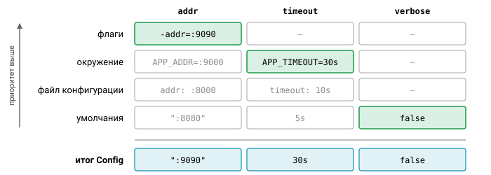
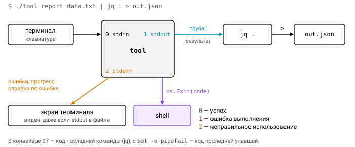

# Урок 2. Работа с аргументами командной строки

Утилита командной строки общается с миром через очень узкий интерфейс: список аргументов, переменные окружения, три стандартных потока и код возврата. Кажется, что здесь нечего изучать, но именно на этих мелочах чаще всего ломаются инструменты: флаг после имени файла вдруг не работает, ошибка печатается в stdout и портит конвейер, а программу невозможно протестировать, потому что она вызывает `os.Exit` из глубины кода. В этом уроке мы разберём, как устроен разбор аргументов в Go и как написать CLI, который удобно и пользоваться, и тестировать.

## `os.Args`

Всё начинается со среза `os.Args`:

```go
fmt.Println(os.Args)   // [./app -v input.txt]
```

`os.Args[0]` — имя программы в том виде, в каком её запустили, а дальше идут аргументы. К моменту запуска их уже разбил по пробелам shell, с учётом кавычек. Раскрытием шаблонов Go тоже не занимается: `*.txt` превращает в список файлов shell, а в Windows этого не делает вообще никто, и программа получит буквальную строку `*.txt`.

Разбирать `os.Args` вручную разумно, пока у программы один-два позиционных аргумента. Как только появляются флаги, пора переходить на пакет `flag`.

## Пакет `flag`

Флаги объявляют заранее, а затем один вызов `flag.Parse` разбирает командную строку:

```go
var (
    addr    = flag.String("addr", ":8080", "адрес для прослушивания")
    timeout = flag.Duration("timeout", 5*time.Second, "таймаут")
    verbose bool
)

func main() {
    flag.BoolVar(&verbose, "v", false, "подробный вывод")
    flag.Parse()                   // разбирает os.Args[1:]
    files := flag.Args()           // позиционные аргументы после флагов
    fmt.Println(*addr, *timeout, verbose, files)
}
```

Есть два стиля объявления. `flag.String` возвращает указатель на новую переменную, а `flag.BoolVar` привязывает флаг к уже существующей — это удобно, когда значения собираются в поля структуры конфигурации.

Синтаксис, который понимает `flag`, проще привычного по GNU-утилитам, и в нём есть несколько сюрпризов. Одинарный и двойной дефис равнозначны: `-flag` и `--flag` означают одно и то же, и никакого деления на «короткие» и «длинные» флаги нет. Значение можно передать как `-flag=value` или как `-flag value`, но второй вариант не работает для булевых флагов. Их задают только как `-v` или `-v=false`, а запись `-v false` означает флаг `-v` плюс позиционный аргумент `false`.

Самый неожиданный для пользователей GNU момент в том, что разбор **останавливается** на первом аргументе, который не похож на флаг, или на `--`. В команде `app file.txt -v` флаг `-v` не будет разобран: он станет вторым позиционным аргументом. И последнее: если передать `-h` или `-help`, а такой флаг не объявлен, `Parse` вернёт `flag.ErrHelp`.

![`flag.Parse` идёт по `os.Args[1:]` и останавливается на первом не-флаге: всё после него, даже `-timeout 1s`, попадает в `flag.Args()`; `--` просто завершает флаги](img/flag-parse.svg)

Встроенных типов флагов довольно много: `String`, `Bool`, `Int`, `Int64`, `Uint`, `Uint64`, `Float64` и `Duration`. Последний разбирается через `time.ParseDuration` и понимает `"1m30s"` или `"250ms"`, но число без единицы измерения, кроме `0`, считает ошибкой. Для всего остального есть `TextVar`, который принимает любой тип с `encoding.TextUnmarshaler`: `net.IP`, `netip.Addr`, `big.Int` или ваш собственный. А `Func` и `BoolFunc` вызывают колбэк на каждое появление флага.

## `flag.FlagSet`: флаги без глобального состояния

Функции вроде `flag.String` работают с глобальным набором `flag.CommandLine`. Он создан в режиме `ExitOnError`: встретив ошибку, печатает справку и вызывает `os.Exit(2)`. Для `main` небольшой утилиты это нормально, но в библиотеке и в коде, который хочется тестировать, такое поведение недопустимо: тест не может проверить процесс, который сам себя завершил. Поэтому заводят собственный набор флагов:

```go
func parse(args []string) (Config, error) {
    fs := flag.NewFlagSet("app", flag.ContinueOnError)
    fs.SetOutput(io.Discard)         // не печатать ничего самим
    var cfg Config
    fs.StringVar(&cfg.Addr, "addr", ":8080", "адрес")
    if err := fs.Parse(args); err != nil {
        return Config{}, err         // errors.Is(err, flag.ErrHelp) — просили справку
    }
    cfg.Files = fs.Args()
    return cfg, nil
}
```

Функция `parse` принимает аргументы параметром и возвращает ошибку, поэтому тест просто вызывает её с нужным срезом строк. Режимов обработки ошибок три: `ContinueOnError` возвращает ошибку, `ExitOnError` вызывает `os.Exit(2)` (а для `-h` — `os.Exit(0)`), `PanicOnError` паникует.

У `FlagSet` есть ещё несколько полезных методов. `fs.Visit` обходит только флаги, которые были заданы, а `fs.VisitAll` — все объявленные. `fs.Lookup(name)` находит флаг по имени. Присвоив `fs.Usage = func(){...}`, можно заменить текст справки, а `fs.PrintDefaults()` печатает список флагов с описаниями.

Через `fs.Visit` решается частый вопрос: как узнать, задал ли пользователь флаг явно, или значение просто совпало с умолчанием?

```go
set := map[string]bool{}
fs.Visit(func(f *flag.Flag) { set[f.Name] = true })
```

Это понадобится, когда мы будем сводить вместе флаги, переменные окружения и файл конфигурации.

## Свой тип: `flag.Value`

Если встроенных типов не хватает, можно определить свой. Для этого достаточно реализовать интерфейс из двух методов:

```go
type Value interface {
    String() string
    Set(string) error
}
```

Ключевая деталь в том, что `Set` вызывается на **каждое** появление флага в командной строке, а не один раз с последним значением. Именно так делаются повторяемые флаги:

```go
type StringList []string

func (s *StringList) String() string { if s == nil { return "" }; return strings.Join(*s, ",") }
func (s *StringList) Set(v string) error { *s = append(*s, v); return nil }

var tags StringList
fs.Var(&tags, "tag", "тег (можно повторять)")   // -tag a -tag b → [a b]
```

Флаг-перечисление делается тем же приёмом: `Set` проверяет значение и возвращает ошибку, если оно недопустимо. А если добавить к типу метод `IsBoolFlag() bool { return true }`, флаг можно будет задавать без значения, как обычный булев.

Обратите внимание на проверку `s == nil` в `String`. Документация предупреждает, что `String` может быть вызван на нулевом значении типа, например на nil-указателе (пакет делает так, чтобы узнать значение по умолчанию для справки). Поэтому `String` нужно писать так, чтобы он не падал на nil.

## Подкоманды

У многих инструментов есть подкоманды со своими флагами: `git commit -m msg`, `go test -run X`. В пакете `flag` специальной поддержки для этого нет, но она и не нужна: подкоманда — это просто ещё один `FlagSet`, который разбирает остаток аргументов.

```go
func Run(args []string, stdout, stderr io.Writer) int {
    global := flag.NewFlagSet("tool", flag.ContinueOnError)
    jsonOut := global.Bool("json", false, "JSON-вывод")
    if err := global.Parse(args); err != nil { return 2 }
    rest := global.Args()
    if len(rest) == 0 { fmt.Fprintln(stderr, "нужна команда"); return 2 }

    switch rest[0] {
    case "add":
        fs := flag.NewFlagSet("add", flag.ContinueOnError)
        n := fs.Int("n", 1, "сколько")
        if err := fs.Parse(rest[1:]); err != nil { return 2 }
        ...
    default:
        fmt.Fprintf(stderr, "неизвестная команда %q\n", rest[0])
        return 2
    }
    return 0
}
```

Здесь пригодилось то самое поведение, которое раньше казалось неудобным: глобальный набор разбирает свои флаги и останавливается на имени команды, потому что это первый не-флаг.

![Подкоманды: глобальный `FlagSet` разбирает свои флаги и останавливается на имени команды, `rest[0]` выбирает ветку, а `FlagSet` подкоманды разбирает `rest[1:]`](img/flag-subcommands.svg)

В этом примере есть и более важная вещь, чем подкоманды. Это главный архитектурный приём для CLI: **вся** логика живёт в функции `Run(args, stdin, stdout, stderr) int`, а `main` сводится к одной строке:

```go
func main() { os.Exit(app.Run(os.Args[1:], os.Stdin, os.Stdout, os.Stderr)) }
```

Теперь CLI тестируется обычными unit-тестами: передаёте аргументы, подставляете `bytes.Buffer` вместо stdout и stderr и проверяете вывод и код возврата. Не нужно ни собирать бинарник, ни запускать его через `exec.Command`. Единственное условие — никаких `os.Exit` внутри `Run`. Дело не только в тестах: `os.Exit` не выполняет отложенные вызовы `defer`, так что незакрытые файлы и несброшенные буферы останутся как есть.

## Переменные окружения

Вторым источником настроек служат переменные окружения. Читать их можно двумя способами:

```go
v := os.Getenv("APP_ADDR")              // "" — и если не задана, и если пустая
v, ok := os.LookupEnv("APP_ADDR")       // различает эти случаи
os.Setenv / os.Unsetenv / os.Environ()  // осторожно: глобальное состояние процесса
```

Разница между ними важна, когда пустая строка — осмысленное значение: `os.Getenv` её не отличит от отсутствия переменной, а `os.LookupEnv` отличит.

Когда у программы несколько источников настроек, нужен порядок, в котором они перекрывают друг друга. Типичный приоритет такой: **умолчания < файл конфигурации < переменные окружения < флаги**. Чем ближе источник к конкретному запуску, тем он главнее.

Для тестируемости и здесь лучше не трогать глобальное состояние: передавайте в код функцию `getenv func(string) string` параметром. Если всё-таки нужно выставить настоящую переменную в тесте, используйте `t.Setenv`, который восстановит прежнее значение после теста, но при этом запрещает `t.Parallel`. И ещё одна мелочь, которая сильно экономит время пользователям: сообщение об ошибке в переменной окружения должно называть саму переменную. В командной строке её не видно, и без подсказки человек будет долго искать, откуда взялось неверное значение.



## stdin, stdout, stderr и коды возврата

Хорошая утилита легко встраивается в конвейер, и для этого у каждого потока своя роль. В stdout пишется только результат работы, потому что его перенаправляют в файл или передают дальше, например в `| jq`. Всё остальное — ошибки, прогресс, справка при неверном использовании — идёт в stderr. Стоит напечатать ошибку в stdout, и следующая программа в конвейере получит на вход мусор.

Код возврата сообщает shell'у, чем всё кончилось. Принято так: `0` — успех, `1` — ошибка выполнения, `2` — неправильное использование (так поступают `flag`, `grep` и bash). Если вам нужны свои коды, например `3` для частичного успеха, задокументируйте их.

Иногда программе нужно знать, откуда пришёл stdin: с терминала или из трубы. Проверка выглядит так: `fi, _ := os.Stdin.Stat(); fi.Mode()&os.ModeCharDevice != 0` — если условие истинно, это терминал.

Корректное завершение по Ctrl+C тоже укладывается в одну строку: `ctx, stop := signal.NotifyContext(context.Background(), os.Interrupt, syscall.SIGTERM)`. При получении сигнала контекст отменяется, и программа завершается штатно, успевая всё за собой убрать.

Наконец, о `log.Fatal`. Он печатает сообщение и вызывает `os.Exit(1)`, а значит, отложенные вызовы не выполнятся. За пределами `main` его лучше не использовать.



## Сторонние библиотеки

Для больших CLI со множеством команд стандартного `flag` бывает мало, и в экосистеме есть несколько популярных решений.

- **spf13/cobra** — стандарт де-факто для больших CLI, на нём написаны kubectl, hugo, gh и docker. Он даёт дерево команд, POSIX-флаги через spf13/pflag (`--long`, `-s`, склейка `-abc`), генерацию справки и автодополнения для shell. Часто используется в паре с viper для конфигов.
- **urfave/cli** — декларативное описание команд и флагов с привязкой флагов к переменным окружения (`EnvVars`).
- **alecthomas/kong** — строит CLI из структуры с тегами.

Для небольших утилит стандартного `flag` вполне достаточно, а его главное достоинство в том, что он не тянет зависимостей. В курсе мы используем только его.

## Типичные ошибки

1. Вызывать `flag.Parse()` в `init()` или в библиотеке. Это ломает `go test`: к этому моменту его флаги вроде `-test.v` ещё не зарегистрированы.
2. Ожидать, что флаги после позиционного аргумента будут разобраны.
3. Передавать `-timeout 5` флагу типа `Duration`. Это ошибка разбора (`invalid value "5" for flag -timeout: parse error`), потому что `time.ParseDuration` требует единицу измерения.
4. Печатать ошибки в stdout и тем самым ломать конвейеры.
5. Вызывать `os.Exit` в глубине кода: такой код невозможно тестировать, а `defer` не выполняются.

## Вопросы с собеседований

- Как сделать флаг, который можно повторять? А флаг-перечисление?
- Как протестировать CLI, не запуская процесс?
- Чем `os.Getenv` отличается от `os.LookupEnv`?
- Почему `defer` не срабатывает при `os.Exit` и `log.Fatal`?
- Как корректно обработать Ctrl+C?

## Ссылки

- https://pkg.go.dev/flag, https://pkg.go.dev/os#Args, https://pkg.go.dev/os/signal#NotifyContext
- https://clig.dev — Command Line Interface Guidelines
- https://github.com/spf13/cobra, https://github.com/urfave/cli

## Практика

- [03_config](../tasks/03_config) — `FlagSet`, свой `flag.Value` (перечисление и список), `Duration`, окружение и приоритеты.
- [04_subcmd](../tasks/04_subcmd) — утилита с подкомандами, коды возврата, stdout/stderr.
