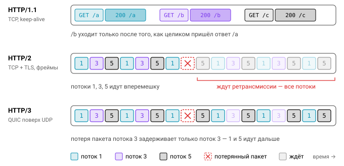

# Урок 1. Основы HTTP и запуск сервера в Go

## HTTP в двух словах

Прежде чем писать сервер, полезно вспомнить, с чем именно он работает. HTTP устроен предельно просто: клиент отправляет запрос, сервер возвращает ответ, а доставку байтов по сети берёт на себя надёжный транспорт под ними. Вот как выглядит один такой обмен в HTTP/1.1:

```
GET /users/42?fields=name HTTP/1.1          ← стартовая строка: метод, цель, версия
Host: api.example.com                       ← заголовки
Accept: application/json

                                            ← пустая строка, дальше тело (если есть)
HTTP/1.1 200 OK
Content-Type: application/json
Content-Length: 29

{"id":42,"name":"Гофер"}
```

Запрос начинается со стартовой строки, за ней идут заголовки, потом пустая строка и, если нужно, тело. Ответ устроен так же, только вместо метода и пути в первой строке стоят версия и код статуса.

### Версии

Текстовый формат выше — это HTTP/1.1. Более новые версии передают те же по смыслу запросы иначе, и разница заметна в первую очередь при большом количестве параллельных запросов.

| | HTTP/1.1 | HTTP/2 | HTTP/3 |
|---|---|---|---|
| Транспорт | TCP (+TLS) | TCP + TLS (h2), редко h2c | QUIC поверх UDP (TLS 1.3 встроен) |
| Формат | текст | бинарные фреймы, HPACK-сжатие заголовков | фреймы, QPACK |
| Мультиплексирование | нет: один запрос на соединение за раз (pipelining не взлетел) | много потоков в одном соединении | то же, но без head-of-line blocking на уровне TCP |
| В Go | `net/http` | `net/http` автоматически при TLS (ALPN); с Go 1.24 — `Server.Protocols` | нет в stdlib (`quic-go`) |

Хорошая новость в том, что хендлеру версия протокола почти безразлична. В `r.Proto` вы увидите `HTTP/2.0`, но API остаётся тем же самым, и код писать иначе не придётся.



### Методы и их свойства

У каждого метода есть два свойства, которые определяют, как с ним можно обращаться клиентам, прокси и кэшам.

| Метод | Безопасный | Идемпотентный | Тело запроса |
|---|---|---|---|
| GET, HEAD, OPTIONS | да | да | нет (не принято) |
| PUT | нет | **да** | да |
| DELETE | нет | **да** | обычно нет |
| POST | нет | нет | да |
| PATCH | нет | нет (в общем случае) | да |

**Безопасный** метод не меняет состояние сервера — по крайней мере с точки зрения клиента. **Идемпотентный** метод устроен так, что $N$ одинаковых запросов дают тот же эффект, что и один. Второе свойство становится очень практичным, как только вы начинаете делать ретраи. Повторить `PUT /users/1 {...}` безопасно: пользователь просто ещё раз получит те же данные. А повторный `POST /payments` может списать деньги дважды, поэтому для таких операций придумали заголовок `Idempotency-Key`.

### Коды ответа

Коды статуса группируются по первой цифре, и запомнить стоит не столько все коды подряд, сколько самые ходовые в каждой группе.

- `2xx`, успех: 200 OK, 201 Created (вместе с `Location`), 202 Accepted, 204 No Content.
- `3xx`, перенаправления: 301 и 308 означают «навсегда», 302 и 307 — «временно», а **304 Not Modified** говорит клиенту, что его кэш всё ещё валиден.
- `4xx`, ошибка клиента: 400, 401 (не аутентифицирован), 403 (нет прав), 404, 405 (вместе с `Allow`), 409, 413, 415, 422, 429 (вместе с `Retry-After`).
- `5xx`, ошибка сервера: 500, 502 (апстрим вернул плохой ответ), 503 (перегрузка), 504 (апстрим не ответил вовремя).

### Заголовки, которые надо знать

На практике постоянно встречается один и тот же набор: `Host`, `Content-Type`, `Content-Length`, `Accept`, `Authorization`, `Cache-Control`, пара `ETag`/`If-None-Match`, `Location`, `Retry-After`, `Connection: keep-alive` и `X-Request-ID`, ставший де-факто стандартом для трассировки. Имейте в виду, что Go канонизирует ключи заголовков: `http.CanonicalHeaderKey("x-request-id") == "X-Request-Id"`. Если вы ищете заголовок в карте напрямую, а не через `Header.Get`, это легко упустить.

## net/http: Handler — один метод

Весь пакет `net/http` держится на крошечном интерфейсе с единственным методом:

```go
type Handler interface {
    ServeHTTP(ResponseWriter, *Request)
}

// Адаптер: любая функция с нужной сигнатурой становится Handler.
type HandlerFunc func(ResponseWriter, *Request)
func (f HandlerFunc) ServeHTTP(w ResponseWriter, r *Request) { f(w, r) }
```

Именно благодаря этой простоте всё в пакете компонуется. Роутер — это Handler, middleware принимает и возвращает Handler, `http.FileServer` тоже Handler. Любой кусок можно вставить внутрь любого другого, и мы будем пользоваться этим весь модуль. Минимальный сервер выглядит так:

```go
mux := http.NewServeMux()
mux.HandleFunc("GET /hello/{name}", func(w http.ResponseWriter, r *http.Request) {
    fmt.Fprintf(w, "Привет, %s!\n", r.PathValue("name"))
})
log.Fatal(http.ListenAndServe(":8080", mux)) // так — только в примерах!
```

Комментарий в последней строке не для красоты: чуть ниже разберём, почему в продакшене так делать нельзя.

## Каждый запрос — своя горутина

Как сервер обслуживает тысячи клиентов одновременно? `Server.Serve` крутит цикл, в котором вызывает `Accept()`, и на каждое новое соединение запускает `go c.serve(ctx)`. Внутри одного соединения HTTP/1.1 запросы обрабатываются последовательно, а в HTTP/2 каждый поток получает собственную горутину.

Из этой модели вытекает несколько следствий. Во-первых, хендлеры выполняются **конкурентно**, поэтому любое общее состояние нужно защищать мьютексом или атомиками; `go test -race` поможет найти гонки, которые вы пропустили. Во-вторых, паника в хендлере не роняет весь сервер: `net/http` перехватит её, запишет в лог и закроет соединение. Полагаться на это всё же не стоит, потому что клиент не получит нормального ответа, так что свой Recover-middleware нужен. В-третьих, горутины дешёвы (стек начинается с 2 КБ), и 10 тысяч одновременных соединений для Go-сервера — обычная нагрузка.


## http.Server и таймауты

Теперь о той самой строке с `log.Fatal`. Функция `http.ListenAndServe` создаёт сервер **без таймаутов**. Это значит, что медленный клиент может держать соединение сколько угодно, присылая заголовки по одному байту, — так работает атака Slowloris. Несколько сотен таких клиентов исчерпают ресурсы сервера. Линтеры знают об этой проблеме: gosec выдаёт G114 на `http.ListenAndServe` и G112 на `http.Server` без `ReadHeaderTimeout`.

Правильно создавать `http.Server` явно и задавать таймауты:

```go
srv := &http.Server{
    Addr:              ":8080",
    Handler:           mux,
    ReadHeaderTimeout: 5 * time.Second,  // чтение стартовой строки и заголовков
    ReadTimeout:       15 * time.Second, // заголовки + тело
    WriteTimeout:      15 * time.Second, // от конца чтения заголовков до конца ответа
    IdleTimeout:       60 * time.Second, // keep-alive между запросами
    MaxHeaderBytes:    1 << 20,
}
```


У этих таймаутов есть неочевидные стороны. `WriteTimeout` на деле ограничивает и время работы самого хендлера. Хендлер никто не прерывает, но всё, что он запишет после дедлайна, клиенту уже не уйдёт. Для SSE и другого стриминга это проблема, и дедлайн там сдвигают вручную через `http.NewResponseController(w).SetWriteDeadline(...)`.

Если `IdleTimeout` равен нулю, вместо него используется `ReadTimeout`. Об этом стоит помнить, когда вы задаёте один таймаут и не трогаете другой.

И главное: ограничивать время **бизнес-логики** нужно через `context.WithTimeout` или `http.TimeoutHandler`, а не через `WriteTimeout`. Когда срабатывает `WriteTimeout`, клиент видит просто оборванное соединение без всякого объяснения, тогда как таймаут на уровне логики позволяет вернуть осмысленную ошибку.

## Graceful shutdown

Сервер не только запускается, но и останавливается, причём при каждом деплое. Оркестратор посылает процессу SIGTERM и какое-то время ждёт (Kubernetes по умолчанию даёт 30 секунд). Корректный сервер за это время должен перестать принимать новые соединения, дождаться завершения уже начатых запросов и закрыть ресурсы. Вот типовой каркас `main`:

```go
func main() {
    ctx, stop := signal.NotifyContext(context.Background(), os.Interrupt, syscall.SIGTERM)
    defer stop()

    srv := &http.Server{Addr: ":8080", Handler: mux, ReadHeaderTimeout: 5 * time.Second}
    errCh := make(chan error, 1)
    go func() { errCh <- srv.ListenAndServe() }()

    select {
    case err := <-errCh: // не смогли стартовать (порт занят и т.п.)
        log.Fatal(err)
    case <-ctx.Done():
    }
    stop() // повторный Ctrl+C теперь убьёт процесс сразу

    shCtx, cancel := context.WithTimeout(context.Background(), 10*time.Second)
    defer cancel()
    if err := srv.Shutdown(shCtx); err != nil {
        log.Printf("shutdown: %v", err)
        _ = srv.Close() // принудительно
    }
}
```

Разберём, что происходит внутри `Shutdown`. Сначала он закрывает листенеры, так что новых соединений больше не будет. Затем закрывает простаивающие соединения. После этого периодически, с нарастающим интервалом, проверяет, не завершились ли активные, и в итоге возвращает `nil` или `ctx.Err()`, если дедлайн истёк раньше. Как только `Shutdown` вызван, `ListenAndServe` немедленно возвращает `http.ErrServerClosed`. Это штатный сигнал, а не ошибка.


Здесь легко ошибиться в нескольких местах. Контекст для `Shutdown` нельзя брать от сигнального `ctx`: к этому моменту он уже отменён, и `Shutdown` вернётся мгновенно, никого не дождавшись. Hijacked-соединения, например WebSocket, `Shutdown` не отслеживает вовсе; чтобы их корректно закрыть, зарегистрируйте колбэк через `srv.RegisterOnShutdown(func(){...})`. Если хотите, чтобы все запросы узнали об остановке, пригодится поле `BaseContext`: через него можно выдать запросам контекст, который отменится при shutdown.

Наконец, в Kubernetes важен порядок действий. Сначала переведите `/readyz` в 503, подождите, пока балансировщик уберёт под из ротации, и только после этого вызывайте `Shutdown`. Иначе часть трафика успеет прийти на уже закрытый листенер.

## Health-чеки

Раз уж речь зашла о `/readyz`, разберёмся с двумя видами проверок, которые часто путают.

**Liveness** (`/healthz`) отвечает на вопрос «жив ли процесс». Не проверяйте здесь базу данных: если БД упадёт, liveness провалится у всех подов сразу, и оркестратор начнёт их перезапускать, хотя перезапуск ничего не исправит.

**Readiness** (`/readyz`) отвечает на вопрос «готов ли под принимать трафик». Сюда как раз относятся прогретый кэш, живое соединение с БД и то, что процесс не находится в состоянии shutdown.

## Типичные ошибки

1. `http.ListenAndServe` в продакшене: у такого сервера нет таймаутов.
2. `log.Fatal(srv.ListenAndServe())` в коде с graceful shutdown. После `Shutdown` функция вернёт `ErrServerClosed`, и `log.Fatal` завершит процесс с кодом 1, не дав дождаться запросов.
3. Запись в общую `map` из хендлеров без мьютекса.
4. Использование `http.DefaultServeMux`. Зарегистрировать в нём хендлер может любой импортированный пакет; например, `import _ "net/http/pprof"` молча открывает профилировщик наружу.

## Вопросы с собеседований

- Чем `ReadTimeout` отличается от `ReadHeaderTimeout`, и почему второй важнее?
- Что происходит с активными запросами при `Shutdown` и что при `Close`?
- Идемпотентен ли `DELETE`? А `PATCH`? Почему это важно, когда клиент делает ретраи?
- В какой горутине выполняется хендлер и что будет, если он запаникует?
- Как HTTP/2 решает проблему head-of-line blocking и почему HTTP/3 перешёл на UDP?

## Ссылки

- https://pkg.go.dev/net/http#Server
- https://pkg.go.dev/os/signal#NotifyContext
- https://blog.cloudflare.com/the-complete-guide-to-golang-net-http-timeouts/
- RFC 9110 (HTTP Semantics): https://www.rfc-editor.org/rfc/rfc9110

## Практика

- [01_graceful](../tasks/01_graceful) — сервер с таймаутами, health-чеками и graceful shutdown.
