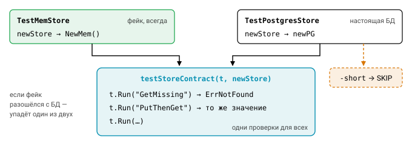

# Урок 2. Мокирование и тестирование API

## Главная идея: зависимости через интерфейсы

Представьте сервис, который сам создаёт `sql.DB`, ходит в сеть через `http.DefaultClient` и узнаёт текущее время вызовом `time.Now()`. Протестировать его можно только целиком: поднять базу, настоящий внешний API и ждать, пока пройдёт нужное время. Такие тесты медленные, хрупкие, и писать их никто не любит. Если же тот же код получает зависимости снаружи, через **маленькие интерфейсы**, в тесте их можно подменить, и проверка займёт миллисекунды.

```go
// Интерфейс объявляет потребитель (пакет service), а не поставщик (пакет postgres).
type UserStore interface {
    Get(ctx context.Context, id int64) (User, error)
}

type Service struct {
    store UserStore
    clock func() time.Time
}
```


Обратите внимание, где объявлен интерфейс. В Java или C# его обычно кладут рядом с реализацией, а в Go принято наоборот. Интерфейсы здесь реализуются неявно: типу не нужно писать `implements`, достаточно иметь нужные методы. Поэтому интерфейс удобно объявлять у потребителя, причём минимальный, ровно с теми методами, которые этому потребителю нужны. Его можно завести постфактум, не трогая пакет поставщика, а фейк для интерфейса из одного метода пишется за минуту.

Отсюда известная максима «accept interfaces, return structs»: функции принимают интерфейсы, а возвращают конкретные типы. У неё есть и обратная сторона. Не создавайте интерфейс «на всякий случай» для единственной реализации: если он не нужен ни для тестов, ни для второй реализации, это просто лишний уровень косвенности.

## Виды тестовых двойников

Всё, что в тесте подменяет настоящую зависимость, называют тестовым двойником. Слово «мок» в обиходе употребляют для любого из них, но различать виды полезно, потому что они по-разному влияют на тесты.

| | Что это | Пример |
|---|---|---|
| **Stub** | возвращает заготовленные ответы | `func() time.Time { return fixed }` |
| **Fake** | упрощённая, но рабочая реализация | `MemStore` на map, `FakeClock` |
| **Spy** | stub + записывает вызовы | `SpyNotifier` со списком сообщений |
| **Mock** | заранее описанные ожидания вызовов, проверяет их сам | gomock: `EXPECT().Get(1).Return(u, nil)` |

В Go-сообществе ручные фейки обычно предпочитают мокам, и тому есть причины. Тест с фейком проверяет поведение, то есть результат работы кода, а не последовательность вызовов. Поэтому он переживает рефакторинг: вы можете переставить вызовы или объединить два запроса в один, и тест останется зелёным, пока результат верен. Кроме того, один хорошо написанный фейк переиспользуется в десятках тестов. Моки уместны там, где важен именно факт или порядок вызова (скажем, «списание не должно вызываться, если валидация не прошла»), или когда интерфейс настолько большой, что писать фейк вручную дорого.

```go
type fakeStore struct {
    users map[int64]User
    err   error // для сценариев с ошибками
}
func (f *fakeStore) Get(_ context.Context, id int64) (User, error) {
    if f.err != nil { return User{}, f.err }
    u, ok := f.users[id]
    if !ok { return User{}, ErrNotFound }
    return u, nil
}
```

Если интерфейс всё-таки велик, а тесту нужен лишь один метод, выручает приём со встраиванием интерфейса в структуру фейка: `type partial struct{ Store }`. Такой тип формально реализует весь `Store`, а вы пишете только нужные методы. Остальные уходят во встроенный интерфейс, который равен nil, так что при неожиданном вызове тест упадёт с паникой nil pointer и сразу покажет, что код дёрнул что-то лишнее.

## Генераторы моков (обзор)

Когда моки всё же нужны, их обычно не пишут вручную, а генерируют. Чаще всего вы встретите три инструмента:

- **gomock** (`go.uber.org/mock`, форк заброшенного golang/mock): утилита `mockgen` генерирует тип с методом `EXPECT()`, а порядок и число вызовов задаются через `gomock.InOrder`, `Times` и матчеры вроде `gomock.Any()`;
- **mockery** генерирует моки в стиле `testify/mock`: `m.On("Get", 1).Return(u, nil)`, а в конце теста `m.AssertExpectations(t)`;
- **testify/mock** позволяет описать мок вручную, встроив `mock.Mock`.

Генерацию обычно подключают директивой `//go:generate mockgen -source=store.go -destination=mock_store_test.go`. Но какой бы инструмент вы ни выбрали, у всех моков общий недостаток: они хрупкие. Тест с моком знает, **как** код устроен внутри, и ломается от любой перестановки вызовов, даже если поведение не изменилось.

## Подмена времени

Время — одна из самых неудобных зависимостей. Код с TTL, ретраями и таймаутами хочется проверить, но никто не станет ждать в тесте реальный час, пока истечёт кэш. Поэтому время тоже прячут за интерфейсом:

```go
type Clock interface {
    Now() time.Time
    After(d time.Duration) <-chan time.Time
}
```

В тесте вместо настоящих часов подставляют фейк, которым управляет сам тест. Вызов `Advance(time.Hour)` мгновенно «проматывает» час, и все таймеры, срок которых наступил, срабатывают.

С горутинами здесь есть тонкость. Допустим, тестируемая горутина вызывает `clock.After(time.Minute)`, а тест сразу же делает `Advance(time.Minute)`. Кто успеет первым? Если `Advance` выполнится раньше, чем горутина зарегистрирует таймер, время сдвинется впустую, таймер будет ждать следующей минуты, и тест зависнет. Поэтому фейковым часам нужен способ дождаться, пока горутина «уснёт» на `After`, например метод `BlockUntil(n)`, который ждёт, пока ожидающих таймеров станет $n$. Готовые реализации есть в библиотеках `github.com/jonboulle/clockwork` и `k8s.io/utils/clock`. А в Go 1.24+ появился экспериментальный пакет `testing/synctest`, который даёт виртуальное время целому «пузырю» горутин.

Если же горутин нет и нужно лишь `Now()`, самый простой вариант — поле `now func() time.Time`, которое по умолчанию равно `time.Now`, а в тесте заменяется функцией, возвращающей фиксированное время.


## Тестирование HTTP-хендлеров: httptest.NewRecorder

Хендлер — это просто значение с методом `ServeHTTP`, и для проверки ему не нужен настоящий сервер. Пакет `httptest` даёт две заготовки: `NewRequest` создаёт запрос, а `NewRecorder` записывает всё, что хендлер отправил в ответ.

```go
func TestGetUser(t *testing.T) {
    h := NewHandler(&fakeStore{users: map[int64]User{1: {Name: "Ann"}}})
    req := httptest.NewRequest(http.MethodGet, "/users/1", nil) // паникует на ошибке — удобно в тестах
    rec := httptest.NewRecorder()
    h.ServeHTTP(rec, req)

    res := rec.Result()
    if res.StatusCode != http.StatusOK { t.Fatalf("status %d", res.StatusCode) }
    // проверить заголовки и тело (json.Unmarshal в структуру, а не сравнение строк)
}
```

Никакой сети и никаких портов, поэтому такие тесты работают быстро. Споткнуться здесь можно в двух местах. Первое — параметры пути. Значения шаблонов `ServeMux` вроде `{id}` заполняет сам mux во время маршрутизации. Если вызвать хендлер-функцию напрямую, `r.PathValue("id")` вернёт пустую строку. Поэтому тестируйте весь роутер, а не голую функцию, или задайте значение вручную через `req.SetPathValue("id", "1")`.

Второе — заголовки. `rec.Header()` возвращает «живую» карту, которую хендлер может менять даже после `WriteHeader`. То, что реально ушло бы клиенту, смотрите в `rec.Result().Header`.

## Тестирование HTTP-клиентов

С клиентом ситуация зеркальная: нужно подсунуть ему сервер, который ответит так, как требует тест. Есть два основных способа.

Первый — `httptest.NewServer`. Он поднимает настоящий HTTP-сервер на `127.0.0.1:0` (порт выбирается свободный) и отдаёт его URL. Такой тест проверяет всё: построение URL, заголовки, сериализацию, таймауты и обработку кодов ошибок. Внутри хендлера фейкового сервера удобно проверять сам запрос, например `if r.Header.Get("Authorization") != "Bearer x" { t.Errorf(...) }`.

Второй способ — фейковый `RoundTripper`, и здесь сети нет вообще. `RoundTripper` — это интерфейс с единственным методом, через который `http.Client` отправляет запросы, так что подменить его проще простого. Этот вариант особенно хорош, чтобы имитировать сетевые ошибки и таймауты или проверить, что клиент закрывает тело ответа.

```go
type rtFunc func(*http.Request) (*http.Response, error)
func (f rtFunc) RoundTrip(r *http.Request) (*http.Response, error) { return f(r) }

client := &http.Client{Transport: rtFunc(func(r *http.Request) (*http.Response, error) {
    return nil, errors.New("connection reset")
})}
```


Оба способа работают, только если клиент спроектирован под тестирование: **он должен принимать `*http.Client` и base URL** снаружи. Клиент, который жёстко использует `http.DefaultClient` и зашитый адрес, не протестировать ни тем, ни другим способом.

## Контрактные тесты

Фейк полезен ровно до тех пор, пока ведёт себя как настоящая реализация. Если `MemStore` на отсутствующий ключ возвращает пустого пользователя без ошибки, а Postgres-реализация возвращает `ErrNotFound`, юнит-тесты с фейком будут зелёными, а продакшен сломается. Защищаются от этого контрактными тестами. **Контрактный тест** — это один набор проверок, который прогоняется на всех реализациях интерфейса:

```go
func testStoreContract(t *testing.T, newStore func(t *testing.T) Store) {
    t.Run("GetMissing", func(t *testing.T) {
        _, err := newStore(t).Get(ctx, 42)
        if !errors.Is(err, ErrNotFound) { t.Fatal(err) }
    })
    // ...
}
func TestMemStore(t *testing.T)      { testStoreContract(t, func(*testing.T) Store { return NewMem() }) }
func TestPostgresStore(t *testing.T) { if testing.Short() { t.Skip() }; testStoreContract(t, newPG) }
```



Для внешних API, которыми владеет другая команда, существует похожая идея — consumer-driven contracts (например, Pact). Потребитель описывает свои ожидания от API, а поставщик проверяет их в своём CI и узнаёт о поломке раньше, чем она дойдёт до продакшена.

## Типичные ошибки

Напоследок соберём ошибки, которые встречаются чаще всего. Первая — интерфейс на 20 методов, скопированный «как у поставщика»: фейк для него писать мучительно, и в итоге все сдаются и берут генератор моков. Вторая — моки на всё подряд, из-за которых тест повторяет реализацию строка за строкой и ломается при любом рефакторинге.

Третья ошибка — `time.Sleep` в тестах, чтобы «подождать, пока горутина успеет». На загруженной CI-машине она не успеет, и тест станет флаки. Синхронизируйтесь явно: каналами или фейковым временем. Четвёртая — подмена через глобальные переменные вроде `var now = time.Now`: два параллельных теста, подменяющих одну глобальную переменную, мешают друг другу, и `t.Parallel` становится невозможен. Наконец, пятая — фейк, незаметно разошедшийся с настоящей реализацией. От неё защищает контрактный тест.

## Вопросы с собеседований

- Где объявлять интерфейс зависимости: у поставщика или у потребителя? Почему именно там?
- Чем fake отличается от mock, и когда стоит выбрать одно, а когда другое?
- Как протестировать код, который зависит от `time.Now()` и `time.After`?
- Как протестировать HTTP-хендлер? А HTTP-клиент?
- Что такое контрактный тест и какую проблему он решает?

## Ссылки

- https://pkg.go.dev/net/http/httptest
- https://go.dev/wiki/CodeReviewComments#interfaces
- https://github.com/uber-go/mock, https://github.com/vektra/mockery
- https://martinfowler.com/articles/mocksArentStubs.html

## Практика

- [03_fakeclock](../tasks/03_fakeclock) — фейковые часы, TTL-кэш и Poll, которые тестируются без ожидания.
- [04_weather](../tasks/04_weather) — клиент погодного API: httptest.Server, фейковый RoundTripper, ручной фейк Provider.
