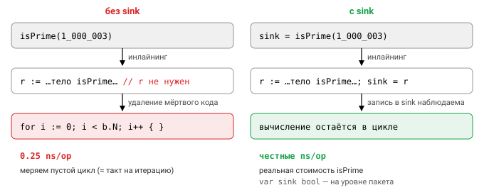

# Урок 3. Бенчмарки

## Базовая форма

Споры о производительности без измерений бесполезны: интуиция о том, что быстрее, `strings.Builder` или `fmt.Sprintf`, map или срез, подводит даже опытных инженеров. Поэтому в Go инструмент для измерений встроен в тот же пакет `testing`, что и тесты. Бенчмарк — это функция `BenchmarkXxx(b *testing.B)` в файле `*_test.go`, которая выполняет измеряемую операцию `b.N` раз:

```go
func BenchmarkJoin(b *testing.B) {
    parts := makeParts(100)   // подготовка
    b.ReportAllocs()          // показывать B/op и allocs/op (как -benchmem)
    b.ResetTimer()            // не учитывать подготовку
    for i := 0; i < b.N; i++ {
        sink = strings.Join(parts, ",")
    }
}
```

Таймер включается в момент вызова функции, поэтому время на подготовку данных тоже попало бы в результат. `b.ResetTimer()` обнуляет накопленное время и счётчики аллокаций, и в замер идёт только цикл. `b.ReportAllocs()` добавляет к выводу колонки с памятью, так же как флаг `-benchmem`, но для одного конкретного бенчмарка.


```
go test -run XXX -bench Join -benchmem ./pkg
BenchmarkJoin-8   	 1234567	       954.2 ns/op	     896 B/op	       1 allocs/op
```


Разберём команду и вывод. Флаг `-run XXX` (или `-run '^$'`) нужен, чтобы заодно не запускались обычные тесты: регулярному выражению не соответствует ни один из них. Суффикс `-8` в имени бенчмарка — это значение GOMAXPROCS, с которым он выполнялся; флаг `-cpu 1,4` прогонит бенчмарк несколько раз с разными значениями. Дальше идут число итераций, время на одну операцию, байты и число аллокаций на операцию.

### Как выбирается b.N

Откуда берётся $1\,234\,567$ итераций? Фреймворк подбирает `b.N` сам. Сначала он вызывает функцию бенчмарка с $N = 1$, а затем по времени предыдущего прогона предсказывает, сколько итераций уложится в целевое время `-benchtime` (по умолчанию 1s), закладывая запас в 20%. Чтобы одна неудачная оценка не увела $N$ в космос, рост ограничен: не более чем в 100 раз за шаг. В упрощённом виде следующий $N$ считается так:

$$
N_\text{next} = \min\left(\max\left(\min\left(1.2 \cdot \frac{t_\text{goal} \cdot N_\text{prev}}{t_\text{prev}},\ 100 \cdot N_\text{prev}\right),\ N_\text{prev} + 1\right),\ 10^9\right)
$$

Здесь $t_\text{goal}$ — значение `-benchtime`, а $t_\text{prev}$ — время, которое занял прогон с $N_\text{prev}$ итерациями. Процесс повторяется, пока время прогона не достигнет `-benchtime`, а $N$ никогда не превышает $10^9$. Если нужно ровно определённое число итераций, его задают явно: `-benchtime=100x` означает ровно 100.


Из этого механизма следует несколько правил. Функция бенчмарка вызывается целиком несколько раз, поэтому подготовка перед циклом тоже выполняется многократно, и дорогую подготовку стоит учитывать при оценке общего времени прогона. Тело цикла должно зависеть только от `i` и `b.N`. Менять `b.N` нельзя, и нельзя выполнять «одну большую операцию» на весь бенчмарк, иначе подбор $N$ теряет смысл.

Если кусок внутри цикла нужно исключить из замера, есть `b.StopTimer()` и `b.StartTimer()`. Пользуйтесь ими осторожно: вызовы сами по себе недёшевы и искажают результат для быстрых операций.

В Go 1.24 появилась более удобная форма цикла `for b.Loop() { ... }`. Она сама исключает подготовку из замера и не даёт компилятору выбросить результат. В этом курсе мы ориентируемся на Go 1.23, поэтому используем классический `b.N`.

## Подбенчмарки

Как и тесты, бенчмарки можно разбивать на именованные части через `b.Run`. Это особенно удобно, чтобы посмотреть, как операция масштабируется с размером входа:

```go
func BenchmarkSort(b *testing.B) {
    for _, n := range []int{10, 1_000, 100_000} {
        b.Run(fmt.Sprintf("n=%d", n), func(b *testing.B) {
            src := randInts(n)
            buf := make([]int, n)
            b.ResetTimer()
            for i := 0; i < b.N; i++ {
                copy(buf, src) // сортировать уже отсортированное — бессмысленно
                slices.Sort(buf)
            }
        })
    }
}
```

Обратите внимание на `copy` в цикле: после первой итерации срез уже отсортирован, и без восстановления исходных данных мы бы измеряли сортировку отсортированного массива, а это совсем другой случай.

Для конкурентных структур данных есть `b.RunParallel(func(pb *testing.PB){ for pb.Next() { ... } })`. Он создаёт нагрузку сразу из нескольких горутин, и именно так сравнивают, скажем, `sync.Map` с map под `RWMutex`.

## Ловушка: компилятор выкинул работу

Посмотрите на такой бенчмарк:

```go
for i := 0; i < b.N; i++ {
    isPrime(1_000_003) // результат не используется → функция может быть заинлайнена и удалена
}
// BenchmarkPrime   1000000000   0.25 ns/op   ← подозрительно быстро
```

Проверить на простоту семизначное число за четверть наносекунды невозможно, это меньше одного такта процессора. Произошло вот что: `isPrime` не имеет побочных эффектов, а её результат никому не нужен. Компилятор встроил функцию в цикл, увидел, что вычисление ни на что не влияет, и удалил его. Мы измерили пустой цикл.

Лекарство — «сток» (sink): результат присваивают глобальной переменной пакета.

```go
var sink bool
for i := 0; i < b.N; i++ { sink = isPrime(1_000_003) }
```



Запись в глобальную переменную видна за пределами функции, поэтому компилятор обязан её сохранить, а вместе с ней и вычисление.

Выброшенная работа — самая известная ловушка, но не единственная. Если входные данные — константы, компилятор может посчитать всё ещё на этапе компиляции. Кэши процессора тоже умеют обманывать: бенчмарк на 1 КБ данных, целиком помещающихся в L1, ничего не говорит о поведении на 1 ГБ. Одинаковые данные на каждой итерации «прогревают» предсказатель ветвлений, и код с ветвлениями выглядит быстрее, чем на реальных данных. Наконец, сама машина бывает шумной: открытый браузер, троттлинг процессора или ноутбук, работающий от батареи, легко дают заметный разброс между прогонами.

## Сравнение: benchstat

Из-за этого шума один прогон ничего не доказывает. Если бенчмарк после правки показал на 5% лучше, это может быть и ускорение, и случайность. Правильный процесс выглядит так: прогнать каждую версию много раз и сравнить статистически.

```
go test -run XXX -bench . -count=10 > old.txt
# правка
go test -run XXX -bench . -count=10 > new.txt
benchstat old.txt new.txt        # go install golang.org/x/perf/cmd/benchstat@latest
```

```
          │   old.txt   │              new.txt               │
          │   sec/op    │   sec/op     vs base               │
Render-8    154.1n ± 2%   52.0n ± 1%  -66.26% (p=0.000 n=10)
```

benchstat считает медиану, доверительный интервал и p-value. Если вместо процента изменения стоит «~», разница статистически не значима: при таком разбросе нельзя утверждать, что версии вообще различаются. В этом случае нужно больше прогонов, или изменение просто несущественно.

## Аллокации

Каждая аллокация в куче стоит дважды: сначала работает аллокатор, потом сборщику мусора придётся этот объект найти и освободить. В горячем пути аллокации поэтому считают, а иногда и закрепляют тестом их отсутствие:

```go
func TestNoAllocs(t *testing.T) {
    buf := make([]byte, 0, 256)
    n := testing.AllocsPerRun(1000, func() { buf = AppendRecord(buf[:0], rec) })
    if n > 0 { t.Errorf("%v allocs, want 0", n) }
}
```

`testing.AllocsPerRun` на время замера выставляет `GOMAXPROCS=1`, делает один прогон-разогрев, а затем выполняет функцию $N$ раз и считает среднее по счётчику `MemStats.Mallocs`. Деление целочисленное, с округлением вниз:

$$
\text{allocs} = \left\lfloor \frac{\Delta\,\text{Mallocs}}{N} \right\rfloor
$$

Под `-race` цифры получаются выше, потому что детектор аллоцирует сам, а `sync.Pool` в этом режиме намеренно теряет объекты. По этой причине тесты с лимитами аллокаций запускают без `-race`.

Откуда же берутся аллокации? Чаще всего значение «убегает» в кучу по решению escape analysis (подробнее в уроке 4): функция возвращает указатель на локальную переменную, значение сохраняется в интерфейс или захватывается замыканием, размер слишком велик или неизвестен на этапе компиляции. Другой частый источник — `fmt.Sprintf` и вообще любые функции с аргументами `...any`, потому что каждый аргумент упаковывается в интерфейс. Аллоцируют конкатенация строк через `+`, `strings.Split`, преобразования `[]byte(s)` и `string(b)` (кроме случаев, которые компилятор умеет оптимизировать), а также рост срезов и map, если ёмкость не была задана заранее через `make(..., 0, n)`.

Преобразование значения в интерфейс тоже обычно аллоцирует, но не всегда. Указатели, константы, пустые строки `""` и nil-срезы, однобайтовые значения и целые числа от 0 до 255 упаковываются без аллокации: для них рантайм использует статическую память.

Убирать аллокации помогает небольшой набор приёмов:

- функции `strconv.AppendInt`, `AppendFloat`, `AppendQuote` и метод `time.Time.AppendFormat` пишут результат в ваш `[]byte` вместо создания новой строки;
- собственные API в стиле `AppendX(dst []byte, ...) []byte` позволяют вызывающему переиспользовать буфер;
- `strings.Builder` с заранее вызванным `Grow`, а также `bytes.Buffer`;
- `sync.Pool` для временных объектов;
- подстроки и подсрезы вместо копий.

У последних двух приёмов есть оговорки. В `sync.Pool` кладите указатели: срез, упакованный в интерфейс `any`, сам по себе аллоцирует, и смысл пула теряется. Не возвращайте в пул гигантские буферы, иначе они будут вечно занимать память. И помните, что объекты пула выбрасываются при сборках мусора (переживают максимум одну), так что пул — это кэш, а не хранилище. А подстрока, в свою очередь, держит в памяти весь исходник: взяв десять байт из мегабайтного ответа, вы сохраните живым весь мегабайт.

## Когда оптимизировать

Порядок действий здесь важнее любого конкретного приёма. Сначала код должен быть корректным и покрытым тестами. Затем нужно измерение на реальном профиле (о нём урок 4), а не интуиция о том, где «наверняка тормозит». Дальше пишется бенчмарк, который воспроизводит найденный горячий путь, и только потом начинается цикл «правка, benchstat, тесты». И не жертвуйте читаемостью ради 3% в коде, который выполняется раз в минуту.

## Вопросы с собеседований

- Как фреймворк выбирает `b.N`? Зачем вызывать `b.ResetTimer`?
- Бенчмарк показывает 0.3 ns/op. Что, скорее всего, произошло и как это исправить?
- Как корректно сравнить производительность двух версий кода?
- Что означают `B/op` и `allocs/op`? Как проверить в тесте, что функция не аллоцирует?
- Откуда берутся аллокации в Go-коде? Как работает `sync.Pool`?

## Ссылки

- https://pkg.go.dev/testing#hdr-Benchmarks
- https://pkg.go.dev/golang.org/x/perf/cmd/benchstat
- https://go.dev/doc/gc-guide
- Dave Cheney, «How to write benchmarks in Go»

## Практика

- [05_allocs](../tasks/05_allocs) — перепишите четыре функции без аллокаций, сохранив результат байт в байт.
