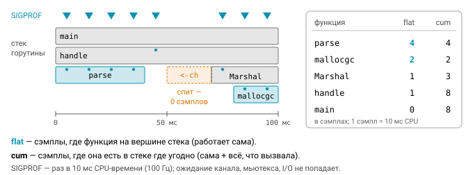

# Урок 4. Профилирование

## Какие бывают профили

Бенчмарк отвечает на вопрос «сколько стоит эта операция», но только если вы уже знаете, какую операцию мерить. В реальном сервисе всё наоборот: он тормозит или ест память, а где именно, непонятно. На этот вопрос отвечает профилировщик. В Go он встроен в рантайм и умеет собирать несколько видов профилей, каждый из которых смотрит на программу со своей стороны.

| Профиль | Что показывает | Как устроен |
|---|---|---|
| **cpu** | где тратится процессорное время | сэмплирование по SIGPROF 100 раз/с: стек текущей горутины |
| **heap** | живые объекты (`inuse_space/objects`) и все аллокации с начала (`alloc_space/objects`) | сэмпл примерно каждые 512 КБ аллокаций (`runtime.MemProfileRate`); обновляется на GC |
| **allocs** | то же, что heap, но по умолчанию показывает `alloc_space` | |
| **goroutine** | стеки всех горутин | снимок; ищем утечки горутин |
| **block** | где горутины ждали (каналы, мьютексы, select) | включить: `runtime.SetBlockProfileRate(n)` |
| **mutex** | где ждали освобождения мьютекса (виноват держатель) | включить: `runtime.SetMutexProfileFraction(n)` |
| **threadcreate** | создание потоков ОС | редко нужен |

Чаще всего вы будете работать с первыми двумя. CPU-профиль статистический: примерно 100 раз в секунду, то есть каждые $10$ мс процессорного времени, приходит сигнал SIGPROF, и рантайм записывает стек горутины, которая в этот момент выполнялась. Функции, которые чаще оказываются в этих снимках, получают больше сэмплов, и по доле сэмплов оценивают долю времени. Если функция попала в $1\,500$ сэмплов из $3\,000$, она заняла около половины процессорного времени.

Heap-профиль тоже не записывает каждую аллокацию, это было бы слишком дорого. В среднем один сэмпл берётся на каждые 512 КБ выделенной памяти (интервал задаёт `runtime.MemProfileRate`), а данные обновляются при сборке мусора. В нём есть две пары метрик, и их важно не путать.


`inuse_space` и `inuse_objects` показывают объекты, которые живы сейчас. На них смотрят, когда ищут утечку памяти или разросшийся кэш. `alloc_space` и `alloc_objects` накапливают все аллокации с начала работы программы, включая давно собранный мусор. Именно они отвечают на вопрос «кто создаёт больше всего мусора», когда сборщик отъедает заметную долю процессора. Профиль allocs содержит те же данные, но по умолчанию открывается на `alloc_space`.

## Как снять профиль

Способов три, и выбор зависит от того, что вы профилируете.

Проще всего снять профиль из тестов и бенчмарков, для этого у `go test` есть готовые флаги:

```
go test -run XXX -bench Render -cpuprofile cpu.out -memprofile mem.out ./pkg
go test -blockprofile block.out -mutexprofile mutex.out ./pkg
```

Для работающего сервиса есть пакет `net/http/pprof`. Достаточно импортировать его ради побочного эффекта:

```go
import _ "net/http/pprof" // регистрирует /debug/pprof/* в http.DefaultServeMux!

go func() { log.Println(http.ListenAndServe("localhost:6060", nil)) }() // только localhost/внутренняя сеть
```

Здесь легко ошибиться. Импорт регистрирует обработчики в глобальном `http.DefaultServeMux`, и если ваш основной сервер слушает `http.ListenAndServe(":8080", nil)`, профили окажутся доступны любому, кто достучится до порта. Профили раскрывают внутреннее устройство сервиса, а запрос CPU-профиля ещё и нагружает его. Надёжнее завести отдельный mux на отдельном внутреннем порту и зарегистрировать обработчики явно: `mux.HandleFunc("/debug/pprof/", pprof.Index)`, а также `pprof.Profile`, `pprof.Symbol`, `pprof.Trace` и `pprof.Cmdline`.

После этого профили забирают прямо по HTTP:

```
go tool pprof http://localhost:6060/debug/pprof/profile?seconds=30   # CPU за 30 с
go tool pprof http://localhost:6060/debug/pprof/heap
curl localhost:6060/debug/pprof/goroutine?debug=1                    # текст, сгруппировано по стекам
curl localhost:6060/debug/pprof/goroutine?debug=2                    # как при панике, каждая горутина
```

Третий способ — снять профиль программно через пакет `runtime/pprof`. Он пригодится для утилит командной строки и для задач, где профилировать нужно конкретный участок кода:

```go
f, _ := os.Create("cpu.out")
pprof.StartCPUProfile(f)          // ошибка, если профиль уже идёт (он один на процесс)
defer pprof.StopCPUProfile()

mf, _ := os.Create("mem.out")
runtime.GC()                        // иначе heap-профиль не увидит свежие данные
pprof.Lookup("heap").WriteTo(mf, 0) // 0 — бинарный protobuf (gzip), 1 — текст
```

Обратите внимание на `runtime.GC()` перед записью heap-профиля: данные профиля обновляются при сборке мусора, и без принудительной сборки вы увидите состояние на момент предыдущей.

## go tool pprof

Снятый профиль читают командой `go tool pprof`. У неё есть интерактивный режим с текстовыми командами и веб-интерфейс:

```
go tool pprof cpu.out
(pprof) top10                  # flat — время в самой функции, cum — вместе с вызываемыми
(pprof) top -cum
(pprof) list TopWords          # исходник с временем по строкам
(pprof) peek regexp            # кто вызывает и кого вызывает
(pprof) web                    # граф вызовов (нужен graphviz)
go tool pprof -http=:8080 cpu.out   # веб-интерфейс: Flame Graph, Source, Top
go tool pprof -sample_index=alloc_space mem.out
go tool pprof -base old.out new.out  # разница профилей
```

Первое, что нужно понять в выводе `top`, — разница между двумя колонками. **flat** — это время, проведённое в самой функции, то есть сэмплы, где она была на вершине стека. **cum** (cumulative) — время вместе со всеми функциями, которые она вызывает, то есть сэмплы, где она встречается где угодно в стеке. У `main` поэтому $\text{flat} \approx 0$, а $\text{cum} \approx 100\%$: сама она почти ничего не делает, но всё остальное происходит внутри неё. Функции с большим flat — это места, где «горит» сам код. Функции с большим cum и маленьким flat ничего дорогого не делают сами, но вызывают что-то дорогое, и искать нужно ниже по стеку.



Из устройства CPU-профиля следует важное ограничение. Горутина, которая ждёт на канале, мьютексе, в сетевом вызове или запросе к базе, не выполняется на процессоре и в сэмплы не попадает. Хендлер может отвечать две секунды и при этом почти не появляться в CPU-профиле. Ожидания ищут в block- и mutex-профилях или в трассе, о которой речь пойдёт ниже.

Самое наглядное представление профиля — **flame graph**. Ширина полосы в нём равна доле времени, а по вертикали выстроен стек вызовов. В классическом flame graph корень находится внизу, а в веб-интерфейсе `go tool pprof` наоборот: корень сверху, листья внизу. Горячие точки выглядят как широкие «плато» на концах стеков, у листьев. Цвета никакого значения не имеют, они нужны только чтобы отличать соседние полосы.


Со временем вы начнёте узнавать типичные «симптомы» в топе профиля:

- `runtime.mallocgc`, `runtime.growslice`, `runtime.concatstrings`, `runtime.memmove` говорят о лишних аллокациях и копированиях;
- `runtime.gcBgMarkWorker` и `runtime.scanobject` значат, что сборщик мусора занят, потому что мусора много;
- `runtime.mapaccess*` и `runtime.mapassign` указывают на интенсивную работу с map;
- `sync.(*Mutex).Lock` вместе с `runtime.futex` выдают конкуренцию за мьютекс, и тогда стоит открыть mutex-профиль;
- `syscall.Syscall` часто означает ввод-вывод без буферизации.

## Утечки горутин

Горутина, заблокированная навсегда, — это утечка. Она держит свой стек, всё, на что ссылается, а часто ещё и соединения или файлы. Типичные причины знакомы по модулю о конкурентности: чтение из канала, который никто не закроет, отправка в канал, у которого нет получателя, забытый `ctx`, который никогда не отменяется.

Главный признак утечки — медленно, но неуклонно растущий `runtime.NumGoroutine()`. Найти её источник помогает профиль горутин с `debug=1`: он группирует одинаковые стеки и показывает, сколько горутин стоит в каждом. Функция, в которой застряли сотни горутин, видна с первого взгляда, обычно они ждут на одном и том же канале или `select`. В тестах утечки ловит библиотека `go.uber.org/goleak`: достаточно добавить `defer goleak.VerifyNone(t)`, и тест упадёт, если после него остались лишние горутины.

## Трассировка: runtime/trace

Профиль агрегирует данные и отвечает на вопрос, где тратится время. Трасса отвечает на другой вопрос: что происходило во времени. Она записывает события: когда горутины запускались и блокировались, сколько ждали планировщика, когда были паузы GC и системные вызовы.

```go
f, _ := os.Create("trace.out")
trace.Start(f); defer trace.Stop()
// или: go test -trace trace.out;  curl .../debug/pprof/trace?seconds=5 > trace.out
```
```
go tool trace trace.out
```

Трасса незаменима для проблем с латентностью и параллелизмом. Вопрос вроде «почему 8 ядер загружены только на 30%?» по CPU-профилю не решить, ведь простаивающее ядро сэмплов не даёт, а на временной шкале трассы сразу видно, кто кого ждал. Чтобы трасса была понятнее, в код можно добавить пользовательские регионы и задачи, например `trace.WithRegion(ctx, "decode", fn)`.

## Escape analysis

Каждый раз, когда вы создаёте значение, компилятор решает, где его разместить. Стек почти бесплатен: память выделяется сдвигом указателя и освобождается при выходе из функции. Куча требует работы аллокатора, а потом и сборщика мусора. Разместить значение на стеке можно, только если компилятор докажет, что оно не переживёт свою функцию. Этот анализ называется **escape analysis**, и его решения можно посмотреть:

```
go build -gcflags=-m ./pkg          # -m=2 — подробнее, почему
./user.go:10:9: &User{...} escapes to heap
./user.go:15:13: ... argument does not escape
./fmt.go:20:14: s escapes to heap          ← упаковка в interface{} для fmt
./main.go:8:6: can inline add
```

Значение «убегает» в кучу, если функция возвращает указатель на него, если его сохраняют в глобальную переменную или в поле объекта, который сам живёт в куче, если его захватывает замыкание, живущее дольше функции, или если его передают как `interface{}` туда, где компилятор не видит, что с ним будет. Кроме того, в куче оказываются слишком большие объекты и срезы, размер которых известен только во время выполнения, вроде `make([]byte, n)`.


## GODEBUG

Переменная окружения GODEBUG включает диагностический вывод рантайма. Самая полезная настройка — трассировка сборщика мусора:

```
GODEBUG=gctrace=1 ./app
gc 7 @0.512s 2%: 0.015+1.2+0.003 ms clock, 0.12+0.4/1.1/0.8+0.02 ms cpu, 4->4->2 MB, 5 MB goal, 0 MB stacks, 0 MB globals, 8 P
```

Строка читается слева направо. Сначала идут номер сборки, время с запуска программы и доля времени, потраченная на GC с момента запуска. Затем длительности фаз: STW sweep termination, конкурентная разметка (concurrent mark) и STW mark termination; в части `cpu` разметка дополнительно разбита на assist, background и idle. Тройка `4->4->2 MB` — это размер кучи в начале сборки, в конце сборки и объём живых данных. Дальше следуют цель по размеру кучи, объём сканируемых стеков и глобальных переменных, а в конце — число P.

Из других настроек пригодятся `GODEBUG=schedtrace=1000`, которая раз в секунду печатает состояние планировщика, и `inittrace=1`, показывающая время работы init-функций.

Поведением сборщика управляют две переменные. `GOGC` задаёт, насколько куча может вырасти относительно живых данных до следующей сборки:

$$
H_\text{goal} = H_\text{live} \cdot \left(1 + \frac{\mathrm{GOGC}}{100}\right)
$$

По умолчанию $\mathrm{GOGC} = 100$, то есть куча растёт вдвое между сборками. `GOMEMLIMIT` (Go 1.19+) добавляет мягкий лимит памяти: приближаясь к нему, сборщик начинает работать чаще.

## Delve

Иногда профилей и логов недостаточно и нужно остановить программу и посмотреть на неё изнутри. Для Go стандартным отладчиком стал Delve:

```
go install github.com/go-delve/delve/cmd/dlv@latest
dlv debug ./cmd/app -- -config dev.yaml
dlv test ./pkg -- -test.run TestX
dlv attach <pid>
(dlv) break user.go:42        (dlv) condition 1 id == 7
(dlv) continue / next / step / stepout
(dlv) print u.Name            (dlv) locals            (dlv) goroutines   (dlv) bt
```

Оптимизации компилятора мешают отладке: переменные исчезают, а функции встраиваются. Поэтому для отладки собирайте программу с флагами `-gcflags=all="-N -l"`; `dlv debug` делает это сам. Delve поддерживается в VS Code и GoLand, так что ставить точки останова можно прямо в редакторе. Он умеет разбирать и core-дампы: запустите программу с `GOTRACEBACK=crash`, а упавший процесс откройте через `dlv core`.

## Вопросы с собеседований

- Как устроен CPU-профиль в Go? Почему в нём не видно времени, которое горутина провела в ожидании на канале?
- Чем `inuse_space` отличается от `alloc_space`, и в каких ситуациях смотреть на каждый?
- Как найти утечку горутин в работающем сервисе?
- Когда полезнее профиль, а когда трасса?
- Что такое escape analysis и как посмотреть решения компилятора?
- Как безопасно подключить pprof к продакшен-сервису?

## Ссылки

- https://go.dev/doc/diagnostics
- https://pkg.go.dev/runtime/pprof, https://pkg.go.dev/net/http/pprof
- https://go.dev/blog/pprof
- https://github.com/google/pprof/blob/main/doc/README.md
- https://go.dev/doc/gc-guide

## Практика

- [06_hotspot](../tasks/06_hotspot) — найдите и устраните квадратичные алгоритмы, $O(n^2)$ там, где хватает $O(n)$ или $O(n \log n)$ (тест с лимитом по времени).
- [07_pprof](../tasks/07_pprof) — CPU/heap-профиль из кода и разбор профиля горутин.
- [08_project_wallet](../tasks/08_project_wallet) — Задание 6: фейки, тесты против мутантов, горячий путь без аллокаций.
