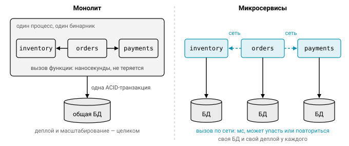
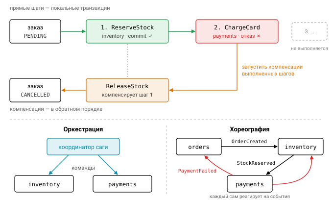
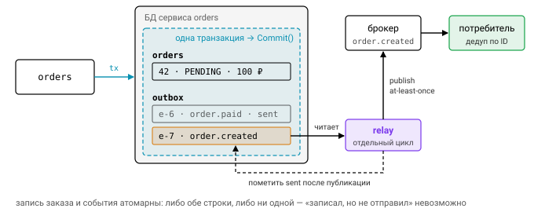
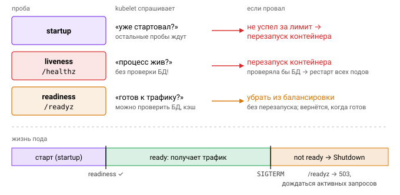

# Урок 1. Введение в микросервисы

## Монолит и микросервисы

Начнём с двух слов, которые вы будете слышать на каждом собеседовании. **Монолит** — это одно развёртываемое приложение: один бинарник и одна база данных. **Микросервисы** — набор небольших сервисов, каждый из которых развёртывается независимо, владеет своими данными и общается с остальными по сети.

На бумаге разница кажется организационной, но на практике она меняет почти всё, с чем вы работаете каждый день. Сравним по пунктам:

| | Монолит | Микросервисы |
|---|---|---|
| Деплой | всё сразу | каждый сервис отдельно |
| Вызов соседнего модуля | вызов функции (нс, не падает) | сетевой запрос (мс, может упасть, зависнуть, выполниться дважды) |
| Транзакции | ACID в одной БД | распределённые: саги, outbox, eventual consistency |
| Масштабирование | целиком | по узким местам |
| Команды | общая кодовая база | команда владеет сервисом («you build it, you run it») |
| Отладка | стек-трейс | распределённый трейсинг |



Самая коварная строка в этой таблице — вторая. В монолите вызов соседнего модуля занимает наносекунды и не может «потеряться». В микросервисах тот же вызов превращается в сетевой запрос: он идёт миллисекунды, может упасть, может зависнуть, а может выполниться дважды. Большая часть этого урока посвящена тому, как с этим жить.

Зачем же тогда вообще резать систему? Микросервисы решают прежде всего организационную проблему: когда много команд работают в одной кодовой базе, они начинают мешать друг другу. Платят за это технической сложностью. Поэтому разумная стратегия — начинать с *модульного монолита* с чёткими границами пакетов и выносить сервис тогда, когда для этого появилась конкретная причина: разный темп релизов, разные требования к масштабированию, отдельная команда. Хуже всего получается «распределённый монолит»: сервисы, которые можно деплоить только вместе и которые синхронно дёргают друг друга цепочкой. Он собирает недостатки обоих подходов и не даёт преимуществ ни одного.

## Границы сервисов: DDD и bounded context

Где проводить границу между сервисами? Самый полезный инструмент здесь пришёл из DDD — **bounded context** (ограниченный контекст), то есть область, внутри которой термины модели однозначны. Возьмём слово «товар». В каталоге это описание и фото, на складе — остаток и ячейка, в бухгалтерии — себестоимость. Перед нами три разные модели, и если попытаться слепить из них одну общую структуру `Product` на всех, сервисы окажутся связаны через неё намертво.

Хорошую границу обычно видно по трём признакам:

- сервис владеет своими данными: никто не лезет в его БД напрямую, только через API;
- большинство изменений затрагивает один сервис, а не пять сразу;
- сервис может выполнять свою работу, хотя бы частично, когда соседи недоступны.

## Синхронное и асинхронное взаимодействие

Сервисы разговаривают друг с другом двумя способами. При **синхронном** взаимодействии (REST, gRPC, JSON-RPC) мы отправляем запрос и ждём ответ. Это просто и понятно, но связывает доступность сервисов: если `inventory` лежит, `orders` тоже не работает. Хуже того, доступности в синхронной цепочке перемножаются. Цепочка из $N$ сервисов, каждый из которых доступен на 99.9%, в целом доступна на

$$
A = 0.999^N,
$$

так что уже три сервиса дают $0.999^3 \approx 99.7\%$, а время простоя почти утраивается.

При **асинхронном** взаимодействии (Kafka, NATS, RabbitMQ) сервис публикует событие, например `OrderCreated`, а подписчики обрабатывают его, когда смогут. Сервисы развязаны по времени, и падение подписчика не мешает издателю. Цена — eventual consistency и дубли сообщений, потому что брокеры обычно гарантируют доставку at-least-once. Порядок сообщений тоже становится отдельной заботой.


## Обнаружение сервисов и API Gateway

В живом кластере сервисы постоянно появляются и исчезают, а их IP-адреса меняются. Чтобы `orders` мог найти `inventory`, нужен **service discovery**. Вариантов три. Самый простой — DNS: в Kubernetes у каждого Service есть имя вида `inventory.default.svc`. Второй — реестр вроде Consul или etcd, из которого клиент сам берёт список адресов и балансирует нагрузку (client-side балансировка). Третий — service mesh (Envoy/Istio): рядом с каждым сервисом работает sidecar, который берёт на себя mTLS, ретраи и балансировку.

Внешним клиентам внутреннее устройство знать незачем, поэтому на входе ставят **API Gateway** — единую точку входа. Он занимается маршрутизацией, аутентификацией, rate limiting, агрегирует ответы нескольких сервисов и транслирует протоколы (например, REST в gRPC и обратно). Если клиенты сильно различаются — мобильное приложение, веб, партнёрский API, — применяют паттерн **BFF** (Backend for Frontend): отдельный gateway под каждый тип клиента.


## Устойчивость: timeout, retry, idempotency, circuit breaker

Раз любой сетевой вызов может сломаться, код вокруг него нужно строить с расчётом на сбой. Четыре приёма из этого раздела встречаются в любом зрелом сервисе, и в задачах модуля вы реализуете их сами.

### Таймауты

Первое правило: таймаут должен быть у каждого сетевого вызова. У `http.DefaultClient` таймаута нет, поэтому зависший сервер будет навсегда держать горутину и соединение. В Go таймауты принято передавать через `context`:

```go
ctx, cancel := context.WithTimeout(r.Context(), 300*time.Millisecond)
defer cancel()
req, _ := http.NewRequestWithContext(ctx, http.MethodPost, url, body)
resp, err := client.Do(req) // вернёт ошибку, как только ctx истечёт
```

Обратите внимание, что контекст здесь наследуется от входящего запроса. Бюджет времени убывает по цепочке: если у входящего запроса осталось 200 мс, ждать соседа целую секунду бессмысленно, ответ всё равно никому не понадобится. В gRPC дедлайн передаётся следующему сервису автоматически, об этом поговорим в третьем уроке.

### Ретраи

Повторять запрос имеет смысл только при временных ошибках: сбой сети, 503, 429, gRPC-код `Unavailable`. Паузы между попытками растут экспоненциально. Если попытки нумеруются с единицы, пауза после $n$-й неудачной попытки равна

$$
d_n = \min\left(d_\text{max},\; d_\text{base} \cdot m^{\,n-1}\right),
$$

где $d_\text{base}$ — начальная пауза, $m$ — множитель (обычно 2), а $d_\text{max}$ ограничивает рост сверху.

Одной экспоненты мало. Если тысяча клиентов упала одновременно, они и повторять будут одновременно, пачками, и снова добьют едва поднявшийся сервер. Это называется *retry storm*. Лекарство — **джиттер**, случайная составляющая паузы. В варианте full jitter пауза выбирается равномерно из отрезка $[0, d_n]$, и нагрузка размазывается по времени. Кроме того, всегда ограничивайте число попыток и общий бюджет ретраев.

![Экспоненциальная пауза без джиттера синхронизирует повторы всех клиентов в пачки; full jitter выбирает паузу случайно из `[0, backoff]` и размазывает нагрузку](img/retry-backoff-jitter.svg)

### Идемпотентность

Теперь неприятный случай: запрос дошёл и выполнился, а ответ потерялся по дороге. Клиент видит ошибку и повторяет запрос. Если это было списание денег, деньги спишутся дважды. Поэтому безопасно повторять только идемпотентные операции, то есть такие, повтор которых не меняет результат. По семантике HTTP идемпотентны `GET/PUT/DELETE`, а `POST` — нет.

Чтобы сделать `POST` безопасным для повторов, используют **Idempotency-Key**. Клиент генерирует ключ на операцию и отправляет его во всех попытках. Сервер запоминает результат по этому ключу и на повторный запрос отдаёт сохранённый ответ, не выполняя операцию заново. Так, например, работает Stripe API. В качестве ключа часто подходит естественный идентификатор, скажем ID заказа.


### Circuit breaker

Ретраи помогают пережить короткий сбой, но если зависимость лежит всерьёз, они только добавляют ей нагрузки. Здесь нужен **circuit breaker**, «автомат» по аналогии с электрощитком. У него три состояния: закрыт, открыт и полуоткрыт. В закрытом состоянии вызовы проходят как обычно. После $N$ неудач подряд цепь размыкается, и мы перестаём звать зависимость, сразу возвращая ошибку. Через заданный таймаут breaker переходит в полуоткрытое состояние и пропускает пробный запрос, чтобы проверить, не ожила ли зависимость.

Такая схема защищает обе стороны. Мы не копим горутины, которые ждут мёртвого соседа, а сосед получает передышку, чтобы восстановиться. Одна тонкость: бизнес-ошибки вроде «товара нет на складе» не должны размыкать цепь. Они означают, что зависимость как раз работает исправно.


На практике breaker и retry комбинируют:

```go
err := breaker.Execute(func() error {
    return retry.Do(ctx, policy, func(ctx context.Context, _ int) error {
        return callInventory(ctx, req)
    })
})
```

В каком порядке их вкладывать — популярный вопрос на собеседованиях. Если breaker находится внутри retry, он считает каждую попытку отдельно и прерывает серию повторов, как только цепь разомкнулась (при условии, что retry считает `ErrOpen` неповторяемой ошибкой). Если breaker снаружи, как в примере выше, он видит операцию целиком, вместе со всеми её повторами.

Есть и другие паттерны устойчивости, о которых полезно знать. **Bulkhead** изолирует ресурсы: у каждой зависимости свой пул или семафор, и зависание одной не съедает ресурсы для остальных. **Load shedding** означает, что перегруженный сервис сразу отбрасывает лишние запросы с 503, а не пытается обслужить всех и падает. **Fallback** подставляет значение из кэша или значение по умолчанию, когда зависимость недоступна.

## Распределённые транзакции: saga и outbox

В монолите заказ, резерв товара и списание денег укладываются в одну ACID-транзакцию. Когда эти данные живут в трёх разных сервисах с тремя разными базами, общей транзакции больше нет. Как быть?

**Saga** — это последовательность локальных транзакций, у каждой из которых есть *компенсирующее* действие. Например, `ReserveStock → ChargeCard → (fail) → ReleaseStock`: списание не прошло, поэтому резерв отменяется. Координировать шаги можно двумя способами. При оркестрации есть отдельный координатор, который вызывает сервисы по очереди. При хореографии координатора нет, и сервисы реагируют на события друг друга.



С событиями связана ещё одна ловушка — dual write. Сервис записал заказ в БД и собирается отправить событие в брокер, но падает между этими двумя действиями. Заказ есть, а события нет. **Transactional outbox** решает эту проблему так: событие пишется в специальную таблицу той же базы, в той же транзакции, что и сам заказ.

```go
tx.Exec(`INSERT INTO orders ...`)
tx.Exec(`INSERT INTO outbox(topic, payload) VALUES ('order.created', $1)`, payload)
tx.Commit() // атомарно
// отдельный relay читает outbox и публикует в брокер (at-least-once),
// потребители дедуплицируют по ID события (inbox)
```

Отдельный процесс-relay потом вычитывает неотправленные строки и публикует их в брокер. Гарантия получается at-least-once: relay может упасть после публикации, но до пометки строки отправленной, и тогда событие уйдёт повторно. Поэтому потребители дедуплицируют события по их ID (этот приём называют inbox).



## Наблюдаемость

В монолите для отладки часто хватает стек-трейса. В распределённой системе один пользовательский запрос проходит через несколько процессов, и понять, что случилось, можно только по телеметрии. Её традиционно делят на три столпа.

Логи должны быть структурированными (в Go для этого есть `log/slog`) и содержать `trace_id`, чтобы записи разных сервисов можно было связать. Метрики собирают в Prometheus; для сервисов удобна методика RED (Rate, Errors, Duration), а для ресурсов — USE. Трейсы строят с помощью OpenTelemetry: на каждый запрос заводится span, а контекст трассировки передаётся между сервисами в заголовке `traceparent` по стандарту W3C. Внутри Go-процесса всё это связывается через `context.Context`.

## 12-factor и health-пробы

Многие практики эксплуатации сервисов сведены в методологию [12-factor app](https://12factor.net/ru/). Из неё чаще всего вспоминают такие пункты: конфигурация хранится в переменных окружения, процессы не хранят состояния (stateless), логи пишутся в stdout, процесс быстро стартует и корректно завершается (graceful shutdown), а окружения разработки и продакшена максимально похожи (dev/prod parity).

Graceful shutdown в Go выглядит так:

```go
srv := &http.Server{Addr: ":8080", Handler: mux, ReadHeaderTimeout: 5 * time.Second}
go srv.ListenAndServe()
ctx, stop := signal.NotifyContext(context.Background(), syscall.SIGTERM, os.Interrupt)
defer stop()
<-ctx.Done()
shutdownCtx, cancel := context.WithTimeout(context.Background(), 10*time.Second)
defer cancel()
srv.Shutdown(shutdownCtx) // дождаться активных запросов
```

Получив SIGTERM, сервер перестаёт принимать новые соединения и ждёт завершения активных запросов, но не дольше 10 секунд.

Чтобы Kubernetes знал, в каком состоянии ваш сервис, тот отвечает на пробы. Их три, и путать первые две опасно.

- **liveness** (`/healthz`) отвечает на вопрос «процесс жив?». Если нет, контейнер перезапускают. Зависимости здесь проверять нельзя: иначе падение БД приведёт к перезапуску всех подов, что никак не поможет.
- **readiness** (`/readyz`) отвечает на вопрос «готов ли под принимать трафик?». Если нет, под просто убирают из балансировки. Вот здесь уместно проверить БД и кэш. При shutdown сервис первым делом начинает отвечать not ready.
- **startup** нужна для сервисов с долгим стартом.



## Структура Go-проекта

Жёсткого стандарта раскладки Go-проекта нет, но типичный сервис выглядит примерно так:

```
service/
  cmd/orders/main.go        # точка входа: конфиг, wiring, запуск
  internal/                 # код, который нельзя импортировать извне модуля (проверяет команда go)
    orders/                 # домен + use cases
    inventoryclient/        # клиент к соседнему сервису
    transport/http/         # хендлеры
  pkg/                      # (опционально) то, что осознанно отдаём наружу
  api/                      # .proto, OpenAPI
  migrations/
```

Из всего этого дерева сама команда `go` проверяет только одно правило — про `internal/`. Пакет `a/internal/b` может импортировать лишь код из дерева с корнем `a/`, то есть сам `a` и его подпакеты. Всё остальное, включая `pkg/` и `cmd/`, — договорённости (см. [go.dev/doc/modules/layout](https://go.dev/doc/modules/layout)).

## Типичные ошибки

Большинство инцидентов в микросервисах повторяют одни и те же сценарии. HTTP-клиент без таймаутов приводит к утечкам горутин и соединений. Ретраи неидемпотентных операций оборачиваются двойными списаниями. Ретраи на каждом уровне цепочки перемножаются: если три уровня делают по три попытки, последний сервис получит $3 \times 3 \times 3 = 27$ запросов вместо одного.

Другие ошибки бьют по архитектуре. Общая БД у нескольких сервисов создаёт неявный контракт на схему, и изменить таблицу становится невозможно, не сломав соседей. Liveness-проба, проверяющая зависимости, вызывает каскадные перезапуски. А забытый `resp.Body.Close()` не даёт соединению вернуться в пул.

## Вопросы с собеседований

1. В каких случаях микросервисы — плохая идея? Что называют распределённым монолитом?
2. Чем readiness-проба отличается от liveness и что будет, если перепутать их роли?
3. Как сделать POST-запрос безопасным для ретраев?
4. Что такое saga и чем оркестрация отличается от хореографии? Какую проблему решает outbox?
5. Опишите состояния circuit breaker. Чем он отличается от retry?
6. Что такое jitter и зачем его добавляют к экспоненциальной паузе?

## Ссылки

- [Microservices — Martin Fowler](https://martinfowler.com/articles/microservices.html)
- [Google SRE Book: Handling Overload / Addressing Cascading Failures](https://sre.google/sre-book/addressing-cascading-failures/)
- [AWS: Exponential Backoff And Jitter](https://aws.amazon.com/blogs/architecture/exponential-backoff-and-jitter/)
- [Stripe: Idempotent requests](https://docs.stripe.com/api/idempotent_requests)
- [pkg.go.dev/context](https://pkg.go.dev/context), [go.dev/doc/modules/layout](https://go.dev/doc/modules/layout)

## Практика

- [01_breaker](../tasks/01_breaker/) — circuit breaker с инжектируемыми часами.
- [02_retry](../tasks/02_retry/) — ретраи с backoff и middleware Idempotency-Key.
