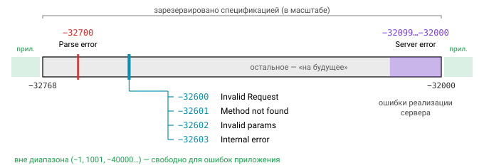

# Урок 2. JSON-RPC

## Идея RPC

Remote Procedure Call, или RPC, — это вызов функции на другой машине так, будто она локальная: `result, err := client.Call("Arith.Multiply", args)`. Сетевые детали спрятаны за обычным вызовом, и код выглядит почти как в монолите.

Чем это отличается от привычного REST? REST моделирует **ресурсы** и действия над ними через HTTP-глаголы: `POST /orders`, `GET /orders/42`. RPC моделирует сами **действия**: `Orders.Create`, `Inventory.Reserve`. Для внутренних API, где операции не всегда ложатся на CRUD, такая модель часто оказывается естественнее.

## Спецификация JSON-RPC 2.0

Одна из самых простых RPC-схем — JSON-RPC 2.0. Вся [спецификация](https://www.jsonrpc.org/specification) умещается на одной странице и не оговаривает транспорт: сообщения можно гонять по HTTP, WebSocket, TCP или stdio. Вы наверняка пользовались JSON-RPC 2.0, даже не зная об этом: на нём работают LSP (протокол между редактором и языковым сервером) и Ethereum-ноды.

### Запрос

Запрос выглядит так:

```json
{"jsonrpc": "2.0", "method": "subtract", "params": [42, 23], "id": 1}
{"jsonrpc": "2.0", "method": "subtract", "params": {"minuend": 42, "subtrahend": 23}, "id": "a1"}
```

Поле `jsonrpc` содержит ровно строку `"2.0"`. В `method` лежит имя метода, строка; имена, начинающиеся с `rpc.`, зарезервированы. Параметры в `params` передаются либо **массивом** (позиционно), либо **объектом** (по именам), а само поле может отсутствовать. Наконец, `id` — строка, число или `null`, хотя `null` использовать не рекомендуется, как и дробные числа.

С `id` связано самое тонкое место спецификации. **Нотификация** — это запрос, в котором поля `id` нет вовсе. На нотификацию сервер не отвечает никогда, даже если при её обработке произошла ошибка. А вот `"id": null` нотификацией *не* является: это обычный запрос с id, равным null, и ответ на него обязателен.

### Ответ

Ответ содержит ровно одно из двух полей, `result` или `error`, и тот же `id`, что был в запросе:

```json
{"jsonrpc": "2.0", "result": 19, "id": 1}
{"jsonrpc": "2.0", "error": {"code": -32601, "message": "Method not found"}, "id": "a1"}
```


### Коды ошибок

Спецификация определяет несколько стандартных кодов:

| Код | Сообщение | Когда |
|---|---|---|
| -32700 | Parse error | невалидный JSON (id = null) |
| -32600 | Invalid Request | JSON валиден, но это не Request-объект |
| -32601 | Method not found | метода нет |
| -32602 | Invalid params | параметры не подходят |
| -32603 | Internal error | внутренняя ошибка сервера |
| -32000…-32099 | Server error | зарезервировано под ошибки реализации |

Зарезервирован весь диапазон от −32768 до −32000: коды из него, не перечисленные в таблице, оставлены «на будущее». Всё, что лежит вне этого диапазона, можно свободно использовать для ошибок приложения. Кроме `code` и `message`, в объекте ошибки может быть необязательное поле `error.data` с произвольными подробностями.



### Батчи

Клиент может отправить несколько запросов сразу, обернув их в массив, — это **batch**. Сервер отвечает массивом ответов, причём в **любом порядке**, так что сопоставлять ответы с запросами нужно по `id`. Нотификации внутри батча, как и поодиночке, ответов не дают.

У батчей есть несколько граничных случаев, которые легко реализовать неправильно:

- на пустой массив `[]` сервер отвечает одиночным объектом с ошибкой `-32600`, а не массивом;
- если невалиден JSON всего пакета, ответ тоже одиночный, с кодом `-32700`;
- на `[1, 2]` приходит массив из двух ошибок `-32600` с `id: null`, по одной на каждый элемент;
- если все элементы батча — нотификации, сервер не возвращает ничего. По HTTP в этом случае обычно отдают `204 No Content`, но это соглашение транспорта, а не требование спецификации.


## Stdlib: `net/rpc` и `net/rpc/jsonrpc`

В стандартной библиотеке Go есть пакет `net/rpc`. Он заморожен, то есть новые возможности в него больше не принимаются. По умолчанию он кодирует сообщения в gob, а пакет `net/rpc/jsonrpc` подменяет кодек на JSON. Только это не тот JSON-RPC, о котором мы говорили выше: `net/rpc/jsonrpc` реализует **JSON-RPC 1.0**. В этой версии нет поля `jsonrpc`, `params` всегда массив из одного элемента, а ошибка передаётся строкой.

К методам `net/rpc` предъявляет строгие требования. Метод должен быть экспортируемым и принадлежать экспортируемому типу, принимать два аргумента экспортируемых (или встроенных) типов, причём второй обязан быть указателем, и возвращать `error`:

```go
type Args struct{ A, B int }
type Arith int

func (t *Arith) Multiply(args *Args, reply *int) error {
    *reply = args.A * args.B
    return nil
}

// сервер
func main() {
    srv := rpc.NewServer()
    srv.Register(new(Arith)) // метод доступен как "Arith.Multiply"
    ln, _ := net.Listen("tcp", ":1234")
    for {
        conn, err := ln.Accept()
        if err != nil { continue }
        go srv.ServeCodec(jsonrpc.NewServerCodec(conn))
    }
}

// клиент
client, _ := jsonrpc.Dial("tcp", "localhost:1234")
var product int
err := client.Call("Arith.Multiply", &Args{7, 8}, &product) // 56
call := client.Go("Arith.Multiply", &Args{2, 3}, &product, nil) // асинхронно
<-call.Done
```

На проводе вызов `Multiply` в версии 1.0 выглядит как `{"method":"Arith.Multiply","params":[{"A":7,"B":8}],"id":0}`, а сервер отвечает `{"id":0,"result":56,"error":null}`.


Для современного сервиса у `net/rpc` слишком много ограничений. В нём нет контекста и дедлайнов, нет метаданных, на каждом вызове работает рефлексия, а gob привязан к Go и бесполезен для клиентов на других языках. Поэтому для JSON-RPC 2.0 обычно берут сторонние библиотеки или пишут собственный тонкий сервер. В задаче мы поступим именно так.

## Типизированный сервер на дженериках

Как совместить удобство типизированных обработчиков с тем, что сервер должен хранить их в одной карте? Идея простая: внутри сервера обработчики хранятся «сырыми», принимающими `json.RawMessage`, а типизацию снаружи даёт generic-обёртка, которая сама декодирует параметры:

```go
type handlerFunc func(ctx context.Context, params json.RawMessage) (any, error)

func Register[P, R any](s *Server, name string, fn func(context.Context, P) (R, error)) {
    s.methods[name] = func(ctx context.Context, raw json.RawMessage) (any, error) {
        var p P
        if len(raw) > 0 {
            if err := json.Unmarshal(raw, &p); err != nil {
                return nil, &Error{Code: -32602, Message: "Invalid params"}
            }
        }
        return fn(ctx, p)
    }
}
```

Почему `Register` — функция, а не метод `Server`? Потому что в Go метод не может иметь собственных параметров типа: запись `func (s *Server) Register[P, R any]` не скомпилируется.

Ещё один полезный приём связан с нотификациями. Чтобы отличить отсутствующее поле `id` от `"id": null`, поле объявляют как `json.RawMessage`. Отсутствующее поле оставит его равным `nil`, а `null` запишется как `[]byte("null")`. С указателем `*T` так не получится: в обоих случаях он останется `nil`, и различить их будет нельзя.

## JSON-RPC, REST и gRPC

Сравним JSON-RPC с двумя главными альтернативами:

| | REST | JSON-RPC | gRPC |
|---|---|---|---|
| Модель | ресурсы + HTTP-глаголы | методы | методы (сервисы в .proto) |
| Формат | JSON (обычно) | JSON | protobuf (бинарный) |
| Контракт | OpenAPI (опционально) | нет стандарта | `.proto` обязателен, кодогенерация |
| Кэширование HTTP | да (GET) | нет (всё POST) | нет |
| Ошибки | HTTP-статусы | коды в теле, HTTP 200 | `grpc-status` в трейлерах |
| Батчи | нет | встроены | стриминг |
| Браузер | нативно | нативно | нужен grpc-web / gateway |


Каждый из трёх подходов хорош в своей нише. JSON-RPC удобен для внутренних API и там, где нужен один эндпоинт и простые батчи: блокчейн-ноды, LSP, админки. REST лучше подходит для публичных API и там, где важно HTTP-кэширование. gRPC выбирают для внутреннего трафика между сервисами, когда нужны жёсткий контракт и стриминг.

## Типичные ошибки

Больше всего ошибок в реализациях JSON-RPC связано с нотификациями: сервер отвечает на них или, наоборот, не отвечает на запрос с `"id": null`. Вторая частая ошибка — возвращать HTTP 500, когда метод завершился ошибкой. По соглашению JSON-RPC-over-HTTP ответ с `error` отправляется с HTTP 200, а HTTP-коды остаются для транспортных проблем.

Не отдавайте клиенту текст внутренней ошибки вроде `pq: password authentication failed`: так наружу утекают детали устройства системы. Не забывайте про `recover`, иначе паника в одном обработчике уронит соединение или весь сервер. А на стороне клиента не полагайтесь на порядок ответов в батче.

## Вопросы с собеседований

1. Как отличить нотификацию от обычного запроса? Что вернёт сервер на батч, состоящий только из нотификаций?
2. Чем JSON-RPC 1.0 отличается от 2.0?
3. Почему `net/rpc` считается устаревшим и каким требованиям должна отвечать сигнатура его методов?
4. Почему в Go нельзя объявить generic-метод и как это ограничение обходят?
5. В каких случаях стоит выбрать JSON-RPC, а не REST?

## Ссылки

- [JSON-RPC 2.0 Specification](https://www.jsonrpc.org/specification)
- [pkg.go.dev/net/rpc](https://pkg.go.dev/net/rpc), [pkg.go.dev/net/rpc/jsonrpc](https://pkg.go.dev/net/rpc/jsonrpc)
- [pkg.go.dev/encoding/json#RawMessage](https://pkg.go.dev/encoding/json#RawMessage)
- [Go spec: Type parameters](https://go.dev/ref/spec#Type_parameter_declarations)

## Практика

- [03_jsonrpc](../tasks/03_jsonrpc/) — сервер JSON-RPC 2.0 с `Register[P, R]`, батчами и нотификациями, а также клиент к нему.
