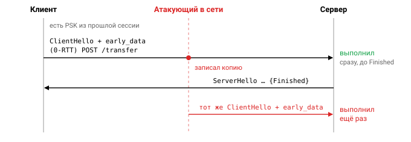
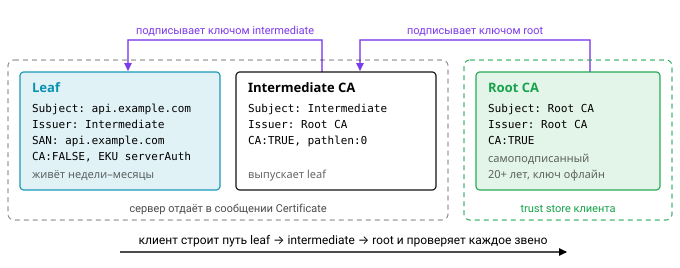

# Урок 1. TLS, сертификаты, цепочки сертификатов

## Зачем нужен TLS

Когда вы открываете `https://bank.com`, между браузером и банком оказывается десяток чужих устройств: точка Wi-Fi в кафе, оборудование провайдера, маршрутизаторы магистральных сетей. TLS нужен, чтобы ни одно из них не могло вмешаться в разговор, и для этого он даёт три гарантии. **Конфиденциальность** означает, что посредник не прочитает трафик. **Целостность** — что он не сможет незаметно его изменить. **Аутентификация** — что на другом конце действительно `bank.com`, а не тот, кто перехватил DNS.

Первые две гарантии обеспечивает симметричное шифрование в режиме AEAD, третью — сертификаты и асимметричная криптография. Чтобы понять, почему нужны обе, сравним их.

## Асимметричная и симметричная криптография

| | Симметричная | Асимметричная |
|---|---|---|
| Ключи | один общий | пара: закрытый и открытый |
| Примеры | AES-GCM, ChaCha20-Poly1305 | RSA, ECDSA, Ed25519; обмен ключами ECDHE (X25519) |
| Скорость | гигабайты в секунду | в тысячи раз медленнее |
| Роль в TLS | шифрование данных | подпись в рукопожатии и сертификатах, согласование общего секрета |

Симметричные шифры быстры, но требуют общего ключа, а его у клиента и сервера до первого соединения нет. Асимметричные алгоритмы позволяют договориться о ключе без предварительного знакомства, зато слишком медленны, чтобы гнать через них поток данных. Поэтому TLS использует обе. Сначала стороны асимметрично, через ECDHE, договариваются об общем секрете. Затем функция HKDF выводит из этого секрета симметричные ключи, и уже ими AEAD-шифр шифрует данные. Отдельно сервер подписывает параметры рукопожатия, и эта подпись доказывает, что он владеет закрытым ключом из своего сертификата.

У такой схемы есть важное следствие, которое называют **forward secrecy**. Ключи сессии получены из эфемерных ECDHE-ключей, а те удаляются сразу после рукопожатия. Если через год злоумышленник украдёт закрытый ключ сервера, записанный сегодня трафик он этим ключом не расшифрует: ключ сертификата только подписывал, но не участвовал в получении секрета. Статический обмен ключами RSA такого свойства не даёт (там секрет шифровался как раз ключом сервера), поэтому в TLS 1.3 его убрали.


## TLS 1.2 и TLS 1.3

В TLS 1.2 до первого байта прикладных данных проходит два полных круга, то есть 2 RTT:
```
ClientHello (шифры, random)        →
                                   ← ServerHello, Certificate, ServerKeyExchange (ECDHE + подпись), ServerHelloDone
ClientKeyExchange, ChangeCipherSpec, Finished →
                                   ← ChangeCipherSpec, Finished
данные
```

TLS 1.3 укладывается в один круг. Клиент заранее угадывает группу и сразу кладёт свой публичный ключ X25519 в расширение `key_share` первого же сообщения, поэтому сервер может вычислить общий секрет уже в ответе:
```
ClientHello + key_share (X25519 публичный ключ) →
          ← ServerHello + key_share, {EncryptedExtensions, Certificate, CertificateVerify, Finished}
{Finished}, данные
```

При возобновлении сессии TLS 1.3 умеет и 0-RTT: клиент отправляет данные вместе с самым первым сообщением. Платить за скорость приходится защитой от повтора. Злоумышленник может записать такое сообщение и проиграть его ещё раз, а сервер выполнит его снова, поэтому в 0-RTT допустимы только идемпотентные запросы. В Go эта проблема для обычных TCP-соединений не возникает: `crypto/tls` поддерживает 0-RTT только в режиме QUIC.




Кроме скорости, TLS 1.3 заметно почистил протокол. Сертификат сервера теперь передаётся зашифрованным. Остались только AEAD-шифры и только обмен ключами (EC)DHE, а значит, forward secrecy стала обязательной. Удалены RSA key exchange, режим CBC, RC4, SHA-1, сжатие и renegotiation. Наборов шифров осталось пять (`TLS_AES_128_GCM_SHA256` и другие), из них Go реализует три: AES-128-GCM, AES-256-GCM и ChaCha20-Poly1305. Настраивать их в Go нельзя, и это сделано намеренно: поле `Config.CipherSuites` влияет только на TLS 1.0–1.2.

## X.509: что внутри сертификата

Сертификат — это открытый ключ плюс сведения о его владельце, заверенные подписью издателя. Посмотреть содержимое любого сертификата можно так:

```
openssl x509 -in cert.pem -noout -text
```

| Поле | Смысл |
|---|---|
| `Subject` / `Issuer` | кому выдан / кто выдал (DN: CN, O, C…) |
| `Serial Number` | уникален в пределах CA, содержит $\ge 64$ бит случайности |
| `NotBefore` / `NotAfter` | срок действия (у публичных сертификатов $\le 398$ дней, дальше будет короче) |
| `Subject Public Key Info` | открытый ключ и его алгоритм |
| SAN (Subject Alternative Name) | DNS-имена, IP, URI (SPIFFE), e-mail. **Имя хоста сверяется только с SAN**: CN для этого не используется (начиная с Go 1.15) |
| Basic Constraints | `CA:TRUE/FALSE` и `pathlen` — сколько промежуточных CA может быть ниже |
| Key Usage | `digitalSignature`, `keyCertSign`, `cRLSign`… |
| Extended Key Usage | `serverAuth`, `clientAuth`, `codeSigning`… |
| AKI / SKI | идентификаторы ключей, помогают строить цепочку |
| CRL DP / AIA (OCSP) | где проверить отзыв |

Большинство полей говорят сами за себя, но на SAN стоит задержаться. Исторически имя сайта записывали в `CN` внутри `Subject`, и старые клиенты сверяли именно его. Современные правила (RFC 6125, требования CA/B Forum) требуют класть имена в SAN, и Go с версии 1.15 на `CN` при проверке имени хоста просто не смотрит. Сертификат с именем только в `CN` для Go-клиента недействителен.


## Цепочка доверия

Браузер не знает заранее сертификат каждого сайта. Он доверяет небольшому набору корневых центров сертификации, а всё остальное проверяет по цепочке подписей:

```
Root CA (самоподписанный, в хранилище ОС/браузера, живёт 20+ лет, ключ офлайн)
  └── Intermediate CA (подписан root, pathlen:0, выпускает конечные сертификаты)
        └── Leaf (api.example.com, CA:FALSE, EKU serverAuth, живёт недели или месяцы)
```

Зачем промежуточное звено? Ключ корня слишком ценен, чтобы держать его на сервере, который каждый день выпускает сертификаты: его хранят офлайн и достают только для того, чтобы подписать intermediate. Если скомпрометирован intermediate, его можно отозвать и выпустить новый, не трогая корень во всех хранилищах мира.



Сервер отдаёт клиенту leaf и intermediate, а root клиенту уже известен. Клиент строит путь от leaf до доверенного корня и на каждом звене проверяет подпись, срок действия, флаг `CA:TRUE` у издателя, `pathlen` и EKU, а в конце сверяет имя хоста. Есть нюанс, характерный именно для Go: `x509.Verify` проверяет EKU по всей цепочке, но биты Key Usage (например, `keyCertSign` у издателя) намеренно не проверяет. Обоснование можно прочитать в комментарии в `crypto/x509/verify.go`.

Самая частая ошибка конфигурации здесь — сервер не отдаёт intermediate. Коварство в том, что браузер такой сайт часто открывает: он «чинит» цепочку из кэша или скачивает недостающий сертификат по ссылке из AIA. Go-клиент так не делает и выдаёт `x509: certificate signed by unknown authority`, поэтому разработчик видит ошибку, которую «не воспроизвести в браузере».

## crypto/x509 в Go

Выпуск сертификата в Go сводится к заполнению шаблона `x509.Certificate` и вызову `x509.CreateCertificate`, которому передаются шаблон, сертификат издателя, открытый ключ владельца и закрытый ключ издателя:

```go
key, _ := ecdsa.GenerateKey(elliptic.P256(), rand.Reader)
serial, _ := rand.Int(rand.Reader, new(big.Int).Lsh(big.NewInt(1), 128))
tmpl := &x509.Certificate{
    SerialNumber: serial,
    Subject:      pkix.Name{CommonName: "api.example.com"},
    DNSNames:     []string{"api.example.com"},
    NotBefore:    time.Now().Add(-5 * time.Minute), // запас на рассинхрон часов
    NotAfter:     time.Now().Add(90 * 24 * time.Hour),
    KeyUsage:     x509.KeyUsageDigitalSignature,
    ExtKeyUsage:  []x509.ExtKeyUsage{x509.ExtKeyUsageServerAuth},
    BasicConstraintsValid: true,
}
der, err := x509.CreateCertificate(rand.Reader, tmpl, caCert, &key.PublicKey, caKey)
// самоподписанный: parent = tmpl, signer = свой ключ
pemBytes := pem.EncodeToMemory(&pem.Block{Type: "CERTIFICATE", Bytes: der})
```

Обратите внимание на серийный номер: он случайный, из диапазона $[0, 2^{128})$, что с запасом покрывает требование о 64 битах случайности. Проверка выглядит так:

```go
roots := x509.NewCertPool()
roots.AppendCertsFromPEM(rootPEM)       // false, если ничего не добавилось
inters := x509.NewCertPool()
inters.AddCert(intermediate)
chains, err := leaf.Verify(x509.VerifyOptions{
    DNSName:       "api.example.com",
    Roots:         roots,               // nil → системные корни
    Intermediates: inters,
    CurrentTime:   time.Now(),          // для тестов — фиксированное время
    KeyUsages:     []x509.ExtKeyUsage{x509.ExtKeyUsageServerAuth},
})
```

Ошибки у `Verify` типизированы: `x509.UnknownAuthorityError`, `x509.HostnameError` и `x509.CertificateInvalidError`, у которой поле `Reason` принимает значения `Expired`, `NotAuthorizedToSign`, `TooManyIntermediates`, `IncompatibleUsage` и другие. Различать их нужно через `errors.As`, а не по тексту сообщения.


Один подводный камень связан с нулевыми значениями Go. Поле `MaxPathLen: 0` без `MaxPathLenZero: true` означает «ограничение не задано», то же самое, что `-1`. Разработчик думал, что запретил промежуточные CA ниже, а на деле снял ограничение вовсе. Чтобы действительно получить `pathlen:0`, нужно выставить и `MaxPathLen: 0`, и `MaxPathLenZero: true`.

## openssl: шпаргалка

Те же операции из командной строки: создать ключ и корневой сертификат, выпустить leaf по запросу на подпись, проверить цепочку и посмотреть, что на самом деле отдаёт сервер.

```bash
openssl ecparam -genkey -name prime256v1 -noout -out ca.key
openssl req -x509 -new -key ca.key -sha256 -days 3650 -subj "/CN=Dev Root CA" -out ca.pem
openssl req -new -key leaf.key -subj "/CN=api.local" -out leaf.csr
openssl x509 -req -in leaf.csr -CA ca.pem -CAkey ca.key -CAcreateserial -days 90 \
        -extfile <(printf "subjectAltName=DNS:api.local\nextendedKeyUsage=serverAuth") -out leaf.pem
openssl verify -CAfile ca.pem -untrusted inter.pem leaf.pem
openssl s_client -connect example.com:443 -servername example.com -showcerts   # что отдаёт сервер
openssl x509 -in leaf.pem -noout -enddate -ext subjectAltName
```

Для локальной разработки удобнее `mkcert`, а в самом Go есть генератор тестовых сертификатов: `go run $(go env GOROOT)/src/crypto/tls/generate_cert.go --host localhost`.

## Pinning, ротация, отзыв

Обычная проверка цепочки доверяет любому CA из хранилища. Если один из сотни корневых центров скомпрометирован, злоумышленник получит «настоящий» сертификат на ваш домен. От этого защищает **pinning**: клиент доверяет только конкретному ключу, обычно заданному хешем $\mathrm{SHA256}(\text{SPKI})$ от структуры открытого ключа. Обратная сторона — хрупкость: смените ключ, и приложение перестанет подключаться. Поэтому пинят обычно ключ intermediate, а не leaf, или держат резервный пин. В браузерах механизм HPKP отменили именно из-за этой хрупкости, но в мобильных приложениях и между своими сервисами pinning применяется.

Раз сертификаты неизбежно приходится менять, смену лучше сделать рутиной. Современный подход — короткоживущие сертификаты с автоматическим обновлением: часы или дни во внутренних mesh, 90 дней у Let's Encrypt, и дальше сроки будут только сокращаться. В Go сертификат можно подменять без рестарта через `tls.Config.GetCertificate` (для mTLS-клиента аналогичный хук называется `GetClientCertificate`):

```go
cfg := &tls.Config{GetCertificate: func(hello *tls.ClientHelloInfo) (*tls.Certificate, error) {
    return current.Load(), nil // atomic.Pointer[tls.Certificate], обновляется фоном
}}
```

Короткий срок жизни решает ещё и проблему отзыва. Классические механизмы, CRL и OCSP, работают плохо: клиенты при недоступности сервера отзыва обычно пропускают проверку (soft-fail), запросы к OCSP раскрывают, какие сайты вы посещаете, а списки отзыва обновляются с задержкой. Поэтому ставку делают на то, что скомпрометированный сертификат просто скоро истечёт.

## Let's Encrypt, ACME, autocert

Автоматическую выдачу сертификатов обеспечивает протокол ACME (RFC 8555). Прежде чем выпустить сертификат, CA проверяет, что вы владеете доменом, и предлагает для этого один из challenge. В HTTP-01 нужно отдать файл по пути `/.well-known/acme-challenge/`, в DNS-01 — создать TXT-запись (только этот способ годится для wildcard-сертификатов), в TLS-ALPN-01 — ответить специальным сертификатом в TLS-рукопожатии. В Go всё это реализует пакет `golang.org/x/crypto/acme/autocert`:

```go
m := &autocert.Manager{
    Prompt:     autocert.AcceptTOS,
    HostPolicy: autocert.HostWhitelist("example.com"),
    Cache:      autocert.DirCache("/var/cache/certs"), // обязательно: у LE есть rate limits
}
srv := &http.Server{Addr: ":443", TLSConfig: m.TLSConfig(), Handler: mux}
go http.ListenAndServe(":80", m.HTTPHandler(nil)) // HTTP-01 + редирект
srv.ListenAndServeTLS("", "")
```

## Типичные ошибки

Почти все проблемы с TLS в Go-сервисах сводятся к короткому списку:

- `InsecureSkipVerify: true`, поставленный «для теста», попадает в прод и полностью отключает аутентификацию сервера. Если стандартная проверка не подходит, допишите свою через `VerifyPeerCertificate` или `VerifyConnection`, но не выключайте проверку.
- Сервер не отдаёт intermediate, и Go-клиенты получают `unknown authority`.
- Имя хоста записано только в CN, без SAN.
- `NotBefore = time.Now()`: при малейшем рассинхроне часов клиент увидит «not yet valid».
- Результат `AppendCertsFromPEM` не проверяют, и если PEM был испорчен, пул корней остаётся пустым.
- Серийные номера предсказуемы, например `big.NewInt(1)`.

## Вопросы с собеседований

1. За счёт чего TLS 1.3 быстрее TLS 1.2 и что в нём стало безопаснее?
2. Что такое forward secrecy и какой механизм её обеспечивает?
3. Как клиент проверяет цепочку сертификатов и зачем вообще нужен intermediate CA?
4. Почему для проверки имени хоста больше не используют CN?
5. Что такое pinning и чем он рискован?
6. Как организовать ротацию сертификатов без даунтайма?

## Ссылки

- [RFC 8446 — TLS 1.3](https://www.rfc-editor.org/rfc/rfc8446), [RFC 5280 — X.509 PKIX](https://www.rfc-editor.org/rfc/rfc5280)
- [pkg.go.dev/crypto/x509](https://pkg.go.dev/crypto/x509), [pkg.go.dev/crypto/tls](https://pkg.go.dev/crypto/tls)
- [The Illustrated TLS 1.3 Connection](https://tls13.xargs.org/)
- [pkg.go.dev/golang.org/x/crypto/acme/autocert](https://pkg.go.dev/golang.org/x/crypto/acme/autocert)

## Практика

- [01_certchain](../tasks/01_certchain/) — выпуск цепочки из root, intermediate и leaf и функция `VerifyChain` с понятными ошибками.
