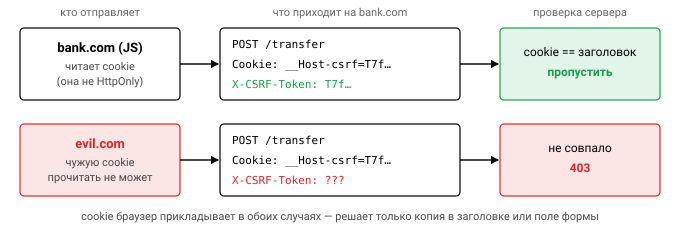

# Урок 2. Безопасность в HTTP (HTTPS)

## HTTPS-сервер в Go

Начнём с того, как выглядит аккуратно настроенный HTTPS-сервер. Большая часть полей ниже не про криптографию, а про таймауты, и это не случайно:

```go
srv := &http.Server{
    Addr:    ":443",
    Handler: mux,
    TLSConfig: &tls.Config{
        MinVersion:       tls.VersionTLS12,              // 1.0/1.1 запрещены (RFC 8996)
        CurvePreferences: []tls.CurveID{tls.X25519, tls.CurveP256},
        CipherSuites: []uint16{                          // влияет только на TLS 1.2
            tls.TLS_ECDHE_ECDSA_WITH_AES_128_GCM_SHA256,
            tls.TLS_ECDHE_RSA_WITH_AES_128_GCM_SHA256,
            tls.TLS_ECDHE_ECDSA_WITH_CHACHA20_POLY1305_SHA256,
            tls.TLS_ECDHE_RSA_WITH_CHACHA20_POLY1305_SHA256,
        },
    },
    ReadHeaderTimeout: 5 * time.Second, // защита от Slowloris
    ReadTimeout:       30 * time.Second,
    WriteTimeout:      30 * time.Second,
    IdleTimeout:       120 * time.Second,
    MaxHeaderBytes:    1 << 20,
}
log.Fatal(srv.ListenAndServeTLS("cert.pem", "key.pem"))
```

С шифрами современный Go справляется сам: по умолчанию он выбирает безопасные наборы, а опасные перечислены отдельно в `tls.InsecureCipherSuites()`. С Go 1.22 минимальной версией по умолчанию стала TLS 1.2, причём и для клиента, и для сервера, так что строка `MinVersion: tls.VersionTLS12` здесь лишь делает намерение явным. А вот таймауты за вас никто не выставит. `http.ListenAndServe` без них — приглашение к DoS: атака Slowloris держит тысячи соединений, присылая заголовки по байту в минуту, и сервер исчерпывает ресурсы, ничего полезного не сделав.

В тестах настоящий сертификат не нужен. `httptest.NewTLSServer(h)` поднимает сервер с тестовым сертификатом, а если нужна своя TLS-конфигурация, используйте `NewUnstartedServer`, заполните `srv.TLS` и вызовите `StartTLS()`. Клиента берите из `srv.Client()`: он уже доверяет тестовому сертификату.

## HSTS и редирект

Даже если сайт работает по HTTPS, пользователь нередко набирает адрес без схемы, и первый запрос уходит по открытому HTTP. Этим пользуется SSL-stripping: посредник перехватывает этот запрос и дальше проксирует сайт жертве по HTTP. Закрывает дыру заголовок HSTS:

```go
w.Header().Set("Strict-Transport-Security", "max-age=63072000; includeSubDomains; preload")
```

Получив его, браузер запоминает, что домен доступен только по HTTPS, и до истечения `max-age` сам переписывает `http://` в `https://`, не выходя в сеть по HTTP. Так SSL-stripping закрывается для всех визитов, кроме самого первого, а первый визит закрывает preload-список, зашитый в браузеры. Учтите, что HSTS действует только в ответе, полученном по HTTPS: по HTTP браузер его проигнорирует. Поэтому редирект с `:80` на `:443` всё равно нужен.


## Cookie

Сессионная cookie — это фактически пароль пользователя на время сессии, и настраивать её нужно соответственно:

```go
http.SetCookie(w, &http.Cookie{
    Name:     "__Host-session", // префикс: браузер требует Secure, Path=/, без Domain
    Value:    sessionID,        // случайный ≥128 бит, а не user_id!
    Path:     "/",
    HttpOnly: true,             // недоступна из JS → XSS не украдёт
    Secure:   true,             // только по HTTPS
    SameSite: http.SameSiteLaxMode,
    MaxAge:   3600,
})
```

Идентификатор сессии должен быть случайным и длинным: при $128$ битах перебор $2^{128}$ вариантов нереален. Использовать вместо него `user_id` нельзя, иначе любой подставит чужой номер.

Атрибут `SameSite` управляет тем, уходит ли cookie с кросс-сайтовыми запросами. При `Strict` она не уходит ни при одном кросс-сайтовом переходе, даже если пользователь просто кликнул по ссылке на ваш сайт в почте. `Lax` — разумный компромисс: cookie отправляется при навигации верхнего уровня методом GET (обычный переход по ссылке), но не при POST, fetch или загрузке в iframe. `None` отправляет cookie всегда и допустим только вместе с `Secure`.

Ещё одна классическая ошибка — session fixation. Если после логина сохранить старый ID сессии, атакующий, который заранее подсунул жертве известный ему ID, окажется залогинен вместе с ней. Поэтому после успешного входа всегда выдавайте **новый** идентификатор сессии.

## CSRF

Представьте: пользователь залогинен в `bank.com`, а в соседней вкладке открыл злой сайт. Тот отправляет форму на `bank.com/transfer`, и браузер послушно прикладывает к запросу cookie жертвы. Красть cookie атакующему не нужно, браузер всё сделает сам. Это и есть CSRF. Защищаются от него несколькими способами, которые обычно комбинируют:

1. `SameSite=Lax` или `Strict` — основной барьер в современных браузерах: кросс-сайтовый POST просто придёт без cookie.
2. Synchronizer token. Сервер хранит случайный токен в сессии и вставляет его в каждую форму, а при обработке сравнивает. Злой сайт не знает этого значения.
3. Double submit cookie. Токен лежит в cookie (не `HttpOnly`) и дублируется в заголовке или поле формы. Злой сайт не может прочитать cookie чужого домена и потому не подставит токен. Но cookie можно *записать* с поддомена или по HTTP при MITM, поэтому имя берут с префиксом `__Host-` либо привязывают токен к сессии, подписывая его HMAC. Сравнивают значения через `subtle.ConstantTimeCompare`.
4. Проверка заголовков `Origin` и `Sec-Fetch-Site` для небезопасных методов.


Все эти защиты исходят из того, что безопасные методы (GET, HEAD, OPTIONS) не меняют состояние. Если перевод денег выполняется по GET, CSRF сработает и через обычный ``, и никакой токен формы не поможет.



## XSS и html/template

XSS — это внедрение чужого скрипта в вашу страницу. Скрипт выполняется с правами вашего сайта и может делать от имени пользователя всё то же, что и ваш собственный код. Основная защита — контекстное экранирование, и в Go она встроена в `html/template`. Пакет разбирает шаблон и знает, где находится каждая подстановка: в тексте, атрибуте, URL, JavaScript или CSS. Для каждого контекста он применяет своё экранирование:

```go
t := template.Must(template.New("").Parse(`<a href="{{.URL}}" title="{{.T}}">{{.Name}}</a>`))
t.Execute(w, map[string]string{"URL": "javascript:alert(1)", "T": `" onmouseover="x`, "Name": "<script>"})
// <a href="#ZgotmplZ" title="&#34; onmouseover=&#34;x">&lt;script&gt;</a>
```

Посмотрите на результат. Опасную схему `javascript:` в URL-атрибуте пакет заменил маркером `#ZgotmplZ`, кавычка в атрибуте не дала закрыть его и дописать обработчик, а `<script>` в тексте превратился в безобидные сущности.


Защиту легко потерять. Пакет `text/template` не экранирует ничего, поэтому для HTML он не годится. Приведение `template.HTML(userInput)` говорит шаблону «это уже безопасный HTML» и отключает экранирование, так что применять его можно только к заранее очищенной разметке, например после bluemonday. Второй линией обороны служит CSP: даже если скрипт всё-таки попал на страницу, политика вроде `Content-Security-Policy: default-src 'self'; script-src 'self' 'nonce-…'; object-src 'none'; base-uri 'self'; frame-ancestors 'none'` не даст его выполнить.

## Security headers

Помимо CSP и HSTS, есть ещё несколько заголовков, которые стоит отдавать почти всегда. Вот короткая сводка:

| Заголовок | Зачем |
|---|---|
| `Content-Security-Policy` | откуда можно грузить скрипты, стили и фреймы; `frame-ancestors` против clickjacking |
| `X-Content-Type-Options: nosniff` | браузер не «угадывает» тип: загруженный `.txt` не исполнится как JS |
| `X-Frame-Options: DENY` | устаревший аналог `frame-ancestors` |
| `Referrer-Policy: no-referrer` / `strict-origin-when-cross-origin` | не утекают токены из URL |
| `Strict-Transport-Security` | только HTTPS |
| `Cache-Control: no-store` | для ответов с токенами и персональными данными |

## CORS правильно

Вокруг CORS много путаницы, поэтому начнём с главного: CORS не защищает сервер. Он **ослабляет** same-origin policy браузера, разрешая скриптам с других origin читать ваши ответы. Каждая ошибка в его настройке открывает дыру, а не закрывает. Правила здесь простые, и их стоит держать перед глазами:

- проверяйте `Origin` по точному списку разрешённых значений. Никогда не отражайте в ответе любой пришедший Origin и не используйте `strings.HasSuffix(origin, "example.com")`: такую проверку пройдёт `evilexample.com`;
- `Access-Control-Allow-Origin: *` запрещено сочетать с `Allow-Credentials: true`;
- не разрешайте `Origin: null`: его присылают sandbox-iframe и страницы с `file://`, то есть атакующему его легко получить;
- добавляйте `Vary: Origin`, иначе кэш отдаст ответ для одного origin другому;
- на preflight-запрос (`OPTIONS` с `Access-Control-Request-Method`) сервер отвечает, какие методы и заголовки можно использовать.


## Rate limiting

Ограничение частоты запросов защищает от перебора паролей, скрейпинга и DoS. Обычно его строят на алгоритме token bucket. У корзины есть ёмкость $\text{burst}$, и она пополняется со скоростью $r$ токенов в секунду, так что за время $\Delta t$ число токенов становится

$$
b(t + \Delta t) = \min\bigl(\text{burst},\; b(t) + r \cdot \Delta t\bigr).
$$

Каждый запрос забирает токен, а пустая корзина означает отказ. Короткий всплеск до $\text{burst}$ запросов проходит, но в среднем больше $r$ запросов в секунду клиент не сделает. В `x/time/rate` это `rate.NewLimiter(r, burst)` с методами `Allow`, `Wait` и `Reserve`.

Ключом лимита служит IP-адрес, пользователь или API-ключ. С IP будьте осторожны: за одним NAT может сидеть целый офис, а заголовку `X-Forwarded-For` можно доверять, только если его выставил ваш собственный прокси. Превысившему лимит отвечают `429 Too Many Requests` с заголовком `Retry-After`. В кластере локальные счётчики не работают, поэтому лимиты хранят в Redis или выносят на gateway.

## Timing attacks

Сравнивать секреты обычным `==` нельзя, и причина неочевидна:

```go
if token == expected { ... }                                        // ❌ время зависит от длины совпавшего префикса
if subtle.ConstantTimeCompare([]byte(token), []byte(expected)) == 1 // ✅
hmac.Equal(mac1, mac2)                                               // ✅ для MAC
```

Сравнение строк останавливается на первом расхождении. Значит, запрос с правильным первым байтом отрабатывает чуть дольше, чем с неправильным, и, измерив время ответа много раз, атакующий подбирает секрет байт за байтом. Вместо $256^n$ вариантов для секрета из $n$ байт ему достаточно примерно $256 \cdot n$ попыток (с поправкой на повторные замеры для борьбы с шумом).


При разной длине `ConstantTimeCompare` сразу возвращает 0: считается, что длина секрета обычно не секретна. Если же сравнивать приходится значения разной длины, сначала хешируйте обе стороны SHA-256 и сравнивайте хеши.

## Хранение паролей

Никогда не храните сам пароль, его SHA-256 или MD5. Быстрые хеши созданы для скорости, и на GPU их перебирают миллиардами в секунду. Прикинем: паролей из 8 строчных латинских букв и цифр всего $36^8 \approx 2{,}8 \cdot 10^{12}$, и при скорости $10^9$ хешей в секунду весь этот набор перебирается меньше чем за час. Нужна **медленная функция с солью**, стоимость которой можно настраивать:

```go
import "golang.org/x/crypto/bcrypt"
hash, _ := bcrypt.GenerateFromPassword([]byte(pw), bcrypt.DefaultCost) // cost 10–12; соль внутри
err := bcrypt.CompareHashAndPassword(hash, []byte(pw))                // постоянное время
// bcrypt учитывает только первые 72 байта; свежие версии x/crypto возвращают ErrPasswordTooLong

import "golang.org/x/crypto/argon2"
salt := make([]byte, 16); rand.Read(salt)
key := argon2.IDKey([]byte(pw), salt, 1, 64*1024, 4, 32) // time=1, memory=64MB, threads=4
// храните параметры + соль + ключ: $argon2id$v=19$m=65536,t=1,p=4$<salt>$<key>
```

У bcrypt параметр cost логарифмический: работа растёт как $2^{\text{cost}}$, и каждая единица удваивает время и для вас, и для атакующего. OWASP сейчас рекомендует Argon2id. Его стойкость к GPU обеспечивается большим расходом памяти: видеокарта может посчитать много хешей параллельно, но не может дать каждому потоку по 64 МБ. Кроме правильного хеша, добавьте rate limiting на логин и отвечайте одинаково на неверный логин и неверный пароль, чтобы по ответу нельзя было перебирать существующих пользователей.

## Инъекции и доступ к файлам

Инъекции объединяет одно: данные пользователя попадают туда, где их интерпретируют как код или как путь.

SQL-инъекции закрываются плейсхолдерами, и только ими: `db.QueryContext(ctx, "SELECT … WHERE id = $1", id)`. Имена таблиц и колонок плейсхолдером передать нельзя, для них нужен whitelist допустимых значений. Собирать SQL через `fmt.Sprintf` запрещено.

Command injection возникает, когда команду запускают через shell. Вызов `exec.Command("convert", file)` передаёт имя файла отдельным аргументом, а `sh -c "convert " + file` позволит имени вроде `x; rm -rf /` выполнить вторую команду.

Path traversal — это запрос вида `../../etc/passwd`, который выводит за пределы разрешённого каталога. Популярная проверка `filepath.Clean` плюс `strings.HasPrefix(root)` не защищает, потому что `/srv/data2` начинается с `/srv/data`. Используйте `filepath.IsLocal` (Go 1.20), `http.Dir` или `http.FileServerFS`, а лучше `os.Root` (Go 1.24), который защищает и от атак через symlink. И не раздавайте `http.Dir(".")`: вместе с кодом утечёт каталог `.git`.


SSRF случается, когда сервер сам делает запрос по URL, полученному от пользователя. Атакующий подставляет `http://169.254.169.254/` (сервис метаданных облака с временными ключами) или `http://localhost:6379` и получает доступ во внутреннюю сеть от имени вашего сервера. Строковые проверки URL здесь обходятся, поэтому защита — whitelist хостов и проверка IP **после резолва** через `net.Dialer.Control`, а также запрет редиректов на внутренние адреса.

Open redirect выглядит безобидно: `?next=https://evil.com` просто уводит пользователя на чужой сайт после логина. Но так удобно делать фишинг, а в OAuth через open redirect уводят коды и токены. Разрешайте в таких параметрах только относительные пути или адреса из whitelist.

Наконец, ограничивайте размер тела запроса: `http.MaxBytesReader(w, r.Body, 1<<20)`. Иначе один клиент может заставить сервер читать гигабайты.

## mTLS

В обычном TLS сертификат предъявляет только сервер. При **mTLS** (взаимной аутентификации) сервер тоже проверяет сертификат клиента. Для трафика между сервисами это стандарт: на нём построены service mesh и SPIFFE.

```go
serverTLS := &tls.Config{
    ClientAuth: tls.RequireAndVerifyClientCert,
    ClientCAs:  caPool,
    MinVersion: tls.VersionTLS13,
}
// в обработчике: r.TLS.VerifiedChains[0][0] — проверенный leaf клиента
clientTLS := &tls.Config{Certificates: []tls.Certificate{clientCert}, RootCAs: caPool}
```


Режимов `ClientAuth` пять: `NoClientCert`, `RequestClientCert`, `RequireAnyClientCert`, `VerifyClientCertIfGiven` и `RequireAndVerifyClientCert`. Ловушка в том, что `RequestClientCert` и `RequireAnyClientCert` сертификат запрашивают, но **не проверяют**: в `PeerCertificates` окажется то, что клиент прислал, включая самоподписанную подделку. Проверку выполняют только `VerifyClientCertIfGiven` и `RequireAndVerifyClientCert`. Поэтому авторизацию делайте по SAN (например, по SPIFFE ID `spiffe://trust-domain/ns/prod/sa/orders`) и берите сертификат только из `VerifiedChains`.

## Вопросы с собеседований

1. Чем `SameSite=Lax` отличается от `Strict`? Можно ли считать, что SameSite полностью защищает от CSRF?
2. Как работает double submit cookie и почему CSRF-cookie в этой схеме не делают `HttpOnly`?
3. Почему для HTML берут `html/template`, а не `text/template`? Откуда в выводе берётся `#ZgotmplZ`?
4. Почему пароли нельзя хранить в виде SHA-256? Чем argon2id лучше bcrypt?
5. Что такое SSRF и как защититься от него в Go?
6. Зачем нужен `subtle.ConstantTimeCompare`, если есть `==`?
7. Чем опасен режим `RequireAnyClientCert`?

## Ссылки

- [OWASP Cheat Sheet Series](https://cheatsheetseries.owasp.org/) (Session Management, CSRF, XSS, Password Storage, SSRF)
- [pkg.go.dev/html/template](https://pkg.go.dev/html/template), [pkg.go.dev/crypto/subtle](https://pkg.go.dev/crypto/subtle)
- [MDN: CORS](https://developer.mozilla.org/en-US/docs/Web/HTTP/CORS), [MDN: Set-Cookie](https://developer.mozilla.org/en-US/docs/Web/HTTP/Headers/Set-Cookie)
- [go.dev/blog/osroot](https://go.dev/blog/osroot), [filepath.IsLocal](https://pkg.go.dev/path/filepath#IsLocal)

## Практика

- [02_mtls](../tasks/02_mtls/) — HTTPS-сервер с mTLS и авторизацией по CN/SAN.
- [03_websec](../tasks/03_websec/) — security headers, secure cookie, CSRF, CORS, `SafeJoin`, XSS.
