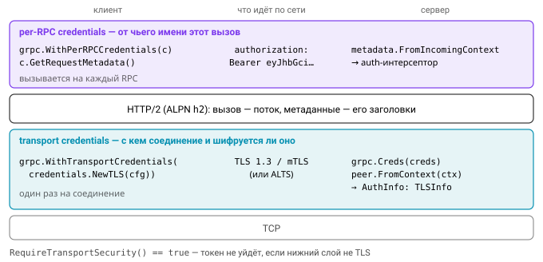

# Урок 3. Безопасность в gRPC

Безопасность в gRPC удобно представлять как два независимых слоя, которые отвечают на разные вопросы.

Нижний слой — **transport credentials**. Они защищают само соединение (TLS, mTLS или ALTS) и отвечают на вопросы «с каким сервисом я говорю» и «шифруется ли трафик». Устанавливаются они один раз, при подключении.

Верхний слой — **per-RPC credentials**. Они прикладывают к каждому вызову метаданные, обычно токен пользователя или сервиса, и отвечают на вопрос «от чьего имени сделан вызов». На одном соединении могут идти вызовы от разных пользователей.

Проверку обоих слоёв на сервере выполняют интерсепторы, до которых мы доберёмся чуть позже.



## TLS на сервере и клиенте

Transport credentials в grpc-go создаются из обычного `tls.Config`, так что всё, что вы знаете о TLS в Go, здесь применимо без изменений:

```go
import (
    "google.golang.org/grpc"
    "google.golang.org/grpc/credentials"
    "google.golang.org/grpc/credentials/insecure"
)

// сервер: только TLS
cert, _ := tls.LoadX509KeyPair("server.pem", "server.key")
creds := credentials.NewTLS(&tls.Config{
    Certificates: []tls.Certificate{cert},
    MinVersion:   tls.VersionTLS13,
})
s := grpc.NewServer(grpc.Creds(creds))

// клиент
pool := x509.NewCertPool()
pool.AppendCertsFromPEM(caPEM)
conn, err := grpc.NewClient("inventory.internal:443",
    grpc.WithTransportCredentials(credentials.NewTLS(&tls.Config{RootCAs: pool, MinVersion: tls.VersionTLS13})),
)
// или короче: credentials.NewClientTLSFromFile("ca.pem", "inventory.internal")

// без шифрования (только локально/в тестах, или когда TLS делает sidecar):
grpc.NewClient(addr, grpc.WithTransportCredentials(insecure.NewCredentials()))
```

Одна деталь, о которой полезно знать: gRPC работает поверх HTTP/2, а HTTP/2 поверх TLS требует согласования протокола через ALPN со значением `h2`. `credentials.NewTLS` настраивает это сам. Но если вы соберёте `tls.Config` без `NextProtos: ["h2"]` и попробуете подключиться в обход grpc-go, соединение не установится.

## mTLS

Для взаимной аутентификации сервер требует и проверяет сертификат клиента, а клиент добавляет свой сертификат в конфигурацию:

```go
creds := credentials.NewTLS(&tls.Config{
    Certificates: []tls.Certificate{serverCert},
    ClientAuth:   tls.RequireAndVerifyClientCert,
    ClientCAs:    caPool,
    MinVersion:   tls.VersionTLS13,
})
// клиент добавляет свой сертификат:
credentials.NewTLS(&tls.Config{Certificates: []tls.Certificate{clientCert}, RootCAs: caPool})
```

Как на сервере узнать, кто к нам пришёл? Информация о транспорте лежит в контексте вызова, в структуре `peer.Peer`. Для TLS её поле `AuthInfo` имеет тип `credentials.TLSInfo`, внутри которого полный `tls.ConnectionState`:

```go
import "google.golang.org/grpc/peer"

func serviceIdentity(ctx context.Context) (string, error) {
    p, ok := peer.FromContext(ctx)
    if !ok {
        return "", status.Error(codes.Unauthenticated, "no peer")
    }
    tlsInfo, ok := p.AuthInfo.(credentials.TLSInfo)
    if !ok || len(tlsInfo.State.VerifiedChains) == 0 {
        return "", status.Error(codes.Unauthenticated, "no verified client certificate")
    }
    leaf := tlsInfo.State.VerifiedChains[0][0]
    for _, u := range leaf.URIs {
        if u.Scheme == "spiffe" {
            return u.String(), nil // spiffe://shop.local/ns/prod/sa/orders
        }
    }
    return leaf.Subject.CommonName, nil
}
```

![Путь от `ctx` до идентичности клиента. Брать её можно только из `VerifiedChains[0][0]`: `PeerCertificates` содержит то, что клиент прислал, без всякой проверки.](img/grpc-peer-identity.svg)

Выпускать и ротировать клиентские сертификаты для сотни сервисов вручную тяжело, и эту работу обычно поручают инфраструктуре. **SPIFFE/SPIRE** выдаёт сервисам короткоживущие X.509-SVID с идентификатором в URI SAN и сам их ротирует. В Go с ним работают через `github.com/spiffe/go-spiffe/v2`: источник сертификатов создаёт `workloadapi.NewX509Source`, а готовые credentials — `grpccredentials.MTLSServerCredentials(source, source, tlsconfig.AuthorizeMemberOf(td))`.

В service mesh (Istio, Linkerd) mTLS вообще делает sidecar, и приложение получает identity из заголовка, который выставляет прокси: в Istio и Envoy это `x-forwarded-client-cert`, в Linkerd — `l5d-client-id`. Доверять такому заголовку можно только тогда, когда он гарантированно пришёл от вашего sidecar, иначе его подделает любой клиент.

## Per-RPC credentials

Со вторым слоем работает интерфейс `credentials.PerRPCCredentials`. Он маленький: один метод возвращает метаданные для очередного вызова, второй сообщает, нужен ли для этого защищённый транспорт.

```go
type PerRPCCredentials interface {
    GetRequestMetadata(ctx context.Context, uri ...string) (map[string]string, error)
    RequireTransportSecurity() bool
}
```

Готовые реализации лежат в пакете `google.golang.org/grpc/credentials/oauth`. Это `oauth.TokenSource{TokenSource: ts}`, обёртка над `oauth2.TokenSource` из `golang.org/x/oauth2`, которая сама обновляет токен, а также `oauth.NewJWTAccessFromKey` и `oauth.NewComputeEngine()`. Написать собственную реализацию тоже несложно:

```go
type bearer struct{ token string }
func (b bearer) GetRequestMetadata(context.Context, ...string) (map[string]string, error) {
    return map[string]string{"authorization": "Bearer " + b.token}, nil
}
func (bearer) RequireTransportSecurity() bool { return true }

conn, _ := grpc.NewClient(addr,
    grpc.WithTransportCredentials(tlsCreds),
    grpc.WithPerRPCCredentials(bearer{tok}), // на всё соединение
)
client.Get(ctx, req, grpc.PerRPCCredentials(bearer{userTok})) // на один вызов
```

Метод `RequireTransportSecurity()` — это предохранитель. Если он возвращает `true`, а соединение создано с `insecure`, grpc-go **откажется** отправлять вызов и вернёт ошибку, и секрет не уйдёт по открытому каналу. Если нужно просто положить токен в один вызов, можно обойтись и без интерфейса: `metadata.AppendToOutgoingContext(ctx, "authorization", "Bearer "+tok)`.

## Auth-интерсепторы

На сервере токен из метаданных нужно достать, проверить и положить результат в контекст для обработчика. Делать это в каждом методе вручную — верный способ однажды забыть, поэтому проверку выносят в интерсептор:

```go
func authUnary(verify func(string) (*Claims, error), public map[string]bool) grpc.UnaryServerInterceptor {
    return func(ctx context.Context, req any, info *grpc.UnaryServerInfo, h grpc.UnaryHandler) (any, error) {
        if public[info.FullMethod] { // например, /grpc.health.v1.Health/Check
            return h(ctx, req)
        }
        md, _ := metadata.FromIncomingContext(ctx)
        vals := md.Get("authorization")
        if len(vals) != 1 || !strings.HasPrefix(strings.ToLower(vals[0]), "bearer ") {
            return nil, status.Error(codes.Unauthenticated, "missing bearer token")
        }
        claims, err := verify(vals[0][len("bearer "):])
        if err != nil {
            return nil, status.Error(codes.Unauthenticated, "invalid token") // без подробностей
        }
        return h(context.WithValue(ctx, claimsKey{}, claims), req)
    }
}

s := grpc.NewServer(
    grpc.Creds(mtlsCreds),
    grpc.ChainUnaryInterceptor(recoveryUnary, mtlsAuthz, authUnary(verify, public), scopesUnary),
    grpc.ChainStreamInterceptor(recoveryStream, authStream),
)
```

Порядок в цепочке важен. Первый интерсептор в `ChainUnaryInterceptor` — самый внешний: управление проходит через них по порядку до обработчика, а результат возвращается в обратном порядке. Поэтому `recoveryUnary` ставят первым, чтобы он поймал панику в любом звене после себя.


Стримы проходят через отдельный тип интерсепторов, и про них часто забывают. Есть и техническая сложность: у `grpc.ServerStream` нельзя заменить контекст, поэтому его оборачивают в структуру с переопределённым методом `Context()`:

```go
type wrappedStream struct {
    grpc.ServerStream
    ctx context.Context
}
func (w *wrappedStream) Context() context.Context { return w.ctx }

func authStream(srv any, ss grpc.ServerStream, info *grpc.StreamServerInfo, h grpc.StreamHandler) error {
    ctx, err := authenticate(ss.Context())
    if err != nil {
        return err
    }
    return h(srv, &wrappedStream{ss, ctx})
}
```

Писать всё это самому не обязательно. В `github.com/grpc-ecosystem/go-grpc-middleware/v2/interceptors/auth` есть готовый `auth.UnaryServerInterceptor(authFunc)`, а если отдельному сервису нужна своя логика, он может реализовать интерфейс `ServiceAuthFuncOverride`.

Отдельно стоит договориться о кодах ошибок. `codes.Unauthenticated` (16) означает, что учётных данных нет или они невалидны, это аналог HTTP 401. `codes.PermissionDenied` (7) означает, что личность известна, но прав на операцию у неё нет, это аналог 403. Авторизацию по методам стройте по принципу **deny by default**: метод, не описанный в политике, запрещён. Иначе каждый новый RPC окажется открытым, пока кто-нибудь не вспомнит обновить политику.

## Авторизация: где и как

Проверки прав живут на разных уровнях, и у каждого своя зона ответственности. Грубую проверку по сервису («кто вообще может вызывать `inventory.v1.Inventory/*`») удобно делать по mTLS identity или политиками mesh, например Istio `AuthorizationPolicy`. Более тонкая проверка по пользователю, то есть по scopes и ролям из JWT, выполняется в интерсепторе. А вопрос владения ресурсом («это заказ именно этого пользователя?») интерсептор решить не может, потому что не знает, что за заказ лежит в запросе. Такая проверка возможна только в бизнес-логике.

Если политик много, их выносят из кода: в OPA с языком Rego или во встроенный в grpc-go пакет `authz` (`google.golang.org/grpc/authz`), который принимает политику в формате JSON.

Отдельная тема — передача identity по цепочке сервисов. Сервис, получивший запрос пользователя, должен ходить дальше либо с исходным токеном пользователя, либо с токеном, полученным обменом (token exchange, RFC 8693). Соблазн сделать вызов «от своего имени», где сервис может всё, приводит к уязвимости confused deputy: пользователь руками доверенного сервиса получает доступ к тому, что ему самому недоступно.

## ALTS

**ALTS** (Application Layer Transport Security) — протокол взаимной аутентификации и шифрования от Google, по назначению аналогичный mTLS. Разница в том, что идентичностью в нём служит сервисный аккаунт, а не DNS-имя. Работает ALTS только внутри инфраструктуры Google Cloud (GCE, GKE), где есть сервис рукопожатий, от которого он зависит.

```go
import "google.golang.org/grpc/credentials/alts"

s := grpc.NewServer(grpc.Creds(alts.NewServerCreds(alts.DefaultServerOptions())))
conn, _ := grpc.NewClient(addr, grpc.WithTransportCredentials(alts.NewClientCreds(alts.DefaultClientOptions())))

// на сервере:
if err := alts.ClientAuthorizationCheck(ctx, []string{"orders@my-project.iam.gserviceaccount.com"}); err != nil {
    return nil, status.Error(codes.PermissionDenied, "not allowed")
}
```

Вне GCP для той же задачи используют mTLS и SPIFFE.

## Что ещё не забыть

Несколько мелочей, которые не относятся к аутентификации напрямую, но регулярно всплывают на ревью безопасности.

Reflection в проде раскрывает всю схему API. Включайте его только внутри периметра или закрывайте авторизацией. Лимиты `grpc.MaxRecvMsgSize`, `grpc.MaxConcurrentStreams` и keepalive enforcement policy (`grpc.KeepaliveEnforcementPolicy`) защищают сервер от злоупотребления ресурсами. Дедлайны на клиенте спасают и от зависших зависимостей, и от накопления горутин.

В логах не печатайте metadata целиком: в ключе `authorization` лежат секреты. Health-check (`grpc.health.v1`) обычно оставляют доступным без аутентификации, и это нормально, потому что он ничего не раскрывает.

## Типичные ошибки

- `insecure.NewCredentials()` в проде, поставленный «временно».
- Доверие к `PeerCertificates` вместо `VerifiedChains`.
- Интерсептор написан только для unary-вызовов, а стримы остались открытыми.
- Методы, которых нет в политике, по умолчанию разрешены.
- Подробные ошибки валидации токена (`token expired at …, kid k1 not found`) уходят клиенту и подсказывают атакующему, что именно не так.
- Per-RPC credentials с `RequireTransportSecurity() == false` для секретных токенов.

## Вопросы с собеседований

1. Чем transport credentials отличаются от per-RPC credentials и почему нужны оба слоя?
2. Как на сервере gRPC получить проверенный сертификат клиента?
3. Когда возвращать `Unauthenticated`, а когда `PermissionDenied`?
4. Как сделать аутентификацию для stream-методов, если контекст стрима нельзя подменить?
5. Что такое ALTS и SPIFFE и как они соотносятся с mTLS?
6. Зачем в `PerRPCCredentials` метод `RequireTransportSecurity()`?

## Ссылки

- [grpc.io: Authentication](https://grpc.io/docs/guides/auth/)
- [pkg.go.dev/google.golang.org/grpc/credentials](https://pkg.go.dev/google.golang.org/grpc/credentials), [peer](https://pkg.go.dev/google.golang.org/grpc/peer), [credentials/alts](https://pkg.go.dev/google.golang.org/grpc/credentials/alts), [authz](https://pkg.go.dev/google.golang.org/grpc/authz)
- [grpc-go examples: features/authentication, encryption, authz](https://github.com/grpc/grpc-go/tree/master/examples/features)
- [SPIFFE concepts](https://spiffe.io/docs/latest/spiffe-about/spiffe-concepts/)

## Практика

- [04_rpcauth](../tasks/04_rpcauth/) — `ChainUnary`, mTLS-авторизация по SPIFFE ID/CN, bearer-аутентификация, scopes, per-RPC credentials.
