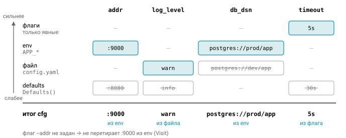
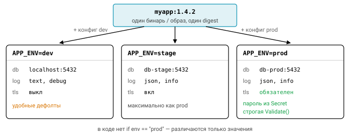

# Управление конфигурациями и средами

Один и тот же сервис живёт в нескольких местах сразу: на ноутбуке разработчика, на стенде, в продакшене. Код везде одинаковый, а адрес базы, пароли, лимиты и уровень логов разные. Как устроить конфигурацию так, чтобы это не превратилось в клубок `if` и не стало источником утечек? Об этом урок.

## 12-factor: конфигурация в окружении

Методология [The Twelve-Factor App, III. Config](https://12factor.net/config) предлагает простое правило: всё, что меняется между средами (dev, stage, prod), то есть адреса, учётные данные, лимиты, хранится **вне кода**, предпочтительно в переменных окружения. Проверить, соблюдаете ли вы его, легко: представьте, что прямо сейчас выкладываете репозиторий в open source. Если при этом не раскроется ни один секрет, конфигурация отделена правильно.

Из правила следует несколько вещей. Во все среды едет один и тот же **артефакт**, бинарник или образ, а различается только конфигурация. В бизнес-логике не бывает `if env == "prod"`: среды отличаются значениями, а не ветками кода. И наконец, «группы» конфигов вроде `config.prod.yaml` плохо масштабируются, когда сред становится больше трёх, поэтому лучше независимые переменные.

## Источники и приоритеты

На практике конфигурация собирается из нескольких источников, и пользователи ожидают вполне определённого порядка их приоритета, от слабого к сильному:

```
значения по умолчанию  <  файл (JSON/YAML/TOML)  <  переменные окружения  <  флаги командной строки
```

Логика такая: чем ближе источник к конкретному запуску, тем он сильнее. Значения по умолчанию зашиты в код, файл общий для среды, переменная окружения задана для конкретного развёртывания, а флаг вы набрали руками прямо сейчас. В коде это выглядит как последовательное наложение слоёв:

```go
cfg := Defaults()
if path := configPath(args, lookup); path != "" { applyFile(&cfg, path) }
applyEnv(&cfg, os.LookupEnv)
applyFlags(&cfg, fs)        // только явно заданные флаги!
if err := cfg.Validate(); err != nil { return err }
```



Схема простая, но в ней три места, где спотыкаются почти все.

### Подвох первый: «не задано» и «задано пустым»

`os.Getenv("X")` вернёт `""` и для незаданной переменной, и для заданной пустой строкой. Для слоистой конфигурации это разные ситуации: в первом случае нужно оставить значение из нижнего слоя, во втором — явно его обнулить. Поэтому используйте `os.LookupEnv`, у которого есть второй результат `ok`. С JSON та же история: чтобы отличить отсутствующий ключ от нулевого значения, декодируйте в структуру с полями-указателями (`*string`, `*int`).

### Подвох второй: флаги перетирают нижние слои своими дефолтами

```go
fs := flag.NewFlagSet("app", flag.ContinueOnError)
addr := fs.String("addr", "", "")
fs.Parse(args)
cfg.Addr = *addr         // BUG: незаданный флаг обнулил значение из env
fs.Visit(func(f *flag.Flag) { /* только явно заданные */ })
```

Незаданный флаг возвращает своё значение по умолчанию, и если безусловно присвоить его в конфиг, он затрёт то, что пришло из env. Решений два: применять только явно заданные флаги через `fs.Visit` или сделать дефолт флага равным текущему значению конфига: `fs.StringVar(&cfg.Addr, "addr", cfg.Addr, "")`.

### Подвох третий: `flag.ExitOnError` в библиотеке

`flag.Parse()` на глобальном `FlagSet` при ошибке разбора вызывает `os.Exit(2)`. В `main` это приемлемо, а в коде, который вы хотите тестировать, нет: тест просто завершится. Заводите свой `FlagSet` с `ContinueOnError` и `SetOutput(io.Discard)`, а ошибку возвращайте наверх.

## Библиотеки

Писать всё это с нуля не обязательно, и экосистема предлагает несколько популярных вариантов:

| Библиотека | Идея |
|---|---|
| [spf13/viper](https://github.com/spf13/viper) | всё-в-одном: файлы разных форматов, env (`AutomaticEnv`, `SetEnvPrefix`), флаги (pflag), remote (etcd/Consul), `WatchConfig` + `OnConfigChange`. Минусы: глобальное состояние, ключи без учёта регистра, `map[string]any` внутри, тяжёлые зависимости |
| [kelseyhightower/envconfig](https://github.com/kelseyhightower/envconfig) | `envconfig.Process("app", &cfg)`, теги `envconfig:"PORT" default:"8080" required:"true"` |
| [ilyakaznacheev/cleanenv](https://github.com/ilyakaznacheev/cleanenv) | файл + env в структуру по тегам `yaml:"port" env:"PORT" env-default:"8080"`, генерация описания переменных |
| [caarlos0/env](https://github.com/caarlos0/env) | env в struct, `env:"PORT" envDefault:"8080"`, поддержка `TextUnmarshaler` |
| [knadh/koanf](https://github.com/knadh/koanf) | модульная альтернатива viper без глобалов |

Viper чаще всего встречается в существующих проектах, и типичный код с ним выглядит так:

```go
// viper — типичный код
v := viper.New()
v.SetConfigName("config"); v.AddConfigPath(".")
v.SetEnvPrefix("APP"); v.AutomaticEnv()
v.SetEnvKeyReplacer(strings.NewReplacer(".", "_")) // db.host → APP_DB_HOST
v.BindPFlags(pflag.CommandLine)
_ = v.ReadInConfig()
var cfg Config
_ = v.Unmarshal(&cfg) // mapstructure-теги
```

Если заглянуть внутрь env-библиотек, окажется, что все они устроены одинаково: `reflect` обходит поля структуры, читает теги и парсит строку в тип поля. Такую библиотеку вы напишете сами в задаче 03.

## Валидация

Конфигурацию валидируют **один раз при старте**. Сервис с неверным конфигом должен упасть сразу (fail fast), а не через час на первом запросе, который дойдёт до сломанной настройки.

Проверять стоит обязательные поля, диапазоны ($1 \le \text{port} \le 65535$, $\text{timeout} > 0$) и перечисления ($\text{env} \in \{\text{dev}, \text{stage}, \text{prod}\}$). Не забывайте и про кросс-полевые правила: в `prod` запрещён `log_level=debug` и обязателен TLS. И собирайте **все** ошибки через `errors.Join`, а не останавливайтесь на первой: иначе исправление конфига превратится в серию деплоев, каждый из которых показывает следующую проблему.

## Секреты

Первое правило про секреты банально, но его всё равно нарушают: не коммитьте их и не кладите в образ. Инструкция `ENV` в Dockerfile видна любому, кто выполнит `docker history`.

Откуда же их брать? Обычно это переменные окружения, которые заполняет секрет-хранилище (Kubernetes Secret, Vault Agent, AWS Secrets Manager), или файлы в tmpfs вроде `/run/secrets/db_password`. Файлы удобнее для ротации, и для них сложилась конвенция: переменная `DB_PASSWORD_FILE` содержит путь к файлу с паролем.

Не менее важно не выдать секрет при выводе. Маскируйте его в методах `String()`, `LogValue()` (для slog) и `MarshalJSON` у типа конфигурации. Строка подключения к базе тоже содержит пароль, и для неё в стандартной библиотеке есть `url.URL.Redacted()`, который превратит адрес в `postgres://app:xxxxx@db/app`.

Удобный приём — тип-обёртка: `type Secret string; func (Secret) String() string { return "***" }`. С ним `fmt.Println(cfg)` безопасен, но только если поле экспортируемое: для неэкспортируемых полей `fmt` не вызывает `String()` и печатает значение как есть. Кроме того, формат `%#v` и `json.Marshal` метод `String()` не используют, поэтому обёртке нужны ещё `GoString`, `MarshalJSON` и `LogValue`.

И последнее: сообщение об ошибке валидации не должно включать значение секрета. «Пароль слишком короткий: hunter2» — это тоже утечка.

## Среды dev, stage и prod

Код и артефакт во всех средах одинаковы, различаются только значения. В `dev` уместны удобные дефолты: локальная база, текстовые логи, уровень debug. В `prod` нужны безопасные дефолты и строгая валидация. Отсюда важное следствие: значения по умолчанию должны быть безопасными. Лучше требовать явного `APP_ENV=dev`, чем однажды случайно выкатить dev-настройки в прод. Stage при этом стоит держать максимально похожим на prod: те же версии, те же флаги функциональности.



## Feature flags

Флаги функциональности позволяют включать код без нового деплоя. С их помощью делают постепенную раскатку, A/B-тесты и аварийный выключатель (kill switch):

```go
if cfg.Enabled("new-checkout") { return newCheckout(ctx, req) }
return oldCheckout(ctx, req)
```

В простейшем варианте флаги — это список в конфиге (`APP_FEATURES=new-ui,beta`). В продвинутом — отдельный сервис флагов (LaunchDarkly, Unleash, OpenFeature SDK) с правилами по пользователю или проценту трафика. В любом варианте у флага должен быть владелец и срок жизни: мёртвые флаги быстро превращаются в технический долг.

## Hot reload

Некоторые настройки хочется менять без рестарта: уровень логов, лимиты, флаги. Типичная реализация перечитывает конфиг по сигналу:

```go
type Holder struct{ v atomic.Pointer[Config] }
func (h *Holder) Load() *Config { return h.v.Load() }

// по SIGHUP или fsnotify
signal.Notify(hup, syscall.SIGHUP)
for range hup {
    cfg, err := Load(...)
    if err != nil { log.Error("reload", "err", err); continue } // старый конфиг остаётся
    holder.v.Store(&cfg)
}
```

Главное здесь — заменять конфиг **атомарно и целиком** через `atomic.Pointer`. Если менять поля существующей структуры на месте, обработчики, читающие её параллельно, получат гонку данных, а то и наполовину обновлённый конфиг. Новый конфиг, не прошедший валидацию, не применяется, и сервис продолжает работать со старым.

Не всё можно перечитать на лету: адрес listener или размер пула соединений обычно фиксируются при старте, и это стоит задокументировать. Для уровня логов готовое решение уже есть в стандартной библиотеке — `slog.LevelVar`. А если сервис работает в Kubernetes, помните, что смонтированный ConfigMap обновляется подменой symlink, поэтому fsnotify должен следить за директорией, а не за файлом.


## Вопросы с собеседований

1. В каком порядке приоритета объединяются источники конфигурации и почему именно так?
2. Как отличить «переменная не задана» от «задана пустой строкой»?
3. Как не допустить утечки секретов в логи?
4. Как безопасно реализовать hot reload?
5. Чем плох viper и когда он всё же оправдан?

## Ссылки

- https://12factor.net/config
- https://pkg.go.dev/flag , https://pkg.go.dev/os#LookupEnv
- https://pkg.go.dev/net/url#URL.Redacted

## Практика: задачи [03_envconfig](../tasks/03_envconfig), [04_layered](../tasks/04_layered)
