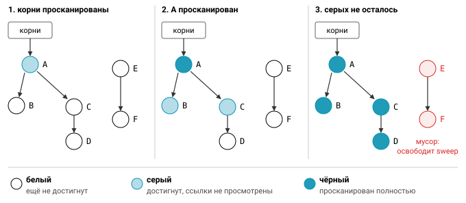
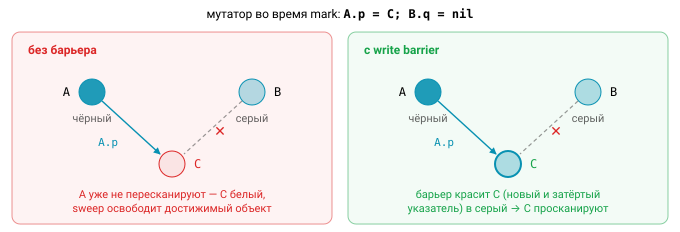
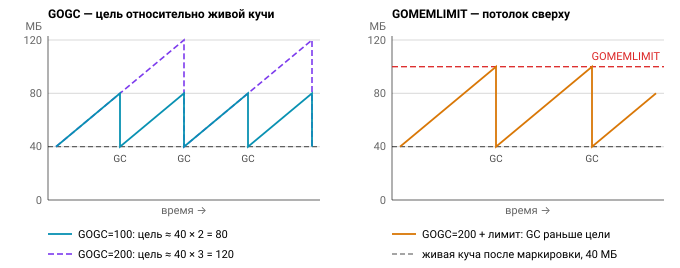

# Управление памятью и аллокациями

В Go память освобождает сборщик мусора, и первое время о ней можно не думать. Но в нагруженном сервисе именно аллокации часто определяют и расход CPU, и хвосты латентности, и то, упадёт ли под по OOM в час пик. В этом уроке разберёмся, где живут переменные, как работает GC и как им управлять, как сократить аллокации и почему в языке со сборщиком мусора всё равно бывают утечки.

## Стек и куча

У каждой горутины есть свой **стек**. Он начинается примерно с 2 КБ и растёт копированием (contiguous stacks): когда места не хватает, runtime выделяет стек вдвое больше, переносит туда кадры и исправляет указатели на них. Выделение на стеке почти бесплатно, это просто сдвиг указателя стека SP. Освобождение происходит само при возврате из функции, и сборщик мусора стек не собирает.

**Куча** — общая память, которую освобождает GC. Каждая аллокация в куче — это работа аллокатора, который идёт через per-P кэши `mcache`, затем `mcentral` и `mheap` и раскладывает объекты по size classes, а заодно дополнительная нагрузка на сборщик.

Любопытно, что спецификация Go вообще не упоминает стек и кучу. Где разместить переменную, решает компилятор, и правило у него одно: переменная живёт на стеке, если он может доказать, что она не переживёт функцию.

## Escape analysis

Этот анализ называется escape analysis, и его решения можно увидеть:

```
go build -gcflags=-m ./...        # решения компилятора
go build -gcflags='-m -m' ./pkg   # с объяснением причин
```

Вот как выглядят типичные сообщения:

```go
func newUser() *User {
    u := User{}      // ./a.go:3:2: moved to heap: u  — указатель пережил функцию
    return &u
}
func sum(xs []int) int { ... }       // xs does not escape
func log(v any) { fmt.Println(v) }   // leaking param: v — интерфейс уходит в fmt (рефлексия), компилятор не доказал обратного
```


Причины «убегания» в кучу обычно одни и те же. Самая очевидная — вернуть указатель на локальную переменную или сохранить его в глобальную переменную либо в поле объекта, который сам живёт в куче. Чуть менее очевидная — конверсия в интерфейс (`any`, `error`), если компилятор не видит, что интерфейс нигде не сохраняется; вызовы `fmt.*` почти всегда приводят именно к этому. Замыкание, захватившее переменную и пережившее функцию (например, запущенное как горутина или возвращённое наружу), тоже уводит переменную в кучу.

Есть и причины, связанные с размером. `make([]T, n)` с неконстантным `n` размещается в куче, потому что компилятор не знает, сколько места резервировать в кадре. Слишком большие объекты тоже уходят в кучу: порог — 64 КБ для `make` и `new` и 128 КБ для явно объявленных переменных. Наконец, в кучу попадает указатель, отправленный в канал, и данные `append`, превысившего известную ёмкость.

Главный совет здесь — не гадать. Смотрите вывод `-m`, а эффект проверяйте бенчмарками с `-benchmem` или `b.ReportAllocs()` и тестами с `testing.AllocsPerRun`.

## Сборщик мусора

Сборщик мусора Go — **конкурентный, неперемещающий, непоколенческий трёхцветный mark & sweep**. Каждое слово здесь важно: «конкурентный» значит, что он работает одновременно с вашим кодом, «неперемещающий» — что объекты в куче не меняют адресов, «непоколенческий» — что молодые и старые объекты не разделяются. Цикл сборки состоит из четырёх фаз.

1. **Sweep termination.** Короткая пауза stop-the-world (STW), во время которой включается write barrier.
2. **Mark.** Конкурентная маркировка: фоновые воркеры забирают около 25% CPU, им помогает mark assist. GC обходит граф объектов от корней: стеков, глобальных переменных и регистров.
3. **Mark termination.** Ещё одна короткая пауза STW, write barrier выключается.
4. **Sweep.** Лениво или в фоне освобождаются все объекты, оставшиеся белыми.


Самое интересное происходит в фазе маркировки. Объекты делятся на три цвета. Белые ещё не достигнуты и являются кандидатами на удаление. Серые достигнуты, но их ссылки ещё не просканированы. Чёрные просканированы полностью. GC берёт серый объект, красит его соседей в серый, а сам объект в чёрный, и повторяет, пока серых не останется. Тогда всё белое — мусор.



Проблема в том, что ваш код, который в терминах GC называется мутатором, всё это время продолжает менять указатели. Задача алгоритма — не «потерять» достижимый объект. Классический, сильный трёхцветный инвариант требует, чтобы чёрный объект никогда не указывал на белый. Гибридный барьер Go гарантирует ослабленную форму: если на белый объект ссылается чёрный, к этому белому объекту должен вести путь от какого-то серого. Обеспечивает это **write barrier**. С Go 1.8 он гибридный, сочетает Yuasa-deletion и Dijkstra-insertion и при записи указателя красит затрагиваемые объекты в серый. Благодаря этому стеки не нужно пересканировать в конце маркировки.



Есть и механизм, который напрямую влияет на латентность, — **mark assist**. Горутина, которая активно аллоцирует во время маркировки, вынуждена помогать GC пропорционально своим аллокациям. Поэтому при высоком allocation rate растёт латентность запросов, даже если паузы короткие.

Паузы STW обычно занимают от десятков до сотен микросекунд. Основная цена GC в Go — CPU и mark assist, а вовсе не паузы.

### GOGC и GOMEMLIMIT

Когда начинать следующий цикл, определяет переменная **`GOGC`**. По умолчанию она равна 100, и это значит, что новый цикл стартует, когда куча вырастет на 100% относительно живой кучи, оставшейся после прошлой маркировки. С Go 1.18 в расчёт входят ещё и корни GC — стеки горутин и глобальные переменные. Точная формула цели кучи из `runtime/mgcpacer.go` такая:

$$
H_\text{goal} = H_\text{live} + \left(H_\text{live} + S_\text{stacks} + S_\text{globals}\right) \cdot \frac{\mathrm{GOGC}}{100}
$$

Если стеки и глобалы малы по сравнению с кучей, она сводится к привычному $H_\text{goal} \approx H_\text{live} \cdot \left(1 + \tfrac{\mathrm{GOGC}}{100}\right)$. Отсюда понятно, как крутить ручку: `GOGC=200` означает более редкие сборки ценой большей памяти, а `GOGC=off` выключает GC совсем. Из кода то же самое делает `debug.SetGCPercent`.

У `GOGC` есть слабое место: он ничего не знает о том, сколько памяти вам вообще доступно. Поэтому в Go 1.19 появился **`GOMEMLIMIT`** (в коде — `debug.SetMemoryLimit`), мягкий лимит на всю память рантайма. Когда потребление приближается к лимиту, GC запускается чаще, чем требует `GOGC`. В контейнере разумно выставить его примерно в 80–90% от лимита cgroup, то есть $\mathrm{GOMEMLIMIT} \approx (0{,}8 \ldots 0{,}9) \cdot L_\text{cgroup}$, и тогда под не будет убит OOMKiller при всплеске.

Популярна комбинация `GOGC=off` плюс `GOMEMLIMIT`: GC работает только тогда, когда память подходит к лимиту. С ней нужно быть осторожным. Если живая куча близка к лимиту, GC начнёт работать почти непрерывно. Рантайм защищается от такой «спирали смерти» (death spiral), ограничивая GC примерно 50% CPU, но сервис в этом режиме всё равно будет еле жив.

Увидеть, как всё это работает, помогает `GODEBUG=gctrace=1`: рантайм печатает строку на каждый цикл с размером кучи до и после сборки, временем фаз и долей CPU.



## Сокращаем аллокации

Лучший способ разгрузить GC — меньше аллоцировать. Для этого есть несколько проверенных приёмов.

### Преаллокация

Если размер результата известен заранее, скажите об этом рантайму:

```go
out := make([]Result, 0, len(in))      // вместо var out []Result + append-реаллокаций
m := make(map[string]int, len(keys))   // без рехешинга при росте
var sb strings.Builder
sb.Grow(estimated)                     // одна аллокация; String() без копирования
buf = strconv.AppendInt(buf, n, 10)    // Append*-API пишут в ваш буфер
```

Обратный пример — конкатенация `s += x` в цикле. Каждая итерация копирует всю накопленную строку, и суммарно это $O(n^2)$ по памяти.

### sync.Pool

Когда одни и те же временные объекты (буферы, энкодеры) создаются на каждый запрос, их можно переиспользовать через `sync.Pool`:

```go
var bufPool = sync.Pool{New: func() any { return new(bytes.Buffer) }}

b := bufPool.Get().(*bytes.Buffer)
b.Reset()                   // объект из пула «грязный»
defer bufPool.Put(b)
```

Пул — это кэш, а не хранилище. Объекты из него могут исчезнуть при любой сборке мусора; с Go 1.13 они переживают один цикл в victim cache, но не больше. Внутри пул устроен per-P и работает почти без блокировок. Именно поэтому он не подходит для пула соединений с базой: соединение может просто пропасть без закрытия.

Кладите в пул указатели (`*bytes.Buffer`, `*[]byte`). Вызов `Put([]byte)` сам аллоцирует память при упаковке среза в интерфейс, и `staticcheck` предупреждает об этом как SA6002. Не возвращайте в пул огромные буферы: один запрос на 100 МБ «раздует» пул навсегда. Так поступает `fmt`, выбрасывая буферы больше 64 КБ. И, конечно, не используйте объект после `Put`: он уже может принадлежать другой горутине.


### Выравнивание и порядок полей

Размер структуры зависит не только от её полей, но и от их порядка. Каждое поле выравнивается по своему `Alignof`, то есть его смещение должно быть кратно выравниванию $a_i$, а размер всей структуры округляется вверх до кратного максимальному выравниванию полей:

$$
\text{offset}_i = \left\lceil \frac{\text{offset}_{i-1} + \text{size}_{i-1}}{a_i} \right\rceil \cdot a_i,
\qquad
\text{Sizeof} = \left\lceil \frac{\text{offset}_{n} + \text{size}_{n}}{A} \right\rceil \cdot A,
\quad A = \max_i a_i
$$

Посмотрим, что это значит на практике:

```go
type Bad struct {   // 24 байта на amd64
    a bool          // 1 + 7 padding
    b int64         // 8
    c bool          // 1 + 7 padding
}
type Good struct {  // 16 байт
    b int64
    a bool
    c bool          // + 6 padding в конце
}
unsafe.Sizeof(Bad{}), unsafe.Alignof(x.b), unsafe.Offsetof(x.c)
```

В `Bad` получается $1 + 7 + 8 + 1 + 7 = 24$ байта: после первого `bool` нужно 7 байт выравнивания, чтобы `int64` начался со смещения 8, а после второго `bool` ещё 7, чтобы размер стал кратен 8. В `Good` оба `bool` стоят рядом, и выходит $8 + 1 + 1 + 6 = 16$ байт.


Отсюда правило: располагайте поля по убыванию размера и выравнивания. Проверять вручную не обязательно, это умеет анализатор `fieldalignment` (`golang.org/x/tools/go/analysis/passes/fieldalignment`). Экономия в 8 байт ничего не значит для одной структуры, но существенна для тех, которых миллионы: элементов больших срезов и ключей map.

Есть и несколько тонкостей. `struct{}` в конце структуры добавляет padding, чтобы указатель на него не указывал за пределы объекта. `atomic.Int64` гарантирует 8-байтовое выравнивание даже на 32-битных платформах. А обратная проблема — false sharing: если горячие счётчики, которые обновляют разные ядра, попали в одну кэш-линию размером 64 байта, ядра будут постоянно отбирать её друг у друга. Такие счётчики специально разносят паддингом.

## Утечки памяти в языке с GC

Сборщик мусора освобождает только недостижимое. Утечка в Go — это память, которая остаётся достижимой, хотя больше не нужна. Посмотрим на самые частые случаи.

**Подслайс большого массива.** `header := data[:16]` держит в памяти весь `data`, даже если это мегабайты: подслайс ссылается на тот же массив. Решение — скопировать нужное через `bytes.Clone(data[:16])` или `slices.Clone`, а для строк через `strings.Clone(s[:16])`. `strings.Clone` появился в Go 1.18, `bytes.Clone` — в Go 1.20.


**Хвост среза указателей.** После `s = s[:len(s)-1]` указатель на последний элемент остаётся в backing array, и объект не будет собран. Обнуляйте его явно (`s[len(s)-1] = nil`) или через `clear(s[n:])`; `slices.Delete` начиная с Go 1.22 делает это сам.

**Заблокированные горутины.** Горутина, которая навсегда застряла на чтении из канала, куда никто не пишет, или на отправке без читателя после таймаута, держит свой стек и всё, на что он ссылается. Лечится это `context`, буферизированным на один элемент каналом для результата и `goleak` в тестах.

**Таймеры.** `time.After` в цикле `select` создаёт новый таймер на каждой итерации. До Go 1.23 неостановленный таймер жил до срабатывания. С Go 1.23 (при `go 1.23` в go.mod) недостижимые таймеры и тикеры собираются GC, а каналы таймеров стали небуферизированными. Тем не менее в горячем цикле правильнее завести один `time.NewTimer` и вызывать `Reset`, а для тикеров писать `defer ticker.Stop()`.

**Map не сжимается.** После `delete` всех элементов buckets остаются выделенными. Если map была огромной, пересоздайте её.

**Глобальные кэши без ограничения.** Кэш, который только растёт, — тоже утечка. Нужна политика вытеснения, LRU или TTL.

**Финализаторы.** `runtime.SetFinalizer` на объектах, которые образуют цикл, может вообще не вызваться. С Go 1.24 есть более предсказуемая замена — `runtime.AddCleanup`.

## Наблюдение

Чтобы понять, что происходит с памятью, у рантайма можно спросить статистику:

```go
var m runtime.MemStats
runtime.ReadMemStats(&m) // внимание: stop-the-world, не вызывайте часто
fmt.Println(m.HeapAlloc, m.HeapInuse, m.HeapSys, m.NumGC, m.Mallocs-m.Frees, m.PauseTotalNs)
```

`HeapAlloc` — байты живых объектов плюс ещё не собранных, `HeapSys` — сколько взято у ОС под кучу, `Sys` — всего получено от ОС. Как и написано в комментарии, `ReadMemStats` останавливает мир, поэтому часто вызывать его нельзя. Предпочтительнее пакет `runtime/metrics`, который работает без STW и отдаёт метрики вроде `/gc/heap/allocs:bytes`, `/memory/classes/heap/objects:bytes` и `/sched/goroutines:goroutines`.

Для поиска конкретных мест пригодится heap-профиль pprof. У него два режима. `inuse_space` показывает, что живо прямо сейчас, и нужен для поиска утечек. `alloc_space` показывает, сколько аллоцировано за всё время, и нужен для поиска горячих аллокаций; включается он командой `go tool pprof -sample_index=alloc_space`. А главный индикатор утечки горутин — постоянный рост `runtime.NumGoroutine()`.

## Вопросы с собеседований

1. Как Go решает, где разместить переменную, и как проверить его решение?
2. Опишите трёхцветный алгоритм маркировки. Зачем нужен write barrier?
3. Что делают GOGC и GOMEMLIMIT? Что вы выставите в контейнере с лимитом 1 ГБ?
4. Почему `sync.Pool` не подходит для пула соединений?
5. Как подслайс может привести к утечке и как это исправить?
6. Сколько байт займёт `struct{ a bool; b int64; c bool }` и как её уменьшить?

## Ссылки

- https://go.dev/doc/gc-guide — официальный гид по GC, обязателен к прочтению
- https://go.dev/blog/ismmkeynote , https://go.dev/doc/diagnostics
- https://pkg.go.dev/runtime/metrics , https://pkg.go.dev/sync#Pool

## Практика: задача [05_memory](../tasks/05_memory)
