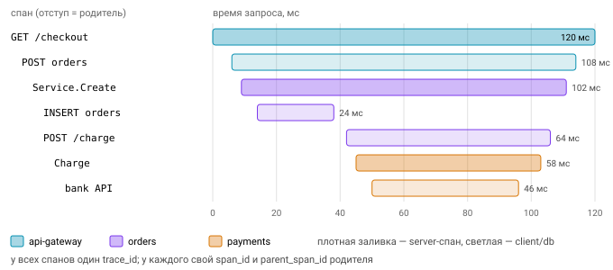

# Логгирование, трейсинг, метрики

Сервис в продакшене — чёрный ящик, пока он не рассказывает о себе. Наблюдаемость (observability) принято строить на трёх столпах, и каждый отвечает на свой вопрос. **Логи** говорят, что произошло: это события с контекстом. **Метрики** говорят, сколько и как быстро: это агрегаты во времени. **Трейсы** показывают, где потрачено время в распределённом запросе, прошедшем через несколько сервисов. По отдельности каждый столп полезен, но настоящая сила появляется, когда они связаны общими идентификаторами: `trace_id` пишется в логи, а exemplars в метриках ведут к конкретным трассам.

## log/slog (Go 1.21)

До Go 1.21 в стандартной библиотеке был только пакет `log`, который пишет строки без структуры, и каждый проект выбирал свой логгер. Пакет `log/slog` дал стандартный структурированный логгер:

```go
log := slog.New(slog.NewJSONHandler(os.Stdout, &slog.HandlerOptions{
    Level:     slog.LevelInfo,  // или *slog.LevelVar — меняется на лету
    AddSource: true,
    ReplaceAttr: func(groups []string, a slog.Attr) slog.Attr {
        if a.Key == "password" { return slog.String("password", "***") }
        return a
    },
}))
slog.SetDefault(log) // заодно перенаправит пакет log

log.Info("заказ создан", "order_id", 42, "amount", 99.5)
log.LogAttrs(ctx, slog.LevelInfo, "заказ создан", slog.Int("order_id", 42)) // быстрее: без any
// {"time":"...","level":"INFO","source":{...},"msg":"заказ создан","order_id":42,"amount":99.5}
```

### Архитектура

slog разделён на две части. `Logger` — это фронтенд с удобным API, которым пользуется ваш код. `Handler` — бэкенд, который решает, как запись отформатировать и куда вывести. В стандартной библиотеке есть два обработчика: `TextHandler` пишет в формате `key=value`, `JSONHandler` пишет JSON. Если вам нужно что-то своё, реализуйте интерфейс из четырёх методов:

```go
type Handler interface {
    Enabled(context.Context, slog.Level) bool          // дешёвая проверка до построения Record
    Handle(context.Context, slog.Record) error          // вывод записи
    WithAttrs(attrs []slog.Attr) slog.Handler           // новый Handler с предзаданными атрибутами
    WithGroup(name string) slog.Handler                 // новый Handler, где следующие атрибуты — в группе
}
```

Такое разделение позволяет библиотекам логировать через `*slog.Logger`, не навязывая приложению формат вывода.

### Атрибуты, группы, уровни

```go
reqLog := log.With("request_id", id)                // WithAttrs: в каждой записи
reqLog.WithGroup("http").Info("done", "status", 200) // {"request_id":"..","http":{"status":200}}
log.Info("user", slog.Group("user", "id", 7, "role", "admin"))
```


Уровни в slog — это просто числа: `Debug=-4, Info=0, Warn=4, Error=8`. Промежутки оставлены специально, чтобы можно было ввести свои уровни, например `slog.Level(12)`.

Ключи и значения передаются парами. Если пара не сложилась, «одинокий» ключ превратится в атрибут `!BADKEY`, и чтобы это не всплыло в проде, `go vet` проверяет вызовы slog. Ещё несколько правил, которые должен соблюдать любой Handler: пустой `slog.Attr{}` игнорируется, группа без атрибутов не выводится, а группа с пустым ключом встраивается в родителя.

### LogValuer — ленивые и безопасные значения

Если тип реализует `LogValuer`, он сам решает, как выглядеть в логе. Это удобно и для безопасности, и для производительности, ведь дорогое значение вычисляется, только если запись действительно выводится:

```go
type User struct{ ID int; Email, Password string }
func (u User) LogValue() slog.Value {
    return slog.GroupValue(slog.Int("id", u.ID), slog.String("email", u.Email)) // без пароля
}
log.Info("login", "user", u) // Handler обязан вызвать Value.Resolve()
```

### Контекст

Каждый метод Handler получает `ctx`, и через него удобно пробрасывать корреляцию, например идентификатор запроса:

```go
type ctxHandler struct{ slog.Handler }
func (h ctxHandler) Handle(ctx context.Context, r slog.Record) error {
    if id, ok := ctx.Value(reqIDKey{}).(string); ok { r.AddAttrs(slog.String("request_id", id)) }
    return h.Handler.Handle(ctx, r)
}
// + WithAttrs/WithGroup должны возвращать ctxHandler, иначе обёртка «потеряется»
log.InfoContext(ctx, "запрос обработан")
```

Обратите внимание на комментарий в коде: если забыть переопределить `WithAttrs` и `WithGroup`, первый же `log.With(...)` вернёт голый встроенный Handler, и обёртка молча «потеряется».

Свой Handler проверяйте официальным набором тестов [`testing/slogtest`](https://pkg.go.dev/testing/slogtest): `slogtest.TestHandler(h, parseResults)`. Подробное руководство по написанию обработчиков — [slog handler guide](https://github.com/golang/example/tree/master/slog-handler-guide).

### zap и zerolog

До slog сообщество пользовалось сторонними логгерами, и они по-прежнему встречаются часто. **uber-go/zap** создаётся через `zap.NewProduction()`, использует строго типизированные поля вроде `zap.String("k","v")` и предлагает `SugaredLogger` для удобства; он почти не аллоцирует, а мост `zapslog` позволяет использовать его вместе со slog. **rs/zerolog** построен на цепочках вызовов, `log.Info().Str("k","v").Int("n",1).Msg("hi")`, и пишет JSON без аллокаций.

Для нового кода обычно хватает `slog`: это стандарт и общий интерфейс для библиотек. zap или zerolog имеет смысл взять, если скорость критична, или подключить как Handler для slog.

### Как логировать на практике

В проде пишите структурированные логи в JSON, а локально — человекочитаемые. Не логируйте секреты и персональные данные; маскировать их надёжнее всего на уровне Handler или LogValuer, а не в каждом вызове. Логируйте ошибку один раз, там, где её обработали, а не на каждом уровне стека, иначе одна ошибка превратится в пять одинаковых записей. И заведите лог на каждый запрос (access log) с `request_id` и `trace_id`.

## Трейсинг: OpenTelemetry

Когда запрос проходит через пять сервисов и в одном из них тормозит, логи каждого сервиса по отдельности мало помогут. Нужна **трасса** (trace) — дерево **спанов** (spans). Спан описывает одну операцию: у него есть имя, `trace_id` (16 байт, общий для всей трассы), `span_id` (8 байт), `parent_span_id`, время начала и конца, атрибуты, события и статус.

```go
var tracer = otel.Tracer("orders") // на уровне пакета

func (s *Service) Create(ctx context.Context, o Order) error {
    ctx, span := tracer.Start(ctx, "Service.Create",
        trace.WithAttributes(attribute.Int("items", len(o.Items))))
    defer span.End()
    if err := s.repo.Save(ctx, o); err != nil {   // ctx несёт текущий спан → дочерний спан в repo
        span.RecordError(err)
        span.SetStatus(codes.Error, err.Error())
        return err
    }
    return nil
}
```

Текущий спан живёт в `context.Context`, и это ещё одна причина, по которой `ctx` в Go передают первым аргументом везде. Функция, получившая контекст, создаёт дочерний спан, и дерево строится само.

Чтобы спаны куда-то уходили, настраивается SDK. В нём `TracerProvider` собирает всё вместе, `BatchSpanProcessor` накапливает спаны пачками, экспортёр отправляет их по OTLP в Jaeger, Tempo или коллектор, а **sampler** решает, какие трассы сохранять, например `ParentBased(TraceIDRatioBased(0.1))`. HTTP-сервер и клиент инструментируются обёртками `otelhttp.NewHandler(mux, "server")` и `otelhttp.NewTransport(http.DefaultTransport)`.



### Пропагация: W3C Trace Context

Чтобы сервисы строили одну трассу, а не пять разных, контекст передаётся между ними в HTTP-заголовке:

```
traceparent: 00-4bf92f3577b34da6a3ce929d0e0e4736-00f067aa0ba902b7-01
             │  └─ trace-id (32 hex)             └─ parent-id (16 hex) └─ flags (01 = sampled)
             └─ version
tracestate:  vendor1=value,vendor2=value      (опционально, вендорские данные)
```

Сервер, получив запрос, делает **extract**: достаёт из заголовков удалённого родителя, кладёт его в `ctx` и создаёт серверный спан. Клиент перед исходящим запросом делает **inject**, записывая текущий спан в заголовки. В OpenTelemetry формат включается вызовом `otel.SetTextMapPropagator(propagation.TraceContext{})`, а для передачи «бизнес-данных» вдоль запроса есть отдельный механизм `baggage`. Если `traceparent` невалиден, он просто игнорируется и начинается новая трасса.


## Метрики: Prometheus

Prometheus работает по модели pull: он сам периодически опрашивает `GET /metrics` у сервиса и сохраняет временные ряды. Ряд определяется именем метрики и набором лейблов.

```go
var reqs = promauto.NewCounterVec(prometheus.CounterOpts{
    Name: "http_requests_total", Help: "Всего запросов.",
}, []string{"method", "route", "code"})
var dur = promauto.NewHistogramVec(prometheus.HistogramOpts{
    Name: "http_request_duration_seconds", Buckets: prometheus.DefBuckets,
}, []string{"method", "route"})

reqs.WithLabelValues("GET", "/users/{id}", "200").Inc()
dur.WithLabelValues("GET", "/users/{id}").Observe(time.Since(start).Seconds())
http.Handle("/metrics", promhttp.Handler())
```

### Типы метрик

**Counter** только растёт и сбрасывается лишь при рестарте процесса. Им считают запросы, ошибки, байты. Сам по себе счётчик неинтересен, смотрят на скорость его роста: `rate(x_total[5m])`. По соглашению имя счётчика заканчивается на `_total`.

**Gauge** хранит текущее значение, которое может и расти, и падать: число горутин, размер очереди, память, запросы в обработке (in-flight).

**Histogram** описывает распределение. Он хранит кумулятивные бакеты `_bucket{le="0.1"}`, сумму `_sum` и количество `_count`. «Кумулятивные» означает, что бакет с границей $b_k$ считает все наблюдения, не превосходящие её, а бакет `+Inf` совпадает с общим количеством:

$$
c_k = \#\{\, x_i \le b_k \,\}, \qquad c_1 \le c_2 \le \dots \le c_{+\infty} = \text{count}
$$

Квантили считаются на сервере запросом `histogram_quantile(0.99, sum by (le) (rate(x_bucket[5m])))`. Для квантиля $\varphi$ Prometheus находит ранг $r = \varphi \cdot \text{count}$, ищет бакет $(b_{k-1}, b_k]$, в который он попадает, и интерполирует внутри него линейно:

$$
q_\varphi \approx b_{k-1} + (b_k - b_{k-1}) \cdot \frac{r - c_{k-1}}{c_k - c_{k-1}}
$$

Поэтому точность квантиля зависит от того, насколько удачно выбраны границы бакетов. Зато бакеты разных инстансов можно просто сложить, а значит, гистограммы агрегируются между инстансами.

**Summary** считает квантили прямо в клиенте. Выглядит удобнее, но такие квантили нельзя агрегировать: среднее из p99 трёх инстансов не является p99 всего сервиса. Поэтому обычно выбирают histogram.

### Text exposition format

По HTTP метрики отдаются в простом текстовом формате:

```
# HELP http_requests_total Всего запросов.
# TYPE http_requests_total counter
http_requests_total{method="GET",code="200"} 1027
# TYPE http_request_duration_seconds histogram
http_request_duration_seconds_bucket{le="0.1"} 900
http_request_duration_seconds_bucket{le="+Inf"} 1027
http_request_duration_seconds_sum 53.4
http_request_duration_seconds_count 1027
```

Значения лейблов экранируются (`\\`, `\"`, `\n`), а ответ отдаётся с Content-Type `text/plain; version=0.0.4`.


### Лейблы и кардинальность

Каждая уникальная комбинация значений лейблов — отдельный временной ряд, который занимает память и в клиенте, и в Prometheus. Число рядов одной метрики — произведение числа значений всех её лейблов, а у гистограммы ещё умножается на число бакетов:

$$
N_\text{series} = \prod_{i=1}^{k} |V_i|, \qquad N_\text{series}^\text{hist} = (B + 2) \cdot \prod_{i=1}^{k} |V_i|
$$

где $|V_i|$ — число различных значений $i$-го лейбла, а $B$ — число бакетов, включая `+Inf` (два дополнительных ряда — это `_sum` и `_count`). Для `http_requests_total` с 5 методами, 30 маршрутами и 10 кодами ответа выходит $5 \cdot 30 \cdot 10 = 1500$ рядов, и это нормально. Но стоит добавить лейбл `user_id` с миллионом значений, и рядов станет полтора миллиарда. Поэтому `user_id`, `email`, полный URL вроде `/users/123` и текст ошибки в лейблах означают взрыв кардинальности и падение мониторинга. Используйте то, у чего множество значений ограничено: шаблон маршрута (в Go 1.23 это `r.Pattern`, например `"GET /users/{id}"`), класс ошибки, код ответа.

### RED и USE

Какие метрики снимать в первую очередь, подсказывают две методологии. **RED** предназначена для сервисов и включает Rate (запросов в секунду), Errors (долю ошибок) и Duration (распределение латентности). **USE** предназначена для ресурсов — CPU, диска, пула соединений — и включает Utilization, Saturation (очередь) и Errors.

К ним стоит добавить метрики самого Go-рантайма: `go_goroutines`, `go_memstats_*`, `go_gc_duration_seconds`. Их отдаёт коллектор `collectors.NewGoCollector()`.

## Вопросы с собеседований

1. Из чего состоит slog и зачем разделять Logger и Handler? Что обязан сделать Handler в `WithGroup`?
2. Как связать запись в логе с трассой?
3. Что передаётся в `traceparent` и что произойдёт, если заголовок невалиден?
4. Чем различаются Counter, Gauge, Histogram и Summary? Почему квантили summary нельзя агрегировать?
5. Что такое кардинальность и почему `user_id` в лейбле — плохая идея?
6. Чем методология RED отличается от USE?

## Ссылки

- https://go.dev/blog/slog , https://pkg.go.dev/log/slog , https://pkg.go.dev/testing/slogtest
- https://www.w3.org/TR/trace-context/
- https://opentelemetry.io/docs/languages/go/
- https://prometheus.io/docs/instrumenting/exposition_formats/ , https://prometheus.io/docs/practices/naming/

## Практика: задачи [07_slog](../tasks/07_slog), [08_metrics](../tasks/08_metrics), [09_tracing](../tasks/09_tracing), [11_project_service](../tasks/11_project_service)
